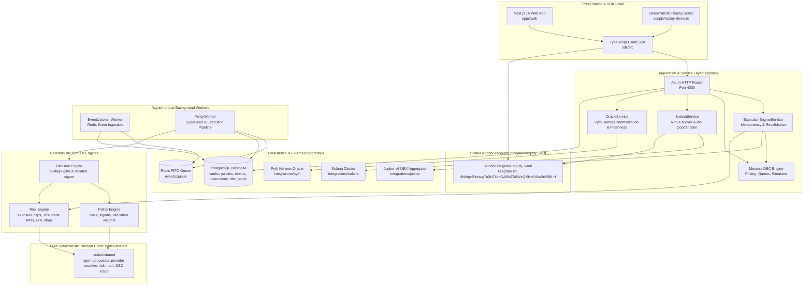

# Equity Catalyst

> **Institutional-Grade Autonomous Liquidity Engine, Dynamic Bonding Curve Controller & Programmable Equity Vaults on Solana**

[](https://solana.com)
[](https://www.rust-lang.org)
[](https://www.typescriptlang.org)
[](https://nextjs.org)
[](LICENSE)

---

## Executive Overview

**Equity Catalyst** makes tokenized equities, real-world assets (RWAs), and pre-IPO representations fully programmable on Solana. Rather than treating tokenized equities (such as Backed Finance `NVDAx`, `AAPLx`, `SPYx`, PreStocks private equities, or Tessera fractional assets) as static, buy-and-hold tokens, Equity Catalyst enables non-custodial, policy-governed smart vaults that dynamically discover price, provide automated liquidity via Meteora Dynamic Bonding Curves (DBC), and deterministically rebalance in response to real-world financial events.

The platform strictly enforces the **Policy, Risk, and Execution Boundary**:
* **Observe**: Ingest real-time market data, Pyth Hermes price feeds, corporate earnings surprises, macro indicators, and on-chain DBC pool metrics.
* **Propose**: AI Agent generates constrained `AgentProposal` structures containing strategic macroeconomic reasoning and suggested portfolio weights. The AI is strictly forbidden from signing transactions or bypassing safety checks.
* **Validate**: Every proposal is intercepted by a deterministic **5-stage validation gate** (Schema, Asset Registry, Price Freshness, Risk Limits, and Policy/Vault Pause state).
* **Simulate**: Test trades pre-flight against Meteora Dynamic Bonding Curves and Jupiter v6 routing to guarantee liquidity, price-impact caps, and slippage thresholds before dispatch.
* **Execute**: Idempotent execution pipeline signed by an isolated keeper, accompanied by immediate post-execution reconciliation and slippage drift tracking.
* **Record**: Mirror on-chain state to PostgreSQL and publish immutable audit events to Redis and the execution ledger.

---

## Architectural Topology



---

## Key Platform Features

### 1. Meteora Dynamic Bonding Curve (DBC) Integration
* **Pricing & Quotes**: Implements Q64.64 fixed-point sqrt-price math and linear price-to-liquidity progression.
* **Bonding Curve Simulator**: Simulates multi-order buy/sell swaps with slippage analysis, price impact checks, and fee breakdowns.
* **Verified Pools**: Pre-configured support for Backed Finance equity assets (`NVDA/USDC`, `AAPL/USDC`, `SPYx/USDC`).
* **Migration & Graduation**: Monitors liquidity thresholds toward automated DAMM v2 pool migration.

### 2. Multi-Provider Statutory RWA Resolver
* **PreStocks**: Pre-IPO tokenized equity representations with on-chain statutory fallback.
* **Tessera**: Fractional collective ownership vault shares.
* **Clawpump**: Fair-value bonding curve launchpad tokens anchored against Pyth oracles.
* **Backed Finance**: Canonical Solana SPL token mints (`NVDAx`, `AAPLx`, `SPYx`).

### 3. Policy-Constrained AI Agent & 5-Stage Validation Gate
* **Strict Separation of Powers**: The AI agent proposes actions (`AgentProposal`); it is cryptographically barred from accessing signing keys, modifying risk limits, or self-authorizing trades.
* **The 5-Stage Gate**:
  1. *Schema Validation*: Ensures typed actions, non-empty justifications, and bounded confidence $[0.0, 1.0]$.
  2. *Asset Validation*: Enforces that target assets exist in the active asset registry and are not halted or delisted.
  3. *Price Freshness*: Validates trusted Pyth oracle prices against configurable staleness limits ($< 60\text{s}$).
  4. *Risk Assessment*: Enforces maximum position limits (e.g. 25%), 10% single-trade caps, and LTV boundaries.
  5. *Policy & Pause Invariant*: Rejects all non-emergency actions if the target vault is paused.

### 4. Hardened Execution Engine & Security Isolation
* **UUID Idempotency**: Every state-mutating transaction requires a unique idempotency key, preventing duplicate executions.
* **Pre-Flight Simulation**: Full swap simulation ensures liquidity is available and slippage bounds are respected before signing.
* **Signer Isolation**: Private keys remain strictly isolated within `apps/api/src/engines/decision_engine/signer.rs` and never leak to logs, headers, or client bundles.
* **Post-Execution Reconciliation**: Automatically tracks slippage drift in basis points and updates the execution ledger.

---

## Repository Structure

```text
├── apps/
│   ├── api/                 # Rust Axum HTTP backend, engines, workers & integration test suites
│   └── web/                 # Next.js 14 App Router web dashboard, proposal gate & asset explorer
├── crates/
│   └── shared/              # Pure deterministic domain crate (types, math, agent, risk, providers)
├── db/
│   ├── migrations/          # PostgreSQL migrations (001_initial through 007_dbc_pools)
│   └── seeds/               # Seed data for demo portfolios, assets, and policies
├── docs/                    # Staff-level engineering architecture documentation (01-26)
├── integrations/
│   ├── jupiter/             # Jupiter v6 DEX Aggregator SDK & quote engine
│   ├── pyth/                # Pyth Hermes HTTP client, feed registry & staleness detector
│   └── solana/              # Solana RPC client with automated failover, WebSocket & Anchor client
├── programs/
│   └── equity_vault/        # Anchor smart contract (vaults, policies, deposits, emergency controls)
├── sdk/                     # TypeScript SDK client
└── tests/                   # End-to-end and scenario test suites
```

---

## Core Engineering Documents Index

The repository features comprehensive, staff-level technical documentation in the [`docs/`](./docs/) directory:

| Document | Description |
|---|---|
| [01. Executive Overview](./docs/01-overview.md) | Problem statement, value proposition, core thesis, and system boundaries |
| [02. Product Model](./docs/02-product-model.md) | The programmable robo-vault concept, lifecycle, and target personas |
| [03. Domain Model](./docs/03-domain-model.md) | Detailed entity specs and $10,000 NVDA earnings surprise trace |
| [04. System Architecture](./docs/04-system-architecture.md) | Component boundaries, subsystem topologies, and Mermaid architecture diagrams |
| [05. Data Flow](./docs/05-data-flow.md) | Ingestion flow, decision synthesis flow, and transaction execution flow |
| [06. State Machines](./docs/06-state-machines.md) | Vault, Decision, Execution, Policy, and Loan lifecycle state machines |
| [07. On-Chain Architecture](./docs/07-onchain-architecture.md) | Anchor program ID `8NhtqxR1...`, PDAs, account layouts, and instructions |
| [08. Off-Chain Architecture](./docs/08-offchain-architecture.md) | Axum server, asynchronous Tokio workers, Postgres repositories, and Redis queues |
| [09. Security Architecture](./docs/09-security.md) | Trust boundaries, cryptographic signer isolation, integer math, and invariant protections |
| [10. Threat Model](./docs/10-threat-model.md) | STRIDE threat matrix, attack scenarios, existing mitigations, and gaps |
| [11. Risk Engine](./docs/11-risk-engine.md) | Concentration limits, LTV boundaries, single trade caps, and stop-loss triggers |
| [12. Policy Engine](./docs/12-policy-engine.md) | Rule conditions, drift detection, sentiment triggers, and target weight computation |
| [13. Decision Engine](./docs/13-decision-engine.md) | Pipeline coordination, order manifest generation, and pre-flight checks |
| [14. Execution Engine](./docs/14-execution.md) | Quote-only execution mode, Jupiter routing, and dry-run audit logging |
| [15. REST API Specification](./docs/15-api.md) | Axum endpoint definitions, request/response models, validation logic, and error codes |
| [16. Testing Strategy](./docs/16-testing.md) | Test pyramid: unit tests in shared crate, Anchor integration suite, and replay demo |
| [17. Debugging Architecture](./docs/17-debugging.md) | Single-hypothesis debugging methodology, pipeline checkpoints, and trace logs |
| [18. Observability](./docs/18-observability.md) | Structured logging around correlation IDs (`event_id`, `vault_address`, `decision_id`) |
| [19. External Integrations](./docs/19-integrations.md) | Solana RPC/WebSocket, Pyth Hermes HTTP oracle, Jupiter v6 Swap API, mock modes |
| [20. Deployment Architecture](./docs/20-deployment.md) | Local validator, devnet deployment, PostgreSQL migrations, Docker configurations |
| [21. Performance & Efficiency](./docs/21-performance.md) | Hot paths, memory allocations, async bottlenecks, database index efficiency |
| [22. Architectural Decisions (ADRs)](./docs/22-adr.md) | ADR-001 through ADR-006 detailing core architectural trade-offs and rationale |
| [23. Failure Scenarios & Recovery](./docs/23-failure-modes.md) | Stale oracles, RPC timeouts, slippage breaches, transaction rejection mitigations |
| [24. Repository File Map](./docs/24-repository-map.md) | Complete directory tree of the repository with component descriptions |
| [25. Current State vs Target State](./docs/25-current-vs-target.md) | Gap analysis categorized by priority (P0 to P3) |
| [26. Senior Engineering Review](./docs/26-senior-engineering-review.md) | Principal engineer review: what is good, weak, risky, over-engineered, and top 10 roadmap |

---

## Quickstart & Local Development

### 1. Prerequisites
* **Rust**: `v1.75.0` or higher (`rustc --version`)
* **Solana CLI**: `v1.18.26` or higher (`solana --version`)
* **Anchor**: `v0.30.1` (`anchor --version`)
* **Node.js**: `v18+` or `v20+` and `pnpm` (`pnpm --version`)
* **Docker**: Docker & Docker Compose (for PostgreSQL 17 and Redis 7)

### 2. Start PostgreSQL & Redis
```bash
docker run -d --name equity-postgres \
  -e POSTGRES_USER=postgres \
  -e POSTGRES_PASSWORD=postgres \
  -e POSTGRES_DB=equity_catalyst \
  -p 5432:5432 postgres:17

docker run -d --name equity-redis \
  -p 6379:6379 redis:7
```

### 3. Run Database Migrations
```bash
for file in db/migrations/*.sql; do
  docker exec -i equity-postgres psql -U postgres -d equity_catalyst < "$file"
done
```

### 4. Build, Test & Lint
```bash
# Verify formatting across all workspace members
cargo fmt --all -- --check

# Enforce zero compiler or linter warnings
cargo clippy --workspace -- -D warnings

# Run the complete workspace test suite (85+ tests passing)
cargo test --workspace

# Run specialized security audit test suites
cargo test --test agent_security_audit_test
cargo test --test market_data_failure_audit_test
cargo test --test execution_failure_audit_test
```

### 5. Run the Deterministic Demo Replay
Experience the full 7-stage event-to-execution pipeline without needing a live testnet wallet:
```bash
npx ts-node scripts/replay-demo.ts --fast
```

### 6. Start Services
```bash
# Start backend API (runs on port 4000)
cargo run --bin equity-catalyst-api

# Start Next.js frontend (runs on port 3000)
cd apps/web
pnpm install
pnpm dev
```

---

## On-Chain Program Details

* **Program Name**: `equity_vault`
* **Program ID**: `8NhtqxR1mwq7a3HTUtcGABNZ3KWzQi9KM3fXu3rHS8LH`
* **On-Chain Instructions**:
  1. `initialize_vault`: Initializes Vault PDA and Policy PDA with authority and risk bounds.
  2. `deposit`: Transfers underlying SPL tokens and mints pro-rata LP shares ($\lfloor \frac{\text{amount} \times S_{\text{total}}}{D_{\text{total}}} \rfloor$). Rejects if vault is paused.
  3. `withdraw`: Burns LP shares and transfers pro-rata underlying assets ($\lfloor \frac{\text{shares} \times D_{\text{total}}}{S_{\text{total}}} \rfloor$). Rejects if vault is paused.
  4. `update_policy`: Updates max LTV, concentration limits, and stop-loss parameters (Authority only).
  5. `emergency_exit`: Authority-triggered circuit breaker toggling `is_paused = true`.

---

## License

Apache-2.0 License. See [LICENSE](LICENSE) for details.
