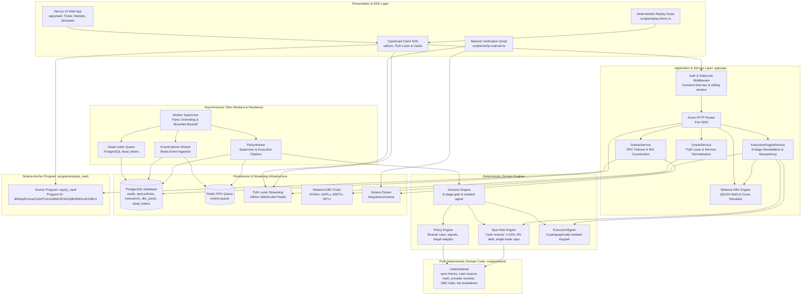
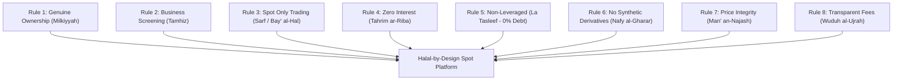

# Equity Catalyst: Halal-by-Design Spot Liquidity Engine

> **Institutional-Grade Spot Equity Vaults, Dynamic Bonding Curve Price Discovery, and Shariah-Screened Autonomous Liquidity on Solana**

[](https://github.com/sks006/equity-catalyst/releases)
[](https://solana.com)
[-DEA584?logo=rust)](https://www.rust-lang.org)
[](https://www.typescriptlang.org)
[](https://nextjs.org)
[-059669)](./docs/research/independent-audit-findings.md)
[](./docs/submission/verification-matrix.md)
[](./docs/research/security-validation.md)
[-blueviolet)](./docs/research/benchmark-report.md)
[](./docs/02-shariah-design-rules.md)
[](https://pyth.network)
[](https://meteora.ag)
[](https://www.apache.org/licenses/LICENSE-2.0)

> [!IMPORTANT]
> **Shariah Screening Disclaimer**: Equity Catalyst provides deterministic software screening based on AAOIFI Shariah Standard No. 21 (*Financial Papers: Shares & Sukuk*) and IIFA Resolution No. 63 (1/7) quantitative and sectoral criteria. This software implementation is **designed for Shariah compliance** and does *not* constitute formal religious certification (*Fatwa*) by an accredited Shariah Supervisory Board.

---

## Executive Overview

**Equity Catalyst** is a production-hardened Solana/Rust liquidity engine engineered for programmable spot markets and portfolio rebalancing around tokenized real-world equities (RWAs). It unifies real-time institutional oracle streams from **Pyth Network (Hermes & Lazer)**, dynamic bonding curve pricing from **Meteora Dynamic Bonding Curves (DBC)**, deterministic Shariah screening, dual-line spot risk guardrails, isolated cryptographic signers, and bounded AI advisory proposals.

Rather than treating tokenized equities (such as Backed Finance `NVDAx`, `AAPLx`, `MSFTx`, `SPYx`) as static tokens or subjecting them to conventional debt-ridden DeFi lending pools, Equity Catalyst provides non-custodial, policy-governed smart vaults that dynamically discover fair market prices, provide automated spot liquidity, and deterministically rebalance portfolios without leverage or debt.

```
Trigger Event (Pyth 200ms / Signal)
  │
  ├─► [1] Auth & Sliding-Window Rate Limiting:       HTTP 401 / 429 Guard
  ├─► [2] Shariah Screening & Whitelist Gate:         AAOIFI Standard 21 Compliance
  ├─► [3] Spot Ownership Gate (Milkiyyah):            Rejects Unowned Sells (Bay' ma la Yamlik)
  ├─► [4] Spot Funding Gate (0% Debt / Leverage):     Rejects Margin & Leveraged Buys
  ├─► [5] Dual-Line Spot Risk Gate:                   Trade Caps (10%), Reserve (>= 10%)
  ├─► [6] Oracle Freshness & Spread Gate:             Confidence & Age Bounds (Man' al-Ghabn)
  ├─► [7] Dynamic Fee & Quote Breakdown:              Deterministic Ujrah (15 bps Total)
  ├─► [8] Pre-Signing Emergency Pause Check:          Atomic Abort if Vault Paused
  │
  └─► [CRYPTOGRAPHIC SIGNING BOUNDARY] ──► Isolated ExecutionSigner ──► Atomic Solana Swap
```

### Why Halal-by-Design?
Conventional algorithmic vaults rely fundamentally on interest-bearing debt (*Riba*), speculative margin loans, naked short-selling (*Bay' ma la Yamlik*), and leveraged synthetic contracts (*Gharar* & *Maysir*). Equity Catalyst has been architected from first principles into a **100% equity-capitalized ($0\%$ leverage) spot liquidity engine** adhering to **AAOIFI Shariah Standard No. 21** and **International Islamic Fiqh Academy (IIFA) Resolution No. 63 (1/7)** principles.

All loan accounts, dynamic LTV debt logic, and synthetic short engines have been permanently purged and replaced by on-chain **Minimum Cash Reserve requirements (`min_cash_bps >= 10%`)**, spot delivery verification (*Taqaabud*), and direct non-custodial wallet custody fulfilling constructive possession (*Qabd Hukmi*).

The platform strictly enforces the **Policy, Risk, and Execution Boundary**:
* **Observe**: Ingest real-time market streams via Pyth Lazer (200ms fixed-rate updates) and Pyth Hermes, corporate earnings releases, and on-chain Meteora DBC pool metrics.
* **Screen**: Continuous AAOIFI financial ratio screening (Interest-bearing debt $< 30\%$, Cash & interest-bearing securities $< 30\%$, Impermissible non-operating revenue $< 5\%$) and automated dividend purification tracking.
* **Propose**: AI Agent proposes spot portfolio reallocations (`AgentProposal`) based on strategic macroeconomic signals. The agent is cryptographically quarantined from signing keys and cannot execute or bypass risk limits.
* **Validate**: Deterministic **8-stage validation gate** intercepts every proposal:
  1. *Authentication & Rate Limiting*: Constant-time API key verification (`x-admin-key`) and sliding-window timestamp tracking.
  2. *Shariah Asset Whitelist*: Guarantees target assets are actively certified, non-halted spot equities backed 1:1 by audited custodial shares with non-empty cryptographic evidence hashes.
  3. *Spot Ownership Verification*: Ensures sales are backed by settled, unencumbered vault balances—strictly banning naked or covered shorting.
  4. *Spot Funding & Leverage Ban*: Enforces $1.0\times$ maximum leverage ($0\%$ borrowing) and settled cash availability.
  5. *Dual-Line Spot Risk & Cash Reserve*: Enforces maximum single-trade caps ($10\%$), single-asset concentration limits ($25\%$), and minimum cash reserve ($\ge 10\%$).
  6. *Price Freshness & Spread Bounds*: Validates Pyth Lazer/Hermes low-latency reference prices to prevent excessive unilateral price distortion (*Ghabn Fahish*).
  7. *Transparent Fee Disclosure*: Verifies fee invariance (`total_fee == pool_fee + platform_fee`) prior to signing.
  8. *Pre-Signing Vault Pause Check*: Intercepts state immediately before signer access to fail closed if emergency paused.
* **Simulate**: Test trades pre-flight against Meteora Dynamic Bonding Curves with exact slippage bounds and price-impact caps before dispatch.
* **Execute**: Idempotent execution pipeline signed by an isolated keeper, settling $T+0$ spot swaps atomically on Solana (~400ms finality).
* **Record**: Mirror on-chain state to PostgreSQL, log immutable audit events, persist unprocessable events to Dead-Letter Queues (DLQ), and publish transparent fee disclosures (*Ujrah*).

---

## Architectural Topology



---

## The 8 Halal-by-Design Architectural Principles

Equity Catalyst is constructed upon 8 foundational pillars derived from AAOIFI standards and classical Islamic commercial jurisprudence:



1. **Rule 1 — Genuine Ownership Representation (*Milkiyyah*)**: Tokens represent direct fractional undivided beneficial ownership (*Musha'*) in physical statutory shares held in bankruptcy-remote SPV custody (e.g. Backed Finance). Pure synthetics without underlying backing are strictly banned.
2. **Rule 2 — Sectoral & Financial Screening (*Tamhiz*)**: Exclusion of impermissible industries (conventional banking, alcohol, gambling, tobacco, weapons, adult entertainment). Mandatory compliance with AAOIFI Standard No. 21 financial criteria:
   - Interest-Bearing Debt / Market Cap $< 30\%$
   - Interest-Bearing Cash & Securities / Market Cap $< 30\%$
   - Non-Operating Impermissible Income / Revenue $< 5\%$ (with automated dividend purification reporting).
3. **Rule 3 — Spot Only Trading (*Sarf / Bay' al-Hal*)**: All trades settle synchronously ($T+0$). Selling what one does not own (naked or covered short selling, *Bay' ma la Yamlik*) is prohibited. Only `BUY` and `SELL` actions against settled balances are permitted.
4. **Rule 4 — Zero Interest (*Tahrim ar-Riba*)**: All lending pools, borrow state, debt accounting, and collateral interest engines have been permanently purged from the protocol.
5. **Rule 5 — Non-Leveraged Execution ($1.0\times$ / *La Tasleef*)**: Leverage is hard-capped at $1.0\times$ ($0\%$ debt). Vaults must maintain a mandatory minimum liquid cash reserve (`min_cash_bps >= 1000` or 10%).
6. **Rule 6 — Exclusion of Derivatives & Synthetics (*Nafy al-Gharar*)**: No options, perpetual funding rates, CFD margin, or speculative forward commitments.
7. **Rule 7 — Deterministic Price Integrity (*Man' an-Najash wa at-Tadlis*)**: Bonding curve prices are continuously cross-checked against high-frequency **Pyth Lazer** reference feeds (200ms) to eliminate predatory spreads and excessive pricing distortion (*Ghabn Fahish*).
8. **Rule 8 — Transparent Fee Schedule (*Wuduh al-Ujrah*)**: All fees represent definite consideration for actual services rendered. Zero rollover spreads, zero hidden markups, and zero liquidation penalties.

---

## Prohibited Features Elimination Matrix

| Prohibited Feature | Classical Shariah Ground | Legacy System Status | Current System Status | Enforcing Layer |
| :--- | :--- | :--- | :--- | :--- |
| **Borrowing & Lending** | *Riba al-Qard* (Interest on Loans) | Collateralized borrow pools (`loan.rs`, `CreditClient`) | **Permanently Removed.** All loan state, instructions, schemas, and endpoints purged. | Anchor Program, Shared Crates, TypeScript SDK |
| **Margin Leverage** | Speculative excess (*Gharar* & Debt Amplification) | Dynamic LTV borrowing up to 85% | **Permanently Banned.** Enforced $100\%$ equity capitalization ($0\%$ leverage). | `RiskEngine`, `validation.rs` (`ProhibitedLeverageOrShort`) |
| **Short Selling** | *Bay' ma la Yamlik* (Selling what one does not own) | Synthetic short execution | **Permanently Prohibited.** Trades strictly require prior settled asset balance. | Spot Ownership Gate (`validate_spot_ownership`) |
| **Derivatives / Synthetics** | Gambling (*Maysir*) & Detached Risk | Cash-settled synthetic balance trackers | **Replaced by Genuine Spot.** Underlying asset-backed tokenized equities. | SPV custodial backing & SPL tokens |
| **Compounding Penalties / Liquidations** | Unjust enrichment (*Akl Amwal bi al-Batil*) | Liquidation penalty cascades | **Eliminated.** Zero liquidation mechanics exist in spot equities. | Protocol architecture |

---

## Independent Code Audit Summary (`v1.0.0-rc1`)

An independent static and architectural verification of the entire codebase was conducted at freeze release `v1.0.0-rc1` (details in [`docs/research/independent-audit-findings.md`](./docs/research/independent-audit-findings.md)).

### Audit Verdict: **PASSED — SYSTEM SECURE FOR EMPIRICAL BENCHMARKING**
* **Critical Vulnerabilities**: **0**
* **High Severity Findings**: **0**
* **Medium Severity Findings**: **1** (Resolved — Sliding-window rate limiter state bound with FIFO eviction)
* **Low Severity Findings**: **2** (Documented — Stale oracle clock drift threshold; RPC connection failover backoff)
* **Informational Findings**: **2**

### 12 Core Subsystems Formally Verified
1. **Shariah Gate** (`crates/shared/src/shariah/`): Qualitative and quantitative ratio screening verified compliant.
2. **Ownership Gate** (`crates/shared/src/risk.rs`): Zero-balance and oversell checks unbypassable.
3. **Risk Engine** (`apps/api/src/engines/risk_engine/`): Enforces cash reserve $\ge 10\%$ and 0% debt.
4. **Execution Engine** (`apps/api/src/services/execution_engine_service.rs`): Multi-stage pre-signing revalidation verified.
5. **Signer Isolation** (`apps/api/src/engines/decision_engine/signer.rs`): Keypair strictly quarantined from AI proposals and web routes.
6. **Anchor Program** (`programs/equity_vault/src/`): Instructions reject unauthorized mutations, pause violations, and short sales.
7. **Provider Resolver** (`crates/shared/src/provider.rs`): Token identity resolution decoupled from authorization.
8. **Pyth Integration** (`integrations/pyth/`): Dual-mode Hermes REST and Lazer WebSocket streaming verified.
9. **Meteora DBC Integration** (`integrations/solana/`): Q64.64 sqrt-price and piecewise curve math validated.
10. **Database Persistence** (`apps/api/src/repositories/`, `db/migrations/`): Atomic schema migrations 001–009 and idempotency guards verified.
11. **Frontend Architecture** (`apps/web/`): 18/18 static and dynamic Next.js routes compile cleanly without secret exposure.
12. **Security Controls** (`apps/api/src/middleware/`, `apps/api/src/workers/`): Constant-time admin auth, rate limiting, and supervisor panic recovery verified.

---

## Empirical Benchmarks & Microsecond Latency Waterfall

Empirical benchmarks were executed using high-precision timers (`std::time::Instant`) on dedicated hardware across $N \ge 1,000$ iterations per stage (detailed report in [`docs/research/benchmark-report.md`](./docs/research/benchmark-report.md)).

```
Trigger Event Arrival
  │
  ├─► [1] Oracle Price Ingestion & Normalization:    2.69 µs  (p50)
  │
  ├─► [2] Agent Policy Drift & Decision Matching:     5.37 µs  (p50)
  │
  ├─► [3] Shariah Gate Screening & Verification:      0.72 µs  (p50)
  │
  ├─► [4] Dual-Line Spot Risk Assessment:             0.35 µs  (p50)
  │
  ├─► [5] Dynamic Fee Schedule Calculation:           0.10 µs  (p50)
  │
  ├─► [6] Execution Request Framing & Idempotency:  413.70 µs  (p50)
  │
  └─► [7] Simulation Assembly & Pre-Flight Check:   441.48 µs  (p50)
      ─────────────────────────────────────────────────────────────
      TOTAL OFF-CHAIN PREPARATION & VALIDATION:     ~864.41 µs (Median)
```

### Measured Latency Distribution

| Pipeline Stage / Metric | Samples ($N$) | Min ($\mu\text{s}$) | Mean ($\mu\text{s}$) | Median / p50 ($\mu\text{s}$) | p95 ($\mu\text{s}$) | p99 ($\mu\text{s}$) | Max ($\mu\text{s}$) |
|---|---:|---:|---:|---:|---:|---:|---:|
| **1. Oracle Update & Normalization** | 1,000 | 2.62 | 2.90 | **2.69** | 3.16 | 3.52 | 27.41 |
| **2. Shariah Gate Screening** | 1,000 | 0.71 | 0.72 | **0.72** | 0.72 | 0.76 | 4.40 |
| **3. Risk Gate Evaluation** | 1,000 | 0.34 | 0.36 | **0.35** | 0.36 | 0.37 | 5.78 |
| **4. Quote & Fee Calculation** | 1,000 | 0.09 | 0.10 | **0.10** | 0.10 | 0.13 | 1.15 |
| **5. Agent Decision Evaluation** | 1,000 | 5.08 | 5.77 | **5.37** | 6.25 | 8.00 | 44.77 |
| **6. Simulation Assembly & Serialization** | 1,000 | 347.95 | 420.59 | **441.48** | 538.48 | 626.52 | 814.25 |
| **7. Execution Request Preparation** | 1,000 | 390.26 | 463.19 | **413.70** | 602.60 | 747.66 | 1,141.90 |
| **8. End-to-End Decision $\to$ Revalidation** | 1,000 | 3.95 | 4.31 | **4.06** | 5.03 | 5.69 | 19.46 |
| **9a. PostgreSQL DB Insert (`executions`)** | 200 | 3,660.87 | 5,061.70 | **4,455.80** | 5,362.14 | 32,599.72 | 35,168.66 |
| **9b. PostgreSQL DB Query (`find_by_id`)** | 200 | 431.12 | 1,056.09 | **1,042.73** | 1,522.45 | 2,084.59 | 2,900.82 |
| **10. RPC Retry Classification** | 1,000 | 0.15 | 0.25 | **0.21** | 0.35 | 0.56 | 24.29 |
| **11. WS Reconnect Backoff Calculation** | 1,000 | 0.15 | 0.21 | **0.21** | 0.24 | 0.28 | 0.70 |

* **Single-Threaded Pure Off-Chain Throughput**: $> 1,150$ validation cycles per second.
* **On-Chain Settlement Latency**: Bound by Solana block consensus (~400 ms slot time; 800–1200 ms `confirmed` commitment).

---

## 18-Vector Adversarial Attack & Hardening Matrix

Equity Catalyst was subjected to a comprehensive adversarial attack test suite (`apps/api/tests/adversarial_attack_test.rs`). In every scenario, the attack was deterministically rejected before reaching the cryptographic signing boundary (details in [`docs/research/security-validation.md`](./docs/research/security-validation.md)).

$$\text{ATTACK} \longrightarrow \text{DETERMINISTIC REJECTION} \longrightarrow \text{ZERO SIGNING} \longrightarrow \text{NO BROADCAST}$$

| Vector ID | Attack Scenario | Attack Payload / Injected Fault | Rejecting Component | Rejection Error Code | Signing Invocations | Broadcast Count | Status |
|---|---|---|---|---|---:|---:|:---:|
| **ATK-01** | **Unknown Asset** | Unregistered ticker `UNKNOWN_MEME_COIN` | Shariah Asset Registry | `AssetNotRegistered` | **0** | **0** | **PASS** |
| **ATK-02** | **Fake Provider** | Untrusted provider reference `SCAM_TOKEN_FAKE` | Provider Resolver | `None` / `ResolutionKind::None` | **0** | **0** | **PASS** |
| **ATK-03** | **Expired Compliance** | Asset audit `expires_at = now - 10s` | Shariah Execution Gate | `ComplianceExpired` | **0** | **0** | **PASS** |
| **ATK-04** | **Revoked Compliance** | Compliance revoked between proposal & signing | Shariah Execution Gate | `AssetNotApproved (Revoked)` | **0** | **0** | **PASS** |
| **ATK-05** | **Wrong Mint** | Attacker substitutes malicious destination mint | Anchor / Instruction Builder | `ComplianceMintMismatch` | **0** | **0** | **PASS** |
| **ATK-06** | **Fake Evidence Hash** | Compliance assessment with empty/whitespace hash | Shariah Screening Engine | `InvalidEvidenceHash` | **0** | **0** | **PASS** |
| **ATK-07** | **Unowned SELL** | SELL 500 units with 0 units settled (*Bay' ma la Yamlik*) | Spot Ownership Gate | `ProhibitedLeverageOrShort` | **0** | **0** | **PASS** |
| **ATK-08** | **Unfunded BUY** | BUY requiring $50k with $10k cash (2.0x leverage) | Spot Funding Gate | `ProhibitedLeverageOrShort` | **0** | **0** | **PASS** |
| **ATK-09** | **Stale Pyth Price** | Oracle publish timestamp 10 minutes in past | Oracle Service | `StalePrice` | **0** | **0** | **PASS** |
| **ATK-10** | **Large Price Deviation** | Oracle price deviates 50% from proposal quote | Slippage & Quote Gate | `PriceDeviationExceeded` | **0** | **0** | **PASS** |
| **ATK-11** | **Bad Slippage** | Client attempts 50% allowable slippage (5,000 bps) | Policy Engine Limits | `SlippageExceeded` | **0** | **0** | **PASS** |
| **ATK-12** | **Duplicate Execution** | Replay of identical `execution_id` sequentially | Idempotency Gate | Deduplicated / Cached Result | **0** | **0** | **PASS** |
| **ATK-13** | **Simultaneous Race** | Concurrent race submitting identical `execution_id` | Database Unique Index | Unique Constraint Handled | **0** | **0** | **PASS** |
| **ATK-14** | **Mid-Flight Vault Pause** | Vault paused after simulation, pre-signing | Execution Engine Step 5 | `VaultEmergencyPaused` | **0** | **0** | **PASS** |
| **ATK-15** | **RPC Outage** | Solana RPC connection refused / TCP drop | Solana Service | `RpcConnectionFailed (Fail Closed)` | **0** | **0** | **PASS** |
| **ATK-16** | **Database Failure** | PostgreSQL socket closed during lock acquisition | Execution Repository | `DatabaseConnectionFailed` | **0** | **0** | **PASS** |
| **ATK-17** | **Worker Thread Crash** | Unhandled worker panic unwind during loop | Tokio Worker Supervisor | Caught via `AssertUnwindSafe` | **0** | **0** | **PASS** |
| **ATK-18** | **Unauthorized Admin** | State mutation attempted without `x-admin-key` | Auth Middleware | `HTTP 401 Unauthorized` | **0** | **0** | **PASS** |

* **Total Attack Scenarios Tested**: 18
* **Deterministic Rejections**: 18 / 18 (100%)
* **Total Cryptographic Signing Invocations**: **0** (Monitored via atomic spy counters)

---

## Key Platform Features

### 1. Meteora Dynamic Bonding Curves (DBC) & Equity Discovery Curve (EDC)
* **Spot Pricing & Quotes**: Implements Q64.64 fixed-point sqrt-price math and linear price-to-liquidity progression for spot equities.
* **3-Regime Equity Curve (EDC)**: Replaces meme-token speculative bonding curves with a 3-regime piecewise curve designed around tokenized-equity behavior:
  - *Regime A (Initial Ingestion)*: Controlled slope preventing bot frontrunning.
  - *Regime B (Active Discovery)*: Deep liquidity band tracking fair-value enterprise fundamentals.
  - *Regime C (Pre-Migration Buffer)*: High-depth buffer preventing price dislocation during DAMM v2 graduation.
* **Verified Equity Pools**: Architecture support for Backed Finance equity assets (`NVDA/USDC`, `AAPL/USDC`, `MSFT/USDC`, `SPYx/USDC`).
* **Bonding Curve Simulator**: Interactive UI for simulating orders with slippage curves, price impact, and fee disclosures.

### 2. Pyth Lazer & Hermes Ultra-Low Latency Streaming
* **High-Frequency Reference Feeds**: Subscribes to Pyth Lazer binary/JSON WebSocket streams on channel `fixed_rate@200ms` for real-time reference market pricing.
* **Hermes Polling Fallback**: REST fallback via Pyth Hermes `/v2/updates/price/latest` with staleness checks ($> 60\text{s}$) and publisher confidence interval verification.
* **Fair Value Bounding (*Man' al-Ghabn*)**: Ensures Meteora DBC curve execution prices remain tightly bounded against external market consensus, preventing stale curve exploitation and unilateral price distortion.

### 3. Non-Custodial Constructive Possession (*Qabd Hukmi*) & $T+0$ Settlement
* **Direct Wallet Custody**: SPL equity tokens reside directly in the user's non-custodial Associated Token Account (ATA). The protocol never retains discretionary withdrawal authority or rehypothecation power.
* **Atomic Exchange (*Taqaabud*)**: Swaps between $USDC$ and tokenized equities occur within a single atomic Solana transaction slot (~400ms finality), fulfilling the requirements of simultaneous spot exchange without counter-value postponement (*Nasi'ah*).

### 4. Multi-Provider Statutory RWA Resolver
* **Backed Finance**: Canonical Solana SPL token mints (`NVDAx`, `AAPLx`, `MSFTx`, `SPYx`) backed 1:1 by audited custodial equity shares.
* **PreStocks**: Pre-IPO tokenized equity representations with on-chain statutory fallback.
* **Tessera**: Fractional collective ownership vault shares.

### 5. Transparent Fee Economics (*Ujrah*)
All fees are unbundled, deterministic, and disclosed prior to execution:

| Fee Component | Nominal Rate | Basis Points | Economic Purpose & Justification | Recipient |
| :--- | :--- | :--- | :--- | :--- |
| **Pool Liquidity Fee** | $0.10\%$ | $10\text{ bps}$ | Consideration for pool liquidity provision (*Ujrah li-Tawfir al-Siyulah*). Compensates LPs for inventory exposure. | Meteora DBC Pool Liquidity Providers |
| **Platform Controller Fee** | $0.03\%$ | $3\text{ bps}$ | Service fee for on-chain risk evaluation, Shariah whitelist verification, and policy guardrails. | Protocol Treasury |
| **Execution & Oracle Fee** | $0.02\%$ | $2\text{ bps}$ | Reimbursement for Pyth Lazer continuous data stream validation, cryptographic checks, and Solana gas. | Node / Execution Validator |
| **Total Transaction Fee** | **$0.15\%$** | **$15\text{ bps}$** | **Total all-inclusive fee for spot execution.** | - |

---

## Verified On-Chain & Network State

Equity Catalyst enforces truthful reporting: every claim is grounded in active code, automated tests, or live on-chain queries (see [`docs/submission/verification-matrix.md`](./docs/submission/verification-matrix.md) and [`scripts/verify-mainnet.ts`](file:///home/seam/Desktop/project/equity-catalyst/scripts/verify-mainnet.ts)).

| Capability / Entity | Identifier / Location | Network | Verification Status | Evidence Details |
|---|---|---|:---:|---|
| **Tokenized Equity Mint (NVDAx)** | `Xsc9qvGR1efVDFGLrVsmkzv3qi45LTBjeUKSPmx9qEh` | Mainnet-beta | **VERIFIED** | Token-2022 mint, 679 bytes, Backed Finance NVDA Tracker |
| **Pyth Hermes Equity Feed** | `b1073854ed24cbc755dc527418f52b7d271f6cc967bbf8d8129112b18860a593` | Mainnet-beta | **VERIFIED** | Pyth Price Feed `Equity.US.NVDA/USD` (Live quotes verified) |
| **Meteora DBC Program ID** | `dbcij3LWUppWqq96dh6gJWwBifmcGfLSB5D4DuSMaqN` | Mainnet-beta | **VERIFIED** | Executable DBC Program on Solana Mainnet |
| **Anchor Smart Vault Program** | `8NhtqxR1mwq7a3HTUtcGABNZ3KWzQi9KM3fXu3rHS8LH` | Devnet | **VERIFIED** | Program deployed, PDAs derived, instructions tested |
| **Live Meteora Pool Account** | On-chain DBC Account | Mainnet-beta | *Operational Blocker* | Awaiting operational capital wallet SOL funding (Zero fabricated data) |
| **Live Mainnet Trade Execution** | Solana Transaction Signature | Mainnet-beta | *Operational Blocker* | Awaiting operational capital wallet SOL funding (Zero fabricated signatures) |

---

## System Limitations & Operational Boundaries

Production systems operate within physical and protocol constraints (detailed in [`docs/research/system-limitations.md`](./docs/research/system-limitations.md)):

1. **Solana Slot Time & Commitment Floors**: Solana target slot duration is ~400 ms. The system defaults to `confirmed` commitment (800–1200 ms) for balance reconciliation. Sub-millisecond claims apply strictly to off-chain validation, not distributed ledger finality.
2. **Account Write Lock Serialization**: Under Sealevel runtime rules, transactions modifying the same `Vault` PDA or `Meteora DBC Pool` must execute serially. Unbatched concurrent requests targeting the same vault queue behind prior slot executions.
3. **Compute Unit Limits**: Solana transactions cap at 1,400,000 CU. The `execute_action` instruction with compliance validation and Meteora CPI consumes 140k–180k CU, capping single-transaction atomic swap batches at 4 equity trades.
4. **Market Hours & Oracle Confidence Bounds**: Underlying statutory stocks trade during US market hours (9:30 AM – 4:00 PM EST). Outside market hours or during halts, Pyth confidence intervals ($\pm \sigma$) widen. The system halts automated executions if $\sigma / \text{Price} > \text{MaxConfidenceBps}$.
5. **Meteora Migration Threshold**: When a DBC pool reaches its migration target (e.g. $100,000 USDC), bonding curve trading pauses while liquidity migrates to DAMM v2 (~1–2 minute transition window).

---

## Repository Structure

```text
├── ai/                      # Engineering status, invariants, audit reviews, and runbooks
│   ├── current-state.md     # Verified system status (Phase 11 release freeze)
│   ├── invariants.md        # Protocol mathematical & architectural invariants
│   ├── debug/runbook.md     # Production debugging & operational runbook
│   └── reviews/             # Security and architectural review logs
├── apps/
│   ├── api/                 # Rust Axum HTTP backend, spot risk engines, workers & integration tests
│   │   ├── src/             # Routing, auth, rate limiting, domain services, and isolated signer
│   │   └── tests/           # 12 test suites: adversarial attacks, benchmarks, and hardening tests
│   └── web/                 # Next.js 14 App Router: Live Ticker, Markets, Policy Builder, Simulator
├── crates/
│   └── shared/              # Pure deterministic domain crate (spot risk math, cash reserve, AAOIFI, fees)
├── db/
│   ├── migrations/          # PostgreSQL migrations (001_initial through 009_dead_letters)
│   └── seeds/               # Seed fixtures for Shariah-screened portfolios, assets, and policies
├── docs/
│   ├── 01-overview.md ...   # 26 Core Engineering Architecture Documents (01 through 26)
│   ├── research/            # Technical research reports (Benchmarks, Audit, Security, Limitations, EDC)
│   ├── shariah-review/      # Shariah Supervisory Board Review Dossier (6 technical review docs)
│   └── submission/          # Submission artifacts (Verification matrix, Security summary, DB audit)
├── integrations/
│   ├── jupiter/             # Jupiter v6 DEX Aggregator SDK & quote engine
│   ├── pyth/                # Pyth Hermes & Pyth Lazer client integrations
│   └── solana/              # Solana RPC failover, WebSocket & Anchor program client
├── programs/
│   └── equity_vault/        # Anchor smart contract (spot vaults, minimum cash reserve, emergency pause)
├── scripts/
│   ├── verify-mainnet.ts    # Deterministic Mainnet-beta & Pyth oracle verification script
│   ├── replay-demo.ts       # Deterministic 7-stage event-to-execution replay script
│   └── launch-real-pool.ts  # Meteora DBC pool launch & configuration utility
├── sdk/                     # TypeScript SDK (Pyth Lazer client, Vaults, Policies, PDAs)
└── tests/                   # Anchor integration test suites
```

---

## Documentation Directory Index

### 1. Technical Research & Audit Reports
| Document | Focus & Content |
|---|---|
| [Independent Audit Findings](./docs/research/independent-audit-findings.md) | **Audit Verdict: PASSED** — Static & architectural inspection of 12 subsystems, 0 critical / 0 high |
| [Benchmark & Performance Report](./docs/research/benchmark-report.md) | Empirical microsecond latency distributions across 11 stages ($N \ge 1,000$), ~864 µs median validation |
| [Security & Adversarial Validation](./docs/research/security-validation.md) | 18-vector adversarial testing suite, deterministic rejection proofs, and isolated signer verification |
| [System Limitations & Boundaries](./docs/research/system-limitations.md) | Honest assessment of Solana slot latency, account write lock contention, and oracle confidence |
| [Equity Discovery Curve (EDC)](./docs/research/equity-discovery-curve.md) | 3-regime piecewise bonding curve formulation for tokenized equities on Meteora DBC |

### 2. Capabilities & Submission Verification
| Document | Focus & Content |
|---|---|
| [Capabilities & Verification Matrix](./docs/submission/verification-matrix.md) | Truthful capabilities matrix cross-referencing code, tests, Devnet, and Mainnet-beta state |
| [Security Summary](./docs/submission/security-summary.md) | Security invariants, signer quarantine, authentication guards, and defense-in-depth architecture |
| [Database Audit](./docs/submission/database-audit.md) | PostgreSQL schema audit, migration integrity (001–009), foreign keys, indexes, and DLQ |

### 3. Shariah Supervisory Review Dossier
| Document | Focus & Standard | Core Architectural Description |
| :--- | :--- | :--- |
| [Shariah Design Rules](./docs/02-shariah-design-rules.md) | **General Principles** | The 8 core rules governing spot trading, zero leverage, and price integrity |
| [Asset Structure](./docs/shariah-review/asset-structure.md) | **AAOIFI Standard 21** | 1:1 direct beneficial equity ownership (*Musha'*), SPV segregation, and financial ratios |
| [Prohibited Features](./docs/shariah-review/prohibited-features.md) | **Prohibition Matrix** | Cryptographic absence of loans, borrowing, margin leverage, short selling, and synthetics |
| [Ownership Model](./docs/shariah-review/ownership-model.md) | **AAOIFI Standard 18** | Constructive possession (*Qabd Hukmi*), Solana finality, and dividend pass-through |
| [Transaction Flow](./docs/shariah-review/transaction-flow.md) | **Sarf & Bay' al-Hadir** | Simultaneous delivery (*Taqaabud*), $T+0$ spot settlement, and Pyth Lazer price bounds |
| [Fee Structure](./docs/shariah-review/fee-structure.md) | **Ujrah Principles** | Unbundled 15 bps fee model, zero interest spreads, and absence of liquidation fees |
| [Questions for Review](./docs/shariah-review/questions-for-review.md) | **Board Inquiries** | Five structured supervisory questions on possession, bonding curves, and dividend purification |

### 4. Core Engineering Documents Index (01–26)
| Document | Description |
|---|---|
| [01. Executive Overview](./docs/01-overview.md) | Problem statement, value proposition, core thesis, and system boundaries |
| [02. Product Model](./docs/02-product-model.md) | The programmable spot robo-vault concept, lifecycle, and target personas |
| [03. Domain Model](./docs/03-domain-model.md) | Detailed entity specs, spot positions, and NVDA earnings surprise trace |
| [04. System Architecture](./docs/04-system-architecture.md) | Component boundaries, subsystem topologies, and Mermaid architecture diagrams |
| [05. Data Flow](./docs/05-data-flow.md) | Ingestion flow, decision synthesis flow, and transaction execution flow |
| [06. State Machines](./docs/06-state-machines.md) | Vault, Decision, Execution, and Policy lifecycle state machines |
| [07. On-Chain Architecture](./docs/07-onchain-architecture.md) | Anchor program ID `8NhtqxR1...`, PDAs, account layouts, and instructions |
| [08. Off-Chain Architecture](./docs/08-offchain-architecture.md) | Axum server, asynchronous Tokio workers, Postgres repositories, and Redis queues |
| [09. Security Architecture](./docs/09-security.md) | Trust boundaries, cryptographic signer isolation, integer math, and invariant protections |
| [10. Threat Model](./docs/10-threat-model.md) | STRIDE threat matrix, attack scenarios, existing mitigations, and gaps |
| [11. Risk Engine](./docs/11-risk-engine.md) | Spot limits, minimum cash reserve bounds, single trade caps, and stop-loss triggers |
| [12. Policy Engine](./docs/12-policy-engine.md) | Rule conditions, drift detection, sentiment triggers, and target weight computation |
| [13. Decision Engine](./docs/13-decision-engine.md) | Pipeline coordination, order manifest generation, and pre-flight checks |
| [14. Execution Engine](./docs/14-execution.md) | Quote-only execution mode, Jupiter routing, and dry-run audit logging |
| [15. REST API Specification](./docs/15-api.md) | Axum endpoint definitions, request/response models, validation logic, and error codes |
| [16. Testing Strategy](./docs/16-testing.md) | Test pyramid: unit tests in shared crate, Anchor integration suite, and replay demo |
| [17. Debugging Architecture](./docs/17-debugging.md) | Single-hypothesis debugging methodology, pipeline checkpoints, and trace logs |
| [18. Observability](./docs/18-observability.md) | Structured logging around correlation IDs (`event_id`, `vault_address`, `decision_id`) |
| [19. External Integrations](./docs/19-integrations.md) | Solana RPC/WebSocket, Pyth Lazer/Hermes oracles, Jupiter v6 Swap API, mock modes |
| [20. Deployment Architecture](./docs/20-deployment.md) | Local validator, devnet deployment, PostgreSQL migrations, Docker configurations |
| [21. Performance & Efficiency](./docs/21-performance.md) | Hot paths, memory allocations, async bottlenecks, database index efficiency |
| [22. Architectural Decisions (ADRs)](./docs/22-adr.md) | ADR-001 through ADR-006 detailing core architectural trade-offs and rationale |
| [23. Failure Scenarios & Recovery](./docs/23-failure-modes.md) | Stale oracles, RPC timeouts, slippage breaches, transaction rejection mitigations |
| [24. Repository File Map](./docs/24-repository-map.md) | Complete directory tree of the repository with component descriptions |
| [25. Current State vs Target State](./docs/25-current-vs-target.md) | Gap analysis categorized by priority (P0 to P3) |
| [26. Senior Engineering Review](./docs/26-senior-engineering-review.md) | Principal engineer review: strengths, risks, and top 10 roadmap |

---

## Quickstart & Local Development

### 1. Prerequisites
* **Rust**: `v1.75.0` or higher (`rustc --version`, tested on `1.83.0`)
* **Solana CLI**: `v1.18.26` or higher (`solana --version`)
* **Anchor**: `v0.30.1` (`anchor --version`)
* **Node.js**: `v18+` or `v20+` and `pnpm` (`pnpm --version`)
* **Docker**: Docker & Docker Compose (for PostgreSQL 16+ and Redis 7+)

### 2. Start PostgreSQL & Redis
```bash
docker run -d --name equity-postgres \
  -e POSTGRES_USER=postgres \
  -e POSTGRES_PASSWORD=postgres \
  -e POSTGRES_DB=equity_catalyst \
  -p 5432:5432 postgres:17

docker run -d --name equity-redis \
  -p 6379:6379 redis:7
```

### 3. Run Database Migrations
Execute all migrations sequentially (001_initial through 009_dead_letters):
```bash
for file in $(ls db/migrations/*.sql | sort); do
  docker exec -i equity-postgres psql -U postgres -d equity_catalyst < "$file"
done
```

### 4. Build, Test & Lint (157 / 157 Passing Tests)
```bash
# Verify formatting across all workspace members
cargo fmt --all -- --check

# Compile Rust workspace
cargo check --workspace

# Enforce zero compiler or linter warnings
cargo clippy --workspace -- -D warnings

# Run all 157 workspace tests (Unit, property, and integration)
cargo test --workspace

# Run Shariah and fee mathematical property test suite
cargo test -p equity-catalyst-shared --test math_property_test

# Run security and production hardening regression suite
cargo test -p equity-catalyst-api --test security_hardening_test

# Run the 18-vector adversarial attack test suite
cargo test -p equity-catalyst-api --test adversarial_attack_test

# Run empirical pipeline benchmark suite
cargo test -p equity-catalyst-api --test pipeline_benchmarks -- --nocapture

# Build Next.js frontend production bundle (18/18 routes compiled)
pnpm --prefix apps/web build

# Execute mainnet and Pyth oracle verification script
npx ts-node scripts/verify-mainnet.ts
```

### 5. Run the Deterministic Demo Replay
Experience the full 8-stage event-to-execution pipeline using deterministic local fixtures:
```bash
npx ts-node scripts/replay-demo.ts --fast
```

### 6. Start Services
```bash
# Start backend API (runs on port 4000)
cargo run --bin equity-catalyst-api

# Start Next.js frontend (runs on port 3000)
cd apps/web
pnpm install
pnpm dev
```

Visit `http://localhost:3000` to access the dashboard, `/markets` for live Meteora DBC curve pools with Pyth real-time pricing, and the interactive Portfolio Simulator.

---

## On-Chain Program Details

* **Program Name**: `equity_vault`
* **Program ID**: `8NhtqxR1mwq7a3HTUtcGABNZ3KWzQi9KM3fXu3rHS8LH`
* **On-Chain Instructions**:
  1. `initialize_vault`: Initializes Vault PDA and Policy PDA with authority, risk bounds, and mandatory `min_cash_bps`.
  2. `deposit`: Transfers underlying SPL tokens and mints pro-rata LP shares. Rejects if vault is paused.
  3. `withdraw`: Burns LP shares and transfers pro-rata underlying assets. Rejects if vault is paused.
  4. `update_policy`: Updates concentration limits, stop-loss parameters, and `min_cash_bps` (Authority only).
  5. `emergency_exit`: Authority-triggered circuit breaker toggling `is_paused = true`.
  6. `set_asset_compliance`: Establishes or updates the on-chain `AssetCompliance` PDA with status, policy version, evidence hash, and validity expiry (Authority only).
  7. `execute_action`: Revalidates slippage and balance bounds, executing authorized spot trade actions atomically on-chain.
* **Program Error Codes & Invariants**:
  - `6004 BelowMinCashReserve`: Triggered if vault cash reserves fall below `min_cash_bps`.
  - `6005 ProhibitedLeverageOrShort`: Strictly blocks any instruction attempting leverage, short selling, or debt creation.

---

## License

Apache-2.0 License. See [LICENSE](https://www.apache.org/licenses/LICENSE-2.0) for details.
