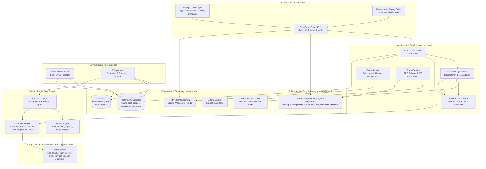
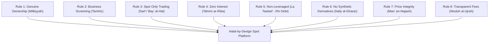

# Equity Catalyst: Halal-by-Design Spot Liquidity Engine

> **Programmable Spot Equity Vaults, Dynamic Bonding Curve Price Discovery & Shariah-Screened Autonomous Liquidity on Solana**

[](https://solana.com)
[](https://www.rust-lang.org)
[](https://www.typescriptlang.org)
[](https://nextjs.org)
[](./docs/02-shariah-design-rules.md)
[](https://pyth.network)
[](https://meteora.ag)
[](https://www.apache.org/licenses/LICENSE-2.0)

> [!IMPORTANT]
> **Shariah Screening Disclaimer**: Equity Catalyst provides deterministic software screening based on AAOIFI Shariah Standard No. 21 and IIFA Resolution No. 63 (1/7) quantitative and sectoral criteria. This software implementation is **designed for Shariah compliance** and does *not* constitute formal religious certification (*Fatwa*) by an accredited Shariah Supervisory Board.

---

## Executive Overview

**Equity Catalyst** is a Solana/Rust system for programmable spot liquidity around tokenized real-world equities (RWAs), combining real-time market data from **Pyth Network**, automated spot liquidity discovery via **Meteora Dynamic Bonding Curves (DBC)**, deterministic Shariah-oriented screening, dual-line spot risk controls, bounded AI advisory proposals, and isolated keeper execution.

Rather than treating tokenized equities (such as Backed Finance `NVDAx`, `AAPLx`, `MSFTx`, `SPYx`) as static tokens or subjecting them to conventional debt-ridden DeFi primitives, Equity Catalyst provides non-custodial, policy-governed smart vaults that dynamically discover fair price, provide automated spot liquidity, and deterministically rebalance portfolios using real-time market data from Pyth Hermes.

### Why Halal-by-Design?
Conventional algorithmic vaults rely fundamentally on interest-bearing debt (*Riba*), speculative margin loans, naked short-selling (*Bay' ma la Yamlik*), and leveraged synthetic contracts (*Gharar* & *Maysir*). Equity Catalyst has been re-architected from first principles into a **100% equity-capitalized ($0\%$ leverage) spot liquidity engine** adhering to **AAOIFI Shariah Standard No. 21** (*Financial Papers: Shares & Sukuk*) and **International Islamic Fiqh Academy (IIFA) Resolution No. 63 (1/7)** principles.

All loan accounts, dynamic LTV debt logic, and synthetic short engines have been permanently purged and replaced by on-chain **Minimum Cash Reserve requirements (`min_cash_bps >= 10%`)**, spot delivery verification (*Taqaabud*), and direct non-custodial wallet custody fulfilling constructive possession (*Qabd Hukmi*).

The platform strictly enforces the **Policy, Risk, and Execution Boundary**:
* **Observe**: Ingest real-time market streams via Pyth Lazer (200ms fixed-rate updates) and Pyth Hermes, corporate earnings releases, and on-chain Meteora DBC pool metrics.
* **Screen**: Continuous AAOIFI financial ratio screening (Interest-bearing debt $< 30\%$, Cash & interest-bearing securities $< 30\%$, Impermissible non-operating revenue $< 5\%$) and automated dividend purification tracking.
* **Propose**: AI Agent proposes spot portfolio reallocations (`AgentProposal`) based on strategic macroeconomic signals. The agent is cryptographically quarantined from signing keys and cannot execute or bypass risk limits.
* **Validate**: Deterministic **5-stage validation gate** intercepts every proposal:
  1. *Schema Validation*: Verifies typed actions (`BUY`/`SELL`), non-empty justification, confidence $\in [0.0, 1.0]$.
  2. *Shariah Asset Whitelist*: Guarantees target assets are actively certified, non-halted spot equities backed 1:1 by audited custodial shares.
  3. *Price Freshness & Spread Bounds*: Validates Pyth Lazer/Hermes low-latency reference prices to prevent excessive unilateral price distortion (*Ghabn Fahish*).
  4. *Spot Risk & Cash Reserve*: Enforces $100\%$ spot capitalization, maximum single-trade caps ($10\%$), single-asset concentration limits ($25\%$), and minimum cash reserve ($\ge 10\%$).
  5. *Vault Pause Invariant*: Rejects non-emergency state changes if the vault is paused.
* **Simulate**: Test trades pre-flight against Meteora Dynamic Bonding Curves with exact slippage bounds and price-impact caps before dispatch.
* **Execute**: Idempotent execution pipeline signed by an isolated keeper, settling $T+0$ spot swaps atomically on Solana (~400ms finality).
* **Record**: Mirror on-chain state to PostgreSQL, log immutable audit events to Redis, and publish transparent fee disclosures (*Ujrah*).

---

## Architectural Topology



---

## The 8 Halal-by-Design Architectural Principles

Equity Catalyst is constructed upon 8 foundational pillars derived from AAOIFI standards and classical Islamic commercial jurisprudence:



1. **Rule 1 — Genuine Ownership Representation (*Milkiyyah*)**: Tokens represent direct fractional undivided beneficial ownership (*Musha'*) in physical statutory shares held in bankruptcy-remote SPV custody (e.g. Backed Finance). Pure synthetics without underlying backing are banned.
2. **Rule 2 — Sectoral & Financial Screening (*Tamhiz*)**: Exclusion of impermissible industries (conventional banking, alcohol, gambling, tobacco, weapons, adult entertainment). Mandatory compliance with AAOIFI financial criteria:
   - Interest-Bearing Debt / Market Cap $< 30\%$
   - Interest-Bearing Cash & Securities / Market Cap $< 30\%$
   - Non-Operating Impermissible Income / Revenue $< 5\%$ (with automated dividend purification reporting).
3. **Rule 3 — Spot Only Trading (*Sarf / Bay' al-Hal*)**: All trades settle synchronously ($T+0$). Selling what one does not own (naked or covered short selling) is prohibited. Only `BUY` and `SELL` actions against settled balances are permitted.
4. **Rule 4 — Zero Interest (*Tahrim ar-Riba*)**: All lending pools, borrow state, debt accounting, and collateral interest engines have been completely deleted from the protocol.
5. **Rule 5 — Non-Leveraged Execution ($1.0\times$ / *La Tasleef*)**: Leverage is hard-capped at $1.0\times$ ($0\%$ debt). Vaults must maintain a mandatory minimum liquid cash reserve (`min_cash_bps >= 1000` or 10%).
6. **Rule 6 — Exclusion of Derivatives & Synthetics (*Nafy al-Gharar*)**: No options, perpetual funding rates, CFD margin, or speculative forward commitments.
7. **Rule 7 — Deterministic Price Integrity (*Man' an-Najash wa at-Tadlis*)**: Bonding curve prices are continuously cross-checked against high-frequency **Pyth Lazer** reference feeds (200ms) to eliminate predatory spreads and excessive pricing distortion (*Ghabn Fahish*).
8. **Rule 8 — Transparent Fee Schedule (*Wuduh al-Ujrah*)**: All fees represent definite consideration for actual services rendered. Zero rollover spreads, zero hidden markups, and zero liquidation penalties.

---

## Prohibited Features Elimination Matrix

| Prohibited Feature | Classical Shariah Ground | Legacy System Status | Current System Status | Enforcing Layer |
| :--- | :--- | :--- | :--- | :--- |
| **Borrowing & Lending** | *Riba al-Qard* (Interest on Loans) | Collateralized borrow pools (`loan.rs`, `CreditClient`) | **Permanently Removed.** All loan state, instructions, schemas, and endpoints purged. | Anchor Program, Shared Crates, TypeScript SDK |
| **Margin Leverage** | Speculative excess (*Gharar* & Debt Amplification) | Dynamic LTV borrowing up to 85% | **Permanently Banned.** Enforced $100\%$ equity capitalization ($0\%$ leverage). | `RiskEngine`, `validation.rs` (`ProhibitedLeverageOrShort`) |
| **Short Selling** | *Bay' ma la Yamlik* (Selling what one does not own) | Synthetic short execution | **Permanently Prohibited.** Trades strictly require prior settled asset balance. | Spot-only validation checks |
| **Derivatives / Synthetics** | Gambling (*Maysir*) & Detached Risk | Cash-settled synthetic balance trackers | **Replaced by Genuine Spot.** Underlying asset-backed tokenized equities. | SPV custodial backing & SPL tokens |
| **Compounding Penalties / Liquidations** | Unjust enrichment (*Akl Amwal bi al-Batil*) | Liquidation penalty cascades | **Eliminated.** Zero liquidation mechanics exist in spot equities. | Protocol architecture |

---

## Key Platform Features

### 1. Meteora Dynamic Bonding Curve (DBC) Integration
* **Spot Pricing & Quotes**: Implements Q64.64 fixed-point sqrt-price math and linear price-to-liquidity progression for spot equities.
* **Bonding Curve Simulator**: Interactive simulation of buy/sell orders with slippage curve analysis, price impact monitoring, and fee breakdowns.
* **Verified Equity Pools**: Pre-configured support for Backed Finance equity assets (`NVDA/USDC`, `AAPL/USDC`, `MSFT/USDC`, `SPYx/USDC`).
* **Migration & Graduation**: Monitors liquidity thresholds toward automated DAMM v2 pool migration.

### 2. Pyth Lazer Ultra-Low Latency Streaming (200ms Heartbeat)
* **High-Frequency Reference Feeds**: Subscribes to Pyth Lazer binary/JSON WebSocket streams on channel `fixed_rate@200ms` for real-time reference market pricing.
* **Fair Value Bounding (*Man' al-Ghabn*)**: Ensures Meteora DBC curve execution prices remain tightly bounded against external market consensus, preventing stale curve exploitation and unilateral price distortion.
* **Dynamic Client Integration**: Native TypeScript SDK service (`EquityPythLazerService`) and React hook (`usePythLazer`) for sub-second UI updates.

### 3. Non-Custodial Constructive Possession (*Qabd Hukmi*) & $T+0$ Settlement
* **Direct Wallet Custody**: SPL equity tokens reside directly in the user's non-custodial Associated Token Account (ATA). The protocol never retains discretionary withdrawal authority or rehypothecation power.
* **Atomic Exchange (*Taqaabud*)**: Swaps between $USDC$ and tokenized equities occur within a single atomic Solana transaction slot (~400ms finality), fulfilling the requirements of simultaneous spot exchange without counter-value postponement (*Nasi'ah*).

### 4. Multi-Provider Statutory RWA Resolver
* **Backed Finance**: Canonical Solana SPL token mints (`NVDAx`, `AAPLx`, `MSFTx`, `SPYx`) backed 1:1 by audited custodial equity shares.
* **PreStocks**: Pre-IPO tokenized equity representations with on-chain statutory fallback.
* **Tessera**: Fractional collective ownership vault shares.

### 5. Shariah-Constrained 5-Stage Validation Gate
* **Strict Separation of Powers**: AI agents propose strategic rebalance weights (`AgentProposal`); they are cryptographically barred from accessing signing keys or bypassing safety limits.
* **Validation Stages**:
  1. *Schema Check*: Structural type integrity and confidence bounds.
  2. *Whitelisted Shariah Asset*: Rejects unverified or impermissible tokens.
  3. *Price Freshness & Spread*: Rejects trades if oracle feeds are stale ($> 60\text{s}$) or spread exceeds limits.
  4. *Spot Risk Check*: Enforces single-trade limit ($10\%$), maximum concentration ($25\%$), zero debt, and minimum cash reserve (`min_cash_bps >= 10%`).
  5. *Vault Active Check*: Verifies the target vault is not in an emergency pause state.

### 6. Transparent Fee Economics (*Ujrah*)
All fees are unbundled, deterministic, and disclosed prior to execution:

| Fee Component | Nominal Rate | Basis Points | Economic Purpose & Justification | Recipient |
| :--- | :--- | :--- | :--- | :--- |
| **Pool Liquidity Fee** | $0.10\%$ | $10\text{ bps}$ | Consideration for pool liquidity provision (*Ujrah li-Tawfir al-Siyulah*). Compensates LPs for inventory exposure. | Meteora DBC Pool Liquidity Providers |
| **Platform Controller Fee** | $0.03\%$ | $3\text{ bps}$ | Service fee for on-chain risk evaluation, Shariah whitelist verification, and policy guardrails. | Protocol Treasury |
| **Execution & Oracle Fee** | $0.02\%$ | $2\text{ bps}$ | Reimbursement for Pyth Lazer continuous data stream validation, cryptographic checks, and Solana gas. | Node / Execution Validator |
| **Total Transaction Fee** | **$0.15\%$** | **$15\text{ bps}$** | **Total all-inclusive fee for spot execution.** | - |

---

## Repository Structure

```text
├── apps/
│   ├── api/                 # Rust Axum HTTP backend, spot risk engines, workers & integration tests
│   └── web/                 # Next.js 14 App Router: Live Ticker, Markets page, Policy Builder, Simulator
├── crates/
│   └── shared/              # Pure deterministic domain crate (spot risk math, cash reserve, agent, DBC)
├── db/
│   ├── migrations/          # PostgreSQL migrations (001_initial through 008_remove_ltv_spot_policy)
│   └── seeds/               # Seed data for Shariah-screened portfolios, assets, and policies
├── docs/
│   ├── shariah-review/      # Shariah Supervisory Board Review Dossier (6 technical review docs)
│   └── ...                  # Comprehensive engineering architecture documentation (01 through 26)
├── integrations/
│   ├── jupiter/             # Jupiter v6 DEX Aggregator SDK & quote engine
│   ├── pyth/                # Pyth Hermes & Pyth Lazer client integrations
│   └── solana/              # Solana RPC failover, WebSocket & Anchor program client
├── programs/
│   └── equity_vault/        # Anchor smart contract (spot vaults, minimum cash reserve, emergency pause)
├── sdk/                     # TypeScript SDK (Pyth Lazer client, Vaults, Policies, PDAs)
└── tests/                   # End-to-end and scenario test suites
```

---

## Shariah Supervisory Review Dossier

The platform includes a dedicated technical dossier in [`docs/shariah-review/`](./docs/shariah-review/) for Shariah supervisory boards and auditing scholars:

| Document | Focus & Standard | Core Architectural Description |
| :--- | :--- | :--- |
| [Shariah Design Rules](./docs/02-shariah-design-rules.md) | **General Principles** | The 8 core rules governing spot trading, zero leverage, and price integrity |
| [Asset Structure](./docs/shariah-review/asset-structure.md) | **AAOIFI Standard 21** | 1:1 direct beneficial equity ownership (*Musha'*), SPV segregation, and financial ratios |
| [Prohibited Features](./docs/shariah-review/prohibited-features.md) | **Prohibition Matrix** | Cryptographic absence of loans, borrowing, margin leverage, short selling, and synthetics |
| [Ownership Model](./docs/shariah-review/ownership-model.md) | **AAOIFI Standard 18** | Constructive possession (*Qabd Hukmi*), Solana finality, and dividend pass-through |
| [Transaction Flow](./docs/shariah-review/transaction-flow.md) | **Sarf & Bay' al-Hadir** | Simultaneous delivery (*Taqaabud*), $T+0$ spot settlement, and Pyth Lazer price bounds |
| [Fee Structure](./docs/shariah-review/fee-structure.md) | **Ujrah Principles** | Unbundled 15 bps fee model, zero interest spreads, and absence of liquidation fees |
| [Questions for Review](./docs/shariah-review/questions-for-review.md) | **Board Inquiries** | Five structured supervisory questions on possession, bonding curves, and dividend purification |

---

## Core Engineering Documents Index

Comprehensive technical documentation is maintained in the [`docs/`](./docs/) directory:

| Document | Description |
|---|---|
| [01. Executive Overview](./docs/01-overview.md) | Problem statement, value proposition, core thesis, and system boundaries |
| [02. Product Model](./docs/02-product-model.md) | The programmable spot robo-vault concept, lifecycle, and target personas |
| [03. Domain Model](./docs/03-domain-model.md) | Detailed entity specs, spot positions, and NVDA earnings surprise trace |
| [04. System Architecture](./docs/04-system-architecture.md) | Component boundaries, subsystem topologies, and Mermaid architecture diagrams |
| [05. Data Flow](./docs/05-data-flow.md) | Ingestion flow, decision synthesis flow, and transaction execution flow |
| [06. State Machines](./docs/06-state-machines.md) | Vault, Decision, Execution, and Policy lifecycle state machines |
| [07. On-Chain Architecture](./docs/07-onchain-architecture.md) | Anchor program ID `8NhtqxR1...`, PDAs, account layouts, and instructions |
| [08. Off-Chain Architecture](./docs/08-offchain-architecture.md) | Axum server, asynchronous Tokio workers, Postgres repositories, and Redis queues |
| [09. Security Architecture](./docs/09-security.md) | Trust boundaries, cryptographic signer isolation, integer math, and invariant protections |
| [10. Threat Model](./docs/10-threat-model.md) | STRIDE threat matrix, attack scenarios, existing mitigations, and gaps |
| [11. Risk Engine](./docs/11-risk-engine.md) | Spot limits, minimum cash reserve bounds, single trade caps, and stop-loss triggers |
| [12. Policy Engine](./docs/12-policy-engine.md) | Rule conditions, drift detection, sentiment triggers, and target weight computation |
| [13. Decision Engine](./docs/13-decision-engine.md) | Pipeline coordination, order manifest generation, and pre-flight checks |
| [14. Execution Engine](./docs/14-execution.md) | Quote-only execution mode, Jupiter routing, and dry-run audit logging |
| [15. REST API Specification](./docs/15-api.md) | Axum endpoint definitions, request/response models, validation logic, and error codes |
| [16. Testing Strategy](./docs/16-testing.md) | Test pyramid: unit tests in shared crate, Anchor integration suite, and replay demo |
| [17. Debugging Architecture](./docs/17-debugging.md) | Single-hypothesis debugging methodology, pipeline checkpoints, and trace logs |
| [18. Observability](./docs/18-observability.md) | Structured logging around correlation IDs (`event_id`, `vault_address`, `decision_id`) |
| [19. External Integrations](./docs/19-integrations.md) | Solana RPC/WebSocket, Pyth Lazer/Hermes oracles, Jupiter v6 Swap API, mock modes |
| [20. Deployment Architecture](./docs/20-deployment.md) | Local validator, devnet deployment, PostgreSQL migrations, Docker configurations |
| [21. Performance & Efficiency](./docs/21-performance.md) | Hot paths, memory allocations, async bottlenecks, database index efficiency |
| [22. Architectural Decisions (ADRs)](./docs/22-adr.md) | ADR-001 through ADR-006 detailing core architectural trade-offs and rationale |
| [23. Failure Scenarios & Recovery](./docs/23-failure-modes.md) | Stale oracles, RPC timeouts, slippage breaches, transaction rejection mitigations |
| [24. Repository File Map](./docs/24-repository-map.md) | Complete directory tree of the repository with component descriptions |
| [25. Current State vs Target State](./docs/25-current-vs-target.md) | Gap analysis categorized by priority (P0 to P3) |
| [26. Senior Engineering Review](./docs/26-senior-engineering-review.md) | Principal engineer review: strengths, risks, and top 10 roadmap |

---

## Quickstart & Local Development

### 1. Prerequisites
* **Rust**: `v1.75.0` or higher (`rustc --version`)
* **Solana CLI**: `v1.18.26` or higher (`solana --version`)
* **Anchor**: `v0.30.1` (`anchor --version`)
* **Node.js**: `v18+` or `v20+` and `pnpm` (`pnpm --version`)
* **Docker**: Docker & Docker Compose (for PostgreSQL 17 and Redis 7)

### 2. Start PostgreSQL & Redis
```bash
docker run -d --name equity-postgres \
  -e POSTGRES_USER=postgres \
  -e POSTGRES_PASSWORD=postgres \
  -e POSTGRES_DB=equity_catalyst \
  -p 5432:5432 postgres:17

docker run -d --name equity-redis \
  -p 6379:6379 redis:7
```

### 3. Run Database Migrations
Execute all migrations sequentially (001_initial through 009_dead_letters):
```bash
for file in $(ls db/migrations/*.sql | sort); do
  docker exec -i equity-postgres psql -U postgres -d equity_catalyst < "$file"
done
```

### 4. Build, Test & Lint
```bash
# Verify formatting across all workspace members
cargo fmt --all -- --check

# Compile Rust workspace
cargo check --workspace

# Enforce zero compiler or linter warnings
cargo clippy --workspace -- -D warnings

# Run all workspace tests (138+ unit, property, and integration tests)
cargo test --workspace

# Run Shariah and fee mathematical property test suite
cargo test -p equity-catalyst-shared --test math_property_test

# Run security and production hardening regression suite
cargo test -p equity-catalyst-api --test security_hardening_test

# Build Next.js frontend production bundle (18/18 static and dynamic routes)
pnpm --prefix apps/web build

# Execute mainnet and Pyth oracle verification script
npx ts-node scripts/verify-mainnet.ts
```

### 5. Run the Deterministic Demo Replay
Experience the full 7-stage event-to-execution pipeline using deterministic local fixtures:
```bash
npx ts-node scripts/replay-demo.ts --fast
```

### 6. Start Services
```bash
# Start backend API (runs on port 4000)
cargo run --bin equity-catalyst-api

# Start Next.js frontend (runs on port 3000)
cd apps/web
pnpm install
pnpm dev
```

Visit `http://localhost:3000` to access the dashboard, `/markets` for live Meteora DBC curve pools with Pyth real-time pricing, and the interactive Portfolio Simulator.

---

## On-Chain Program Details

* **Program Name**: `equity_vault`
* **Program ID**: `8NhtqxR1mwq7a3HTUtcGABNZ3KWzQi9KM3fXu3rHS8LH`
* **On-Chain Instructions**:
  1. `initialize_vault`: Initializes Vault PDA and Policy PDA with authority, risk bounds, and mandatory `min_cash_bps`.
  2. `deposit`: Transfers underlying SPL tokens and mints pro-rata LP shares. Rejects if vault is paused.
  3. `withdraw`: Burns LP shares and transfers pro-rata underlying assets. Rejects if vault is paused.
  4. `update_policy`: Updates concentration limits, stop-loss parameters, and `min_cash_bps` (Authority only).
  5. `emergency_exit`: Authority-triggered circuit breaker toggling `is_paused = true`.
  6. `set_asset_compliance`: Establishes or updates the on-chain `AssetCompliance` PDA with status, policy version, evidence hash, and validity expiry (Authority only).
  7. `execute_action`: Revalidates slippage and balance bounds, executing authorized spot trade actions atomically on-chain.
* **Program Error Codes & Invariants**:
  - `6004 BelowMinCashReserve`: Triggered if vault cash reserves fall below `min_cash_bps`.
  - `6005 ProhibitedLeverageOrShort`: Strictly blocks any instruction attempting leverage, short selling, or debt creation.

---

## License

Apache-2.0 License. See [LICENSE](https://www.apache.org/licenses/LICENSE-2.0) for details.
