# Product Model: Equity Catalyst

## 1. Executive Summary

**Equity Catalyst** is a transparent, non-leveraged market and liquidity platform for Shariah-screened tokenized equities on Solana. It helps issuers and liquidity providers launch healthier markets using reference prices, equity-oriented Meteora Dynamic Bonding Curves (DBCs), deterministic risk controls, and auditable spot-market execution.

- **Core Tagline**: *Build better markets for Shariah-screened tokenized equities.*
- **Role & Positioning**: *Equity Market Launch & Liquidity Controller*.
- **Operating Pipeline**:
  $$\text{ELIGIBLE EQUITY} \longrightarrow \text{OWNERSHIP VERIFICATION} \longrightarrow \text{REFERENCE MARKET DATA} \longrightarrow \text{EQUITY HEALTH} \longrightarrow \text{Meteora DBC} \longrightarrow \text{SPOT LIQUIDITY} \longrightarrow \text{RISK / POLICY} \longrightarrow \text{SPOT EXECUTION} \longrightarrow \text{AUDIT}$$

---

## 2. Problem Statement

Tokenizing an equity does not automatically create a healthy market. New markets suffer from:
1. **Thin Liquidity**: Fragmented order books with severe slippage.
2. **Poor Price Discovery**: Wide divergence between off-chain stock exchanges and on-chain DEX pools.
3. **Excessive Price Deviation**: Arbitrage exploitation against uninformed participants.
4. **Inadequate Monitoring**: Stale oracle updates or unverified assets masquerading as statutory equities.

Equity Catalyst provides a controlled, transparent way to bootstrap and monitor spot liquidity around eligible equity assets on Solana.

---

## 3. Product Scope: In-Scope vs. Out-of-Scope

### ✅ In-Scope (Core Capabilities)
- **Tokenized Equity Identity**: Genuine statutory ownership or custody backing.
- **Ownership & Asset Verification**: Verification of underlying custodian, legal bankruptcy remoteness, and transferability rights.
- **Spot Buying & Selling**: Pure $T+0$ spot exchange ($USDC \leftrightarrow \text{Token}$).
- **Pyth Market Data**: Institutional reference feeds via Pyth Pro and ultra-low latency streaming via Pyth Lazer.
- **Meteora Dynamic Bonding Curves (DBC)**: Mathematical liquidity discovery curves calibrated specifically for equities.
- **Price Discovery & Market-Health Analysis**: Continuous tracking of reference divergence, spread bps, liquidity depth, and feed freshness.
- **Portfolio Allocation & Policy Limits**: Concentration caps, stop-loss protection, take-profit triggers, and unencumbered cash reserves.
- **AI-Guided Market Launch Controller**: AI analyzes market data, suggests DBC parameters, and explains divergence—while execution remains bounded by deterministic risk rules.
- **Auditable Settlement**: Immutable Solana settlement with complete event logging and transparent fee disclosure.

### ❌ Out-of-Scope (Strictly Prohibited & Purged)
- **Interest-Bearing Debt / Lending**: Zero interest (Riba), zero borrowing facilities, no collateralized loan accounts.
- **Leverage & Margin**: No borrowed capital; all transactions are 100% equity/cash funded.
- **Short Selling**: No selling borrowed assets or synthetic short exposure.
- **Synthetic Stock Exposure**: No price-tracking synthetic derivatives that lack underlying share ownership.
- **Derivatives / Options / Futures**: No options, perpetual swaps, or speculative forward commitments.
- **Speculative Gambling (Maysir)**: No meme-token bonding curve presets or gamified trading mechanics.
- **Unscreened Prohibited Businesses**: Automatic disqualification of companies engaged in prohibited industries.
- **Autonomous AI Execution**: AI has zero authority to bypass policy, sign transactions, or alter screening criteria.

---

## 4. User Journey

```mermaid
flowchart LR
    A["1. Select Asset"] --> B["2. Eligibility Screening"]
    B --> C["3. Pyth Reference Price"]
    C --> D["4. Market Analysis"]
    D --> E["5. DBC Recommendation"]
    E --> F["6. Simulation"]
    F --> G["7. Create Meteora Pool"]
    G --> H["8. Live Monitoring"]
    H --> I["9. Spot Execution"]
    I --> J["10. Audit Log"]
```

1. **Select Asset**: Ingest canonical tokenized equity candidate (e.g., Backed Finance, PreStocks, statutory RWAs).
2. **Eligibility Screening**: Verify core business permissible activity, interest-bearing debt ratio $< 30\%$, and statutory custody certificates.
3. **Reference Price**: Ingest live equity reference price from Pyth Hermes and Pyth Lazer streaming feeds.
4. **Market Analysis**: Calculate basis point divergence between reference equity price and current token market price.
5. **DBC Recommendation**: Propose an equity-calibrated bonding curve (e.g., `equity_discovery` or `conservative_equity`).
6. **Simulation**: Model price impact across standard trade sizes ($1k, $10k, $50k) and migration milestones.
7. **Create Meteora Pool**: Deploy dynamic bonding curve liquidity on Meteora.
8. **Live Monitoring**: Track spread, liquidity depth, oracle freshness, and health status in real-time.
9. **Spot Execution**: Execute atomic spot swaps ($USDC \leftrightarrow \text{Equity Token}$) with deterministic slippage protection.
10. **Audit Log**: Record immutable transaction metadata, price, fees, and post-trade allocations.
