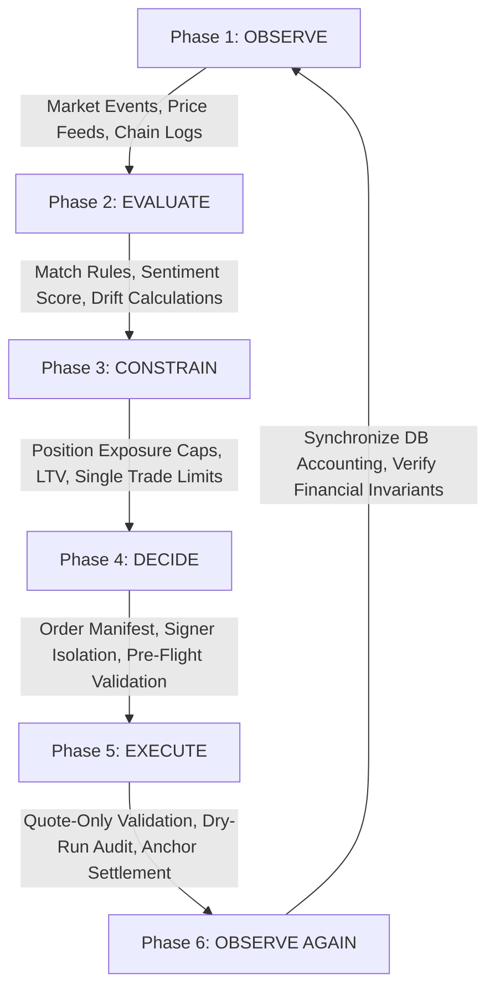

# 02. Product Model & Operational Cycle

## 1. The Autonomous Equity Vault Concept

Equity Catalyst introduces **Autonomous Equity Vaults** to the Solana ecosystem. An Autonomous Equity Vault is an on-chain smart contract (Program Derived Address) that holds tokenized assets, issues fungible LP shares representing fractional ownership of the underlying assets, and is governed by a programmable risk policy.

Unlike traditional smart contracts that require manual interaction for every portfolio modification, an Autonomous Equity Vault delegates execution rights to an **Off-Chain Policy Engine** while constraining execution authority via **On-Chain Invariant Enforcers**.

```
┌─────────────────────────────────────────────────────────────────────────────┐
│                           AUTONOMOUS VAULT MODEL                            │
│                                                                             │
│   Deposit Asset (e.g. USDC) ──► ┌────────────────────────┐                  │
│                                 │   Solana Anchor Vault  │                  │
│   Mint Vault Shares ◄────────── │   (State & Custody)    │                  │
│                                 └───────────┬────────────┘                  │
│                                             │                               │
│                         Governed by Invariant Authority                     │
│                                             ▼                               │
│                                 ┌────────────────────────┐                  │
│                                 │   On-Chain Policy PDA  │                  │
│                                 │ (Max LTV, Max Exposure)│                  │
│                                 └───────────▲────────────┘                  │
│                                             │                               │
│                         Constrained Execution Instructions                  │
│                                             │                               │
│                                 ┌───────────┴────────────┐                  │
│                                 │  Off-Chain Controller  │                  │
│                                 │ (Observe, Decide, Run) │                  │
│                                 └────────────────────────┘                  │
└─────────────────────────────────────────────────────────────────────────────┘
```

---

## 2. The Continuous Operational Cycle

The platform operates as a deterministic, closed-loop feedback system. Every decision follows a six-phase operational lifecycle:



### Phase 1: OBSERVE `[IMPLEMENTED]`
The system continuously ingests telemetry across three distinct data pipelines:
* **Market Data**: Real-time asset prices consumed from Pyth Network Hermes endpoints via `integrations/pyth`.
* **Corporate & Macro Events**: Earnings surprises, analyst revisions, and SEC EDGAR disclosures ingested into `apps/api/src/routes/events.rs` and persisted in PostgreSQL.
* **On-Chain State**: Account balances, total vault deposits, and share balances monitored over WebSocket streams via `integrations/solana/websocket.rs`.

### Phase 2: EVALUATE `[IMPLEMENTED]`
The **Policy Engine** (`apps/api/src/engines/policy_engine/`) processes newly ingested events:
* Compares incoming event metrics (e.g. EPS surprise percentage or sentiment score) against defined threshold conditions.
* Computes portfolio allocation drift:
  $$\text{drift\_bps} = |\text{current\_weight\_bps} - \text{target\_weight\_bps}|$$
* Matches deterministic rules (`PolicyRule::EarningsBeat`, `PolicyRule::EarningsMiss`, `PolicyRule::DriftRebalance`).
* Emits a standardized `PolicySignal` with target weight deltas (e.g. $+500\text{ bps}$ to NVDA).

### Phase 3: CONSTRAIN `[IMPLEMENTED]`
The **Risk Engine** (`apps/api/src/engines/risk_engine/`) acts as the defensive filter. It tests whether the proposed allocation adjustments violate safety limits:
* **Position Concentration**: Ensures no single token exceeds `policy.max_position_bps` (e.g. 35.00%).
* **Single Trade Sizing**: Guarantees that any single trade order does not exceed $10.00\%$ ($1,000\text{ bps}$) of total vault portfolio value.
* **Stop-Loss / Take-Profit Protections**: Prevents additional buy orders if an asset's price has fallen below the configured stop-loss threshold from its entry basis.
* **LTV Invariant**: Ensures vault debt does not exceed `policy.max_ltv_bps`.

### Phase 4: DECIDE `[IMPLEMENTED]`
The **Decision Engine** (`apps/api/src/engines/decision_engine/`):
* Translates approved signals into an immutable `ExecutionRequest` structure containing discrete `TradeOrder` manifests.
* Passes the request through pre-flight sanity checks (`validate_decision_preflight`).
* Assigns cryptographic authority via an isolated execution signer (`ExecutionSigner`).

### Phase 5: EXECUTE `[PARTIALLY IMPLEMENTED]`
Depending on deployment mode:
* **Quote-Only Execution** (`QuoteExecutionService`): Fetches live quotes from Jupiter v6, computes effective execution rates, validates price impact, and creates a `QUOTE_ONLY` audit record.
* **Policy Worker Dry-Run** (`PolicyWorker`): Ingests pending events from Redis/Postgres, evaluates policy and risk, logs decision telemetry, records an execution in Postgres with status `LOGGED`, and marks the event `PROCESSED`.
* **Live On-Chain Settlement**: `[PLANNED / NOT IMPLEMENTED]` — Live on-chain swaps via Anchor instructions are currently bypassed to guarantee security during initial audit phases.

### Phase 6: OBSERVE AGAIN `[IMPLEMENTED]`
Post-execution telemetry:
* Reads updated token account balances from Solana RPC.
* Verifies invariant post-conditions (total assets $\ge$ total obligations).
* Synchronizes off-chain Postgres portfolio models with on-chain truth.

---

## 3. Product Personas & Use Cases

| Persona | Primary Motivation | How Equity Catalyst Solves It |
|---|---|---|
| **Quantitative Desk / Hedge Fund** | Systematic alpha execution on tokenized equities | Defines automated rule policies that react to off-chain earnings data in milliseconds without maintaining custom custody infrastructure. |
| **DAO / Protocol Treasury** | Capital preservation & automated diversification | Allocates treasury stablecoins into a vault that automatically harvests gains and rebalances when tokenized indices drift beyond defined thresholds. |
| **Retail Robo-Investor** | Hands-off wealth building | Deposits USDC into an institutional vault, receiving liquid LP tokens that reflect a professionally managed, risk-constrained equities portfolio. |
| **Credit Provider / Lender** | Earning yield on tokenized equity collateral | Extends credit against tokenized equity vaults, protected by programmatic on-chain LTV limits and automated liquidation policies. |

---

## 4. Traditional Asset Management vs. Equity Catalyst

| Dimension | Traditional Robo-Advisor (e.g. Wealthfront, Betterment) | Traditional DeFi Vault (e.g. Yearn, Kamino) | Equity Catalyst Vault |
|---|---|---|---|
| **Underlying Assets** | Traditional equities in DTCC / broker-dealer custody | Native crypto tokens (SOL, ETH, USDC) | Tokenized equities (NVDAx, MSFTx, AAPLx) + SPL stablecoins |
| **Execution Cadence** | Daily / Weekly batch rebalancing (Market hours only) | Continuous block-by-block yield harvesting | Continuous 24/7 event-driven execution (Reacts to pre-market/after-hours news) |
| **Custody Model** | Custodial brokerage accounts (SIPC insured, but centralized) | Smart contract custody | Non-custodial Solana Anchor smart contract with pro-rata share PDAs |
| **Policy Enforcement** | Internal centralized database rules | Static contract parameters | Dual-layer: On-chain hard invariant PDAs + off-chain algorithmic engine |
| **Composability** | Zero composability | High crypto composability | High: Vault LP shares can be transferred, collateralized, or traded |

---

## 5. Summary of Implementation Boundaries

* **Fully Active**: Event ingestion, deterministic condition evaluation, drift calculations, multi-factor risk validation, isolated decision synthesis, Jupiter quote evaluation, and dry-run audit persistence.
* **Intentionally Constrained**: Live transaction broadcasting on Solana mainnet is gated behind read-only safety locks (`allow_transactions = false` by default in `SolanaService`) to prevent unintended capital loss during development.
