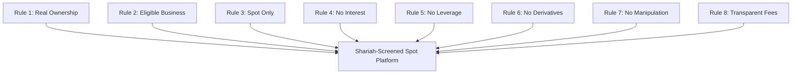

# Shariah Design Rules: Equity Catalyst

## Status & Qualification

> [!IMPORTANT]
> **Regulatory & Compliance Qualifier**:
> This platform is **designed for Shariah compliance** in alignment with internationally recognized Islamic finance principles (AAOIFI Standard No. 21 and International Islamic Fiqh Academy - IIFA resolutions).
>
> It does not claim "certified halal" until the specific token legal trust structures, statutory certificates, fees, and smart contracts have completed formal review by a qualified Shariah board.

---

## The 8 Halal-by-Design Rules

### Rule 1 — Genuine Ownership Representation (Milkiyyah)
- **Principle**: A digital token cannot merely track an index or stock price synthetically; it must represent a clearly defined undivided beneficial ownership interest in the underlying statutory shares or a legally enforceable right to statutory custody assets.
- **Reference**: IIFA Resolution No. 63 (1/7) affirms that a share represents an undivided proportionate share in the company’s capital and its net assets.
- **Enforcement in System**:
  - `OwnershipRecord` verifies custodian identity, depository registration, legal prospectus, and statutory certificate hash before an asset is registered.
  - Pure synthetic tokens without underlying asset backing are rejected at the registry boundary.

### Rule 2 — Eligible Business & Financial Screening (Tamhiz)
- **Principle**: Shares are permissible in principle provided the company’s primary activity is permissible (Halal) and its financial metrics satisfy standard threshold benchmarks (AAOIFI Financial Papers Standard No. 21).
- **Enforcement in System**:
  - **Sectoral Filter**: Prohibits companies whose core activity involves conventional financial services (interest-based banking/insurance), alcohol, tobacco, gambling, weapons, non-halal meat processing, or adult entertainment.
  - **Financial Ratios**:
    1. *Interest-Bearing Debt*: $\frac{\text{Total Interest-Bearing Debt}}{\text{Market Capitalization}} < 30\%$ (or $33\%$ per varying board standards).
    2. *Interest-Bearing Cash/Investments*: $\frac{\text{Cash \& Interest-Bearing Securities}}{\text{Market Capitalization}} < 30\%$.
    3. *Non-Permissible Income*: $\frac{\text{Impermissible Revenue}}{\text{Total Revenue}} < 5\%$.
  - Tickers failing these criteria are marked `ShariahStatus::Rejected`.

### Rule 3 — Spot Only Trading (Sarf / Bay' al-Hal)
- **Principle**: Exchange must occur on a spot basis ($T+0$). Selling what one does not own (naked shorting) or borrowing shares to sell with a promise to repurchase (covered short selling) is strictly prohibited.
- **Reference**: The Prophet (ﷺ) stated: *"Do not sell what you do not possess"* (Sunan Abi Dawud 3503).
- **Enforcement in System**:
  - Only two order actions exist: `BUY` (USDC for Token) and `SELL` (Token for USDC).
  - Borrowing, short selling, and reverse repurchase loops are eliminated from the transaction pipeline.

### Rule 4 — Zero Interest (Tahrim ar-Riba)
- **Principle**: No transaction, fee, deposit, or liquidity allocation may accrue or charge interest.
- **Enforcement in System**:
  - The lending and borrowing engine has been completely removed.
  - Collateral debt, interest calculation functions, and loan PDAs are excised from smart contracts and backend services.

### Rule 5 — Non-Leveraged Execution (La Tasleef)
- **Principle**: Trading must occur strictly with unencumbered, fully paid capital. Margin loans and leveraged multiples violate the prohibition against combining a loan with a sale (*Bay' wa Salaf*).
- **Enforcement in System**:
  - Leverage multiplier is permanently fixed at $1.0\times$ (zero leverage).
  - Trades cannot exceed available settled wallet/vault funds.

### Rule 6 — Exclusion of Derivatives & Speculative Forward Contracts (Nafy al-Gharar)
- **Principle**: Options, futures, perpetual contracts, and synthetic derivatives contain excessive uncertainty (*Gharar*) and zero-sum speculation (*Maysir*).
- **Enforcement in System**:
  - No options pricing, strike contracts, synthetic exposure, or funding-rate perpetual mechanics are implemented.

### Rule 7 — Deterministic Price Integrity (Man' an-Najash wa at-Tadlis)
- **Principle**: The system must not intentionally manipulate prices, fabricate volume, or front-run user orders.
- **Enforcement in System**:
  - Meteora Dynamic Bonding Curves enforce continuous, transparent mathematical pricing.
  - Maximum slippage bounds and price impact caps reject predatory execution.

### Rule 8 — Transparent & Unambiguous Fee Schedule (Wuduh al-Ujrah)
- **Principle**: All fees must be known, fixed or deterministically calculated, and clearly communicated prior to trade execution.
- **Enforcement in System**:
  - Every swap simulation explicitly outputs:
    1. **Pool Fee (e.g. 0.15%)**: Distributed to liquidity providers.
    2. **Platform Fee (0.05%)**: Protocol maintenance fee.
    3. **Solana Network Fee**: Exact lamports network execution fee.
  - No hidden markups or exit penalties.
