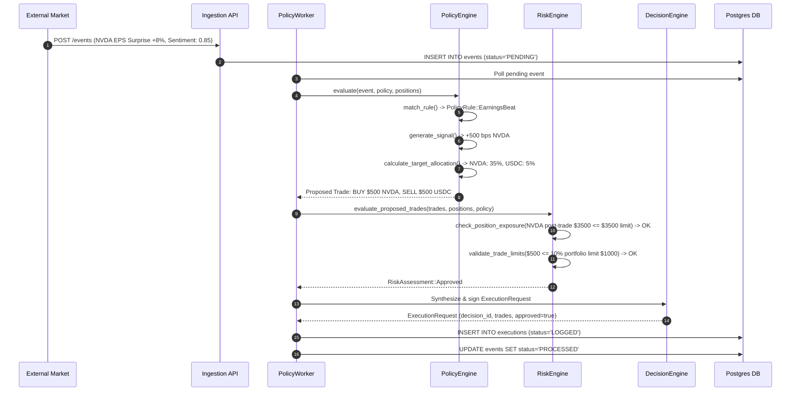

# 03. Domain Model & Entity Lifecycles

## 1. Core Domain Entities Overview

The Equity Catalyst domain model cleanly separates on-chain state, financial accounting, risk policies, market observations, and execution mandates.

```
┌─────────────────────────────────────────────────────────────────────────────┐
│                            DOMAIN ENTITY GRAPH                              │
│                                                                             │
│                   ┌───────────────────────┐                                 │
│                   │         Event         │                                 │
│                   │  (Market / Corporate) │                                 │
│                   └───────────┬───────────┘                                 │
│                               │ evaluated by                                │
│                               ▼                                             │
│  ┌───────────────┐     ┌──────────────┐     ┌──────────────┐                │
│  │     Vault     │◄───►│    Policy    │     │    Signal    │                │
│  │  (On-Chain)   │     │  (Risk Rules)│     │(Bull/Bearish)│                │
│  └───────┬───────┘     └──────────────┘     └───────┬──────┘                │
│          │                                          │                       │
│          │ contains                                 │ guides                │
│          ▼                                          ▼                       │
│  ┌───────────────┐                          ┌──────────────┐                │
│  │   Portfolio   │                          │   Decision   │                │
│  │  (Positions)  │                          │(Trade Orders)│                │
│  └───────┬───────┘                          └───────┬──────┘                │
│          │                                          │                       │
│          │ checked by                               │ initiates             │
│          ▼                                          ▼                       │
│  ┌───────────────┐                          ┌──────────────┐                │
│  │  Risk Engine  │                          │  Execution   │                │
│  │(Limits & LTV) │                          │(Quote/Settle)│                │
│  └───────────────┘                          └──────────────┘                │
└─────────────────────────────────────────────────────────────────────────────┘
```

---

## 2. Detailed Entity Specifications

### 2.1 Vault
* **What is it?**: The foundational on-chain custody and accounting anchor representing an investment fund or strategy.
* **Why does it exist?**: To hold underlying SPL assets in a non-custodial Program Derived Address (PDA), track aggregate capitalization, and issue pro-rata shares to depositors.
* **State Contained**:
  * On-Chain Anchor (`programs/equity_vault/src/state/vault.rs`): `authority: Pubkey`, `asset_mint: Pubkey`, `policy: Pubkey`, `name: String`, `symbol: String`, `total_deposits: u64`, `total_shares: u64`, `is_paused: bool`, `bump: u8`.
  * Off-Chain Database (`db/migrations/002_vaults.sql`): Mirrored in table `vaults`.
* **Who owns the state?**: The Solana Anchor program (`equity_vault`) via PDA `[b"vault", authority.key(), name.as_bytes()]`.
* **What can mutate it?**:
  * `deposit`: Increments `total_deposits` and `total_shares`.
  * `withdraw`: Decrements `total_deposits` and `total_shares`.
  * `emergency_exit`: Mutates `is_paused` flag (Authority only).
* **Important Invariants**:
  * $S_{\text{total}} = 0 \iff D_{\text{total}} = 0$.
  * If $S_{\text{total}} > 0$, then share price $\frac{D_{\text{total}}}{S_{\text{total}}} > 0$.
  * If `is_paused == true`, deposits and withdrawals MUST be rejected.
* **What happens if invariant is violated?**: Anchor returns error code `VaultIsPaused` or `ZeroSharesMinted`, halting transaction execution.

---

### 2.2 Policy
* **What is it?**: The risk configuration and governance rulebook governing vault operations.
* **Why does it exist?**: To establish hard parameters preventing an algorithmic strategy from taking excessive leverage, suffering runaway slippage, or over-concentrating in single assets.
* **State Contained**:
  * On-Chain Anchor (`programs/equity_vault/src/state/policy.rs`): `vault: Pubkey`, `authority: Pubkey`, `max_ltv_bps: u16`, `max_position_bps: u16`, `stop_loss_bps: u16`, `take_profit_bps: u16`, `rebalance_threshold_bps: u16`, `is_active: bool`.
  * Off-Chain Database (`db/migrations/003_policies.sql`): Mirrored in table `policies`.
* **Who owns the state?**: The on-chain PDA `[b"policy", vault.key()]`.
* **What can mutate it?**: Vault authority via the `update_policy` instruction.
* **Important Invariants**:
  * $\text{max\_position\_bps} \le 10,000\text{ bps}$ ($100.00\%$).
  * $\text{max\_ltv\_bps} \le 10,000\text{ bps}$.
  * Invariants verified in `crates/shared/src/validation.rs`.
* **What happens if invariant is violated?**: Throws `InvalidBasisPoints` or on-chain `PolicyLimitsExceeded`.

---

### 2.3 Position & Portfolio
* **What is it?**: `Position` represents the vault's holding of an individual asset (e.g. NVDAx). `Portfolio` is the aggregated collection of all positions belonging to a vault.
* **Why does it exist?**: To calculate net asset value (NAV), track cost basis, measure drift from target weights, and evaluate stop-loss triggers.
* **State Contained**:
  * On-Chain Struct (`programs/equity_vault/src/state/position.rs`): `vault: Pubkey`, `asset_mint: Pubkey`, `amount: u64`, `entry_price: u64`, `current_value: u64`, `is_active: bool`.
  * Database Model (`db/migrations/006_portfolios.sql`): `portfolio_id: Uuid`, `vault_address: String`, `asset_symbol: String`, `asset_mint: String`, `amount: i64`, `entry_price_usd: f64`, `current_price_usd: f64`, `current_value_usd: f64`, `target_weight_bps: i32`, `current_weight_bps: i32`.
* **Who owns the state?**: Off-chain Postgres database synchronized with Solana SPL token accounts.
* **What can mutate it?**: Rebalance executions, deposits/withdrawals, and price oracle update cycles.
* **Important Invariants**:
  * $\sum \text{target\_weight\_bps} = 10,000\text{ bps}$ ($100.00\%$).
  * Any asset with amount $> 0$ must have non-zero valuation.
* **What happens if invariant is violated?**: `AllocationTarget::new` rejects the vector with `WeightsDoNotSumTo100Percent`.

---

### 2.4 Event
* **What is it?**: A structured, discrete data record originating from an external source (news, earnings, oracle update).
* **Why does it exist?**: To serve as the deterministic stimulus that triggers policy evaluation.
* **State Contained** (`db/migrations/004_events.sql`):
  * `event_id: Uuid`, `vault_address: Option<String>`, `event_type: String`, `source: String`, `sentiment_score: Option<f64>`, `payload: JsonValue`, `status: String`, `detected_at: DateTime<Utc>`, `processed_at: Option<DateTime<Utc>>`.
* **Who owns the state?**: Ingestion service and `EventRepository` in Postgres.
* **What can mutate it?**: Ingestion endpoint (`POST /events`) creates it with status `PENDING`. `PolicyWorker` transitions status to `PROCESSED`.
* **Important Invariants**:
  * Status transitions are strictly forward: `PENDING → PROCESSED` or `PENDING → FAILED`.
  * Events marked `PROCESSED` must NEVER be re-processed (Idempotency invariant).
* **What happens if invariant is violated?**: `PolicyWorker` detects replay and terminates with warning log without executing trades.

---

### 2.5 Signal
* **What is it?**: An intermediate evaluation result emitted by the Policy Engine.
* **Why does it exist?**: To decouple abstract market conditions from concrete execution orders.
* **State Contained** (`apps/api/src/engines/policy_engine/signals.rs`):
  * `signal_type: SignalType` (`Bullish`, `Bearish`, `Neutral`, `RebalanceRequired`, `EmergencyExit`).
  * `symbol: Option<String>`.
  * `weight_delta_bps: i16`.
  * `reason: String`.
* **Who owns the state?**: Transient in-memory value returned by `PolicyEngine::evaluate`.
* **What can mutate it?**: Pure function `generate_signal(rule: PolicyRule)`.
* **Important Invariants**: Target delta adjustments must be bounded within $[-10,000, 10,000]$ bps.

---

### 2.6 Decision & Execution Request
* **What is it?**: A finalized, validated trade order manifest ready for dispatch.
* **Why does it exist?**: To bridge off-chain quantitative analysis with cryptographic transaction signing.
* **State Contained** (`apps/api/src/engines/decision_engine/decision.rs`):
  * `decision_id: Uuid`, `vault_address: String`, `event_id: Option<Uuid>`, `action: String`, `trades: Vec<TradeOrder>`, `approved: bool`, `rationale: String`, `timestamp: DateTime<Utc>`.
* **Who owns the state?**: `DecisionEngine`.
* **What can mutate it?**: Pre-flight validation (`validate_decision_preflight`) and Risk Engine approval.
* **Important Invariants**:
  * An approved decision with action other than `NOOP` MUST contain at least one valid trade.
  * An approved decision MUST reference an active, non-paused vault.
* **What happens if invariant is violated?**: Decision status set to `approved = false` with explanatory rationale.

---

### 2.7 Risk Assessment
* **What is it?**: The structured defense evaluation verdict produced by the Risk Engine.
* **Why does it exist?**: To prevent invalid, catastrophic, or policy-violating orders from reaching execution.
* **State Contained** (`apps/api/src/engines/risk_engine/mod.rs`):
  * `RiskAssessment::Approved` or `RiskAssessment::Rejected { reason: String }`.
* **Who owns the state?**: Pure evaluation within `RiskEngine::evaluate_proposed_trades`.
* **What can mutate it?**: Evaluated deterministically against position exposure, policy caps, and LTV.
* **Important Invariants**: If any individual risk check fails, the entire proposed trade bundle is rejected.

---

### 2.8 Execution Record
* **What is it?**: The immutable audit log of a trade evaluation or transaction submission.
* **Why does it exist?**: To guarantee full accounting transparency, track price impact, and maintain on-chain transaction hashes.
* **State Contained** (`db/migrations/005_executions.sql`):
  * `execution_id: Uuid`, `vault_address: String`, `event_id: Option<Uuid>`, `action: String`, `input_mint: String`, `output_mint: String`, `amount_in: i64`, `amount_out_expected: i64`, `amount_out_actual: Option<i64>`, `slippage_bps: i32`, `tx_signature: Option<String>`, `status: String` (`PENDING`, `LOGGED`, `QUOTE_ONLY`, `CONFIRMED`, `FAILED`), `error_message: Option<String>`, `executed_at: DateTime<Utc>`.
* **Who owns the state?**: Postgres database table `executions`.
* **What can mutate it?**: `PolicyWorker` creates `LOGGED` records. `QuoteExecutionService` creates `QUOTE_ONLY` records.
* **Important Invariants**: Records are append-only. Only confirmation signatures or terminal error messages can update an existing record.

---

### 2.9 Loan & LTV `[PARTIALLY IMPLEMENTED]`
* **What is it?**: Vault credit facility allowing borrowing against portfolio equity collateral.
* **Why does it exist?**: Enables capital efficiency and leveraged hedging.
* **State Contained** (`programs/equity_vault/src/state/loan.rs`):
  * `vault: Pubkey`, `borrower: Pubkey`, `collateral_mint: Pubkey`, `collateral_amount: u64`, `borrowed_amount: u64`, `ltv_bps: u16`, `interest_rate_bps: u16`, `is_active: bool`.
* **Current Status**: Account struct exists in Anchor program and SDK has `CreditClient`, but on-chain borrow/repay instruction handlers are `[PLANNED / NOT IMPLEMENTED]`.

---

## 3. End-to-End Business Flow Walkthrough

To demonstrate how the domain entities interact in real execution, we trace the exact scenario specified in product requirements.

### 3.1 Initial Scenario State
* **Vault Capitalization**: $\$10,000\text{ USD}$
* **Current Allocation**:
  * $\text{NVDAx} = 30.00\%$ ($3,000\text{ bps}$, $\$3,000$)
  * $\text{MSFTx} = 25.00\%$ ($2,500\text{ bps}$, $\$2,500$)
  * $\text{GOOGLx} = 20.00\%$ ($2,000\text{ bps}$, $\$2,000$)
  * $\text{AMZNx} = 15.00\%$ ($1,500\text{ bps}$, $\$1,500$)
  * $\text{USDC} = 10.00\%$ ($1,000\text{ bps}$, $\$1,000$)
* **Configured Vault Policy**:
  * `max_position_bps = 3500` ($35.00\%$)
  * `rebalance_threshold_bps = 200` ($2.00\%$)
  * Rule: If NVDA earnings surprise $> 5\%$, expand NVDA target allocation by $+5.00\%$ ($+500\text{ bps}$) funded from USDC.

---

### 3.2 Step-by-Step Pipeline Execution Trace



1. **Event Ingestion**:
   * External event payload arrives via `POST /events`:
     ```json
     {
       "vault_address": "8NhtqxR1mwq7a3HTUtcGABNZ3KWzQi9KM3fXu3rHS8LH",
       "event_type": "earnings_beat",
       "source": "Bloomberg / SEC",
       "sentiment_score": 0.85,
       "payload": { "symbol": "NVDA", "surprise_pct": 8.0 }
     }
     ```
   * Stored in `events` table with `status = 'PENDING'`.

2. **Policy Matching (`apps/api/src/engines/policy_engine/rules.rs`)**:
   * Evaluates `event_type == "earnings_beat"` and `sentiment_score (0.85) > 0.2`.
   * Matches `PolicyRule::EarningsBeat { symbol: "NVDA", sentiment: 0.85 }`.

3. **Signal Generation (`apps/api/src/engines/policy_engine/signals.rs`)**:
   * Emits `PolicySignal`:
     * `signal_type`: `SignalType::Bullish`
     * `symbol`: `"NVDA"`
     * `weight_delta_bps`: `+500` ($+5.00\%$)
     * `reason`: `"Bullish event on NVDA with positive sentiment score 0.85"`

4. **Target Allocation Calculation (`apps/api/src/engines/policy_engine/allocation.rs`)**:
   * Target weight adjustments applied:
     * NVDA target: $3,000 + 500 = 3,500\text{ bps}$ ($35.00\%$, target value $\$3,500$).
     * USDC target: $1,000 - 500 = 500\text{ bps}$ ($5.00\%$, target value $\$500$).
     * MSFT, GOOGL, AMZN remain unchanged.
     * Total sum verified: $3,500 + 2,500 + 2,000 + 1,500 + 500 = 10,000\text{ bps}$ ($100.00\%$).
   * Proposed trades generated via `calculate_rebalance_plan`:
     * `RebalanceTrade { symbol: "NVDA", is_buy: true, trade_value: 500 }`
     * `RebalanceTrade { symbol: "USDC", is_buy: false, trade_value: 500 }`

5. **Risk Engine Validation (`apps/api/src/engines/risk_engine/mod.rs`)**:
   * **Exposure Check**: Post-trade NVDA value is $\$3,500$. Portfolio total is $\$10,000$. Exposure is $35.00\%$. Policy `max_position_bps` is $3,500$ ($35.00\%$). Result: **PASS** ($3,500 \le 3,500$).
   * **Single Trade Sizing Limit**: Trade size is $\$500$. Max allowed single trade is $10.00\%$ of $\$10,000$ = $\$1,000$. Result: **PASS** ($\$500 \le \$1,000$).
   * **Debt / LTV Check**: Vault debt is $\$0$. Result: **PASS**.
   * **Stop-Loss Check**: NVDA entry price is $\$120.00$, current price is $\$129.60$ ($+8\%$). Stop loss is not triggered. Result: **PASS**.
   * Outcome: `RiskAssessment::Approved`.

6. **Decision Creation (`apps/api/src/engines/decision_engine/mod.rs`)**:
   * Generates `ExecutionRequest` with `approved = true`.
   * Signed by isolated `ExecutionSigner`.

7. **Where the Current Implementation Stops**:
   * **In `PolicyWorker` (`apps/api/src/workers/policy_worker.rs:125`)**: The worker logs:
     ```text
     Policy Worker evaluated decision — TRADE EXECUTION SUPPRESSED (DRY-RUN MODE)
     ```
   * It persists the execution record in Postgres `executions` with status `LOGGED`.
   * It updates the event in Postgres to `PROCESSED`.
   * **No live on-chain swap transaction is dispatched**. The pipeline safely terminates at the audit boundary.
