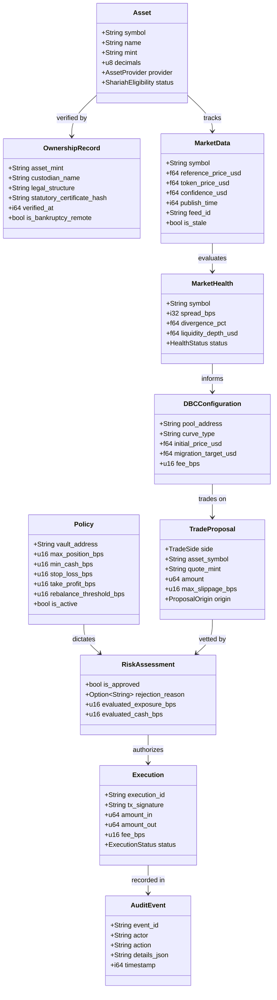

# Domain Model: Shariah-Screened Spot Equity Catalyst

## Overview

The updated domain model defines pure spot market entities for tokenized statutory equities on Solana, completely removing debt, LTV, loan, leverage, and interest concepts.



---

## 1. Core Entities

### 1. `Asset`
Represents a tokenized equity asset on Solana.
- `symbol`: Ticker (e.g., `NVDAx`, `AAPLx`, `SPYx`).
- `name`: Statutory asset name.
- `mint`: Solana SPL token mint address.
- `decimals`: Token decimals (standard 6 to 8).
- `provider`: Legal issuer/tokenization provider (`Backed`, `PreStocks`, `Tessera`).
- `status`: Shariah screening qualification (`Eligible`, `NonCompliant`, `PendingReview`).

### 2. `OwnershipRecord`
Attestation of genuine underlying ownership backing.
- `asset_mint`: Corresponding token mint address.
- `custodian_name`: Regulated custodian holding statutory shares.
- `legal_structure`: Regulatory prospectus / Swiss DLT / statutory trust structure.
- `statutory_certificate_hash`: Cryptographic hash of depositary certificate.
- `verified_at`: Timestamp of latest third-party audit verification.
- `is_bankruptcy_remote`: Flag verifying legal segregation from custodian balance sheet.

### 3. `MarketData`
Live and historical price feeds ingested from Pyth Pro and Pyth Lazer.
- `symbol`: Equity ticker symbol.
- `reference_price_usd`: Authoritative off-chain equity price from Pyth Hermes / Lazer.
- `token_price_usd`: On-chain DEX / DBC pool price.
- `confidence_usd`: Pyth confidence bound ($\pm \text{USD}$).
- `publish_time`: Unix epoch timestamp of oracle update.
- `feed_id`: Pyth canonical feed ID.
- `is_stale`: Boolean flag ($\Delta t > 60\text{s}$).

### 4. `MarketHealth`
Continuous assessment of market condition and alignment.
- `symbol`: Asset ticker.
- `spread_bps`: Basis points difference between token spot price and Pyth reference:
  $$\text{spread\_bps} = \frac{\text{token\_price} - \text{ref\_price}}{\text{ref\_price}} \times 10,000$$
- `divergence_pct`: Normalized absolute deviation percentage.
- `liquidity_depth_usd`: Total available spot liquidity in dynamic bonding curve.
- `status`: `HEALTH_OPTIMAL`, `HEALTH_DEGRADED`, or `HEALTH_CRITICAL`.

### 5. `DBCConfiguration`
Parameters governing Meteora Dynamic Bonding Curves.
- `pool_address`: Solana on-chain DBC pool account address.
- `curve_type`: Calibrated profile (`equity_discovery` or `conservative_equity`).
- `initial_price_usd`: Starting price on bonding curve.
- `migration_target_usd`: Market cap target for graduation to Meteora DAMM v2.
- `fee_bps`: Curve swap fee (e.g. 15 bps = 0.15%).

### 6. `Policy`
Risk management parameters for a spot vault or managed portfolio.
- `vault_address`: On-chain vault identifier.
- `max_position_bps`: Maximum portfolio allocation to any single asset (e.g. 2,500 bps = 25%).
- `min_cash_bps`: Minimum unencumbered liquidity reserve in USDC (e.g. 1,000 bps = 10%).
- `stop_loss_bps`: Maximum permissible drawdown before defensive spot liquidation.
- `take_profit_bps`: Target upside rebalance threshold.
- `rebalance_threshold_bps`: Allocation drift required to trigger portfolio adjustment.
- `is_active`: Operational toggle.

### 7. `RiskAssessment`
Deterministic pre-execution verification verdict.
- `is_approved`: Binary verdict.
- `rejection_reason`: Explicit explanatory string if rejected.
- `evaluated_exposure_bps`: Post-trade projected asset concentration.
- `evaluated_cash_bps`: Post-trade remaining unencumbered USDC.

### 8. `TradeProposal`
Standardized atomic trade request:
```json
{
  "side": "BUY",
  "asset_symbol": "NVDAx",
  "quote_mint": "EPjFWdd5AufqSSqeM2qN1xzybapC8G4wEGGkZwyTDt1v",
  "amount": 500000000,
  "max_slippage_bps": 50,
  "origin": "AI_CONTROLLER_SUGGESTION"
}
```

### 9. `Execution`
On-chain spot transaction record.
- `execution_id`: UUID.
- `tx_signature`: Solana blockchain transaction signature.
- `amount_in`: Input tokens spent (USDC or equity tokens).
- `amount_out`: Output tokens received.
- `fee_bps`: Aggregate fees deducted.
- `status`: `Simulated`, `Submitted`, `Confirmed`, `Failed`.

### 10. `AuditEvent`
Immutable operational log entry detailing who, what, when, and exact execution outcome.
