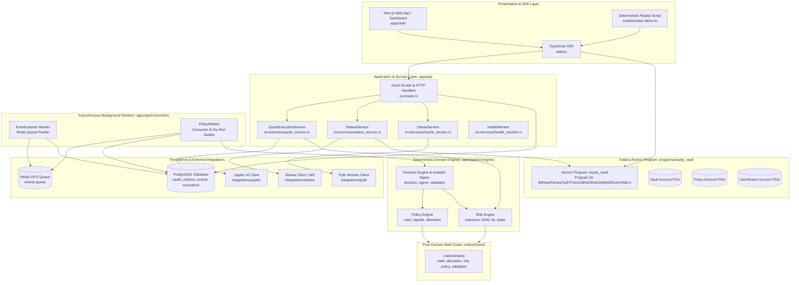

# 04. System Architecture

## 1. High-Level Architecture Overview

The architecture of Equity Catalyst separates state custody, off-chain quantitative computation, external integration, and user presentation into distinct operational layers.

---

## 2. Structural Reality Check: Actual vs Scaffolded Components

A critical architectural responsibility is acknowledging the exact state of the repository:

1. **`apps/api/src/engines/portfolio_engine/` and `event_engine/`**:
   * *Actual State*: These folders are empty directories in `apps/api/src/engines/`.
   * *Actual Location of Logic*:
     * Event ingestion is implemented directly in `apps/api/src/routes/events.rs` and the `EventListener` worker (`apps/api/src/workers/event_listener.rs`).
     * Portfolio rebalancing mathematics, drift calculations, and trade sizing are implemented in the pure shared crate `crates/shared/src/allocation.rs` and imported by `apps/api/src/engines/policy_engine/allocation.rs`.
2. **On-Chain Anchor Program Instructions**:
   * *Actual State*: On-chain instructions exist for `initialize_vault`, `deposit`, `withdraw`, `update_policy`, and `emergency_exit`.
   * *Scaffolded State*: The structs `Position`, `Loan`, and `Execution` exist in `programs/equity_vault/src/state/`, and `integrations/solana/anchor_client.rs` defines instruction builders for `execute_action`, `borrow`, and `repay`. However, the Anchor program does not yet expose instruction handlers for these operations.

---

## 3. Comprehensive Component Specifications

### 3.1 Next.js Web Application (`apps/web`)
* **Responsibility**: Provides the responsive graphical user interface for depositors and portfolio managers.
* **Inputs**: User wallet connection (Phantom, Solflare), user configuration inputs, API JSON streams.
* **Outputs**: Anchor deposit/withdraw transactions sent to Solana, policy update requests, demo replays.
* **Dependencies**: `@solana/web3.js`, `@solana/wallet-adapter-react`, Redux Toolkit, Tailwind CSS, Lucide icons.
* **State**: Client-side Redux store (`vaultsSlice`, `portfolioSlice`, `eventsSlice`, `policySlice`).
* **Failure Modes**: Disconnected wallet, RPC network errors, stale cache.
* **Testing Strategy**: Component unit tests and end-to-end Cypress/Playwright flows.

### 3.2 TypeScript SDK (`sdk`)
* **Responsibility**: Programmatic client library facilitating communication with the on-chain Anchor program and Axum backend.
* **Inputs**: Connection URL, program ID, user Keypair / Wallet adapter.
* **Outputs**: Signed serialized transactions, typed domain models.
* **Dependencies**: `@solana/web3.js`, `@solana/spl-token`, `bn.js`.
* **State**: Stateless orchestrator wrapping sub-clients (`VaultsClient`, `PoliciesClient`, etc.).
* **Testing Strategy**: Jest integration test suite in `sdk/tests/sdk.test.ts`.

### 3.3 Axum REST API (`apps/api`)
* **Responsibility**: REST endpoints for querying portfolio status, ingesting events, evaluating quotes, and reading oracle data.
* **Inputs**: HTTP REST requests on port 8080.
* **Outputs**: JSON responses, database inserts/updates.
* **Dependencies**: `axum`, `tokio`, `deadpool-postgres`, `tower-http`, `tracing`.
* **State**: Shared `Arc<AppState>` holding database pool, Redis client, Solana service, and quote service.
* **Failure Modes**: Postgres connection exhaustion, unhandled deserialization errors.
* **Testing Strategy**: Integration test suite in `apps/api/tests/api_endpoints_test.rs`.

### 3.4 Shared Deterministic Crate (`crates/shared`)
* **Responsibility**: Pure mathematical foundation for basis points, LTV, exposure checking, rebalance calculations, and risk limits.
* **Inputs**: Numeric amounts, basis points parameters, asset snapshots.
* **Outputs**: `Result<T, ValidationError>`, rebalancing trade plans, risk assessments.
* **Dependencies**: `serde`, `thiserror`. **Zero async runtimes, zero I/O, zero network**.
* **State**: Purely functional and stateless.
* **Failure Modes**: Arithmetic overflow, division by zero, invalid percentages.
* **Testing Strategy**: Comprehensive unit tests in `crates/shared/` covering boundary conditions.

### 3.5 Policy Engine (`apps/api/src/engines/policy_engine`)
* **Responsibility**: Matches incoming events against policy rules, computes portfolio drift, and calculates target asset weights.
* **Inputs**: `EventModel`, `PolicyModel`, list of `PortfolioModel`, total portfolio USD valuation.
* **Outputs**: `PolicyEvaluationResult` containing matched `PolicyRule`, emitted `PolicySignal`, `AllocationTarget`, and proposed `Vec<RebalanceTrade>`.
* **Dependencies**: `crates/shared`.
* **State**: Stateless engine instantiated per evaluation.

### 3.6 Risk Engine (`apps/api/src/engines/risk_engine`)
* **Responsibility**: Validates proposed rebalance orders against position concentration caps, single-trade limits (10% max), LTV boundaries, and stop-loss levels.
* **Inputs**: Proposed trades, portfolio positions, policy parameters, total USD portfolio value, total debt.
* **Outputs**: `RiskAssessment::Approved` or `RiskAssessment::Rejected { reason }`.
* **Dependencies**: `crates/shared`.
* **State**: Stateless evaluation pipeline.

### 3.7 Decision Engine (`apps/api/src/engines/decision_engine`)
* **Responsibility**: Coordinates Policy and Risk engines into a signed `ExecutionRequest` structure.
* **Inputs**: Ingested event, vault record, policy record, portfolio positions.
* **Outputs**: `ExecutionRequest` signed by `ExecutionSigner`.
* **Dependencies**: `PolicyEngine`, `RiskEngine`, `ExecutionSigner`.
* **State**: Isolated cryptographic keypair loaded from disk or deterministic seed.

### 3.8 Asynchronous Workers (`apps/api/src/workers`)
* **EventListener (`event_listener.rs`)**:
  * Pushes ingested events into Redis FIFO queue (`events:queue`) or falls back to Postgres.
* **PolicyWorker (`policy_worker.rs`)**:
  * Consumes events, coordinates the decision pipeline, logs execution decisions (`status = 'LOGGED'`), and marks events `PROCESSED`.
  * Operates in **Dry-Run Mode**: suppresses live transaction submission.

### 3.9 Integration Crates (`integrations/`)
* **`integrations/solana`**: Implements RPC queries, WebSocket account/log subscriptions, and Anchor client builders.
* **`integrations/pyth`**: Connects to Pyth Network Hermes REST API for real-time price feeds.
* **`integrations/jupiter`**: Interacts with Jupiter v6 Quote & Swap API, parses price impact, and builds swap instructions.
