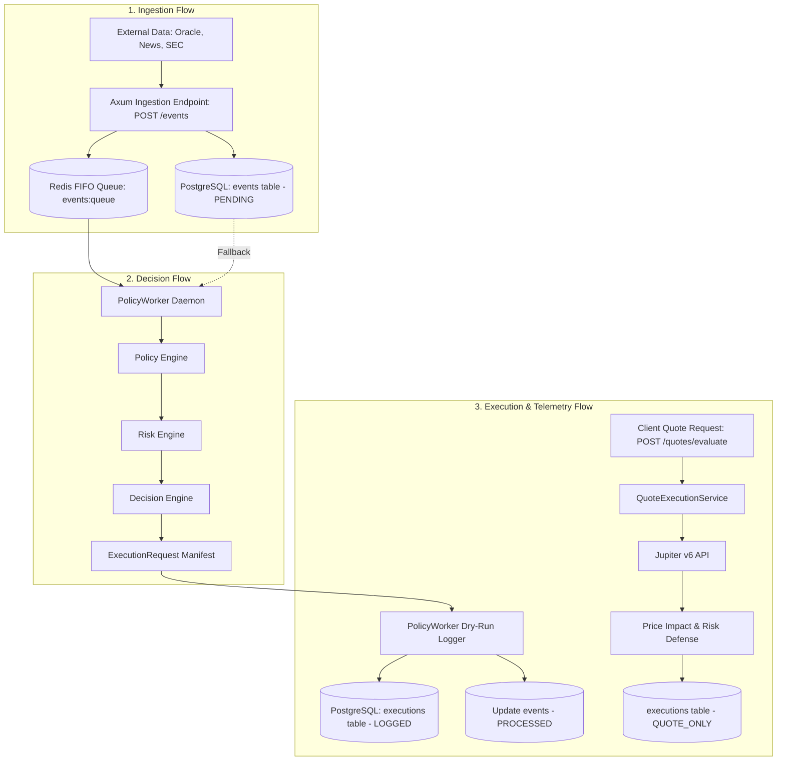
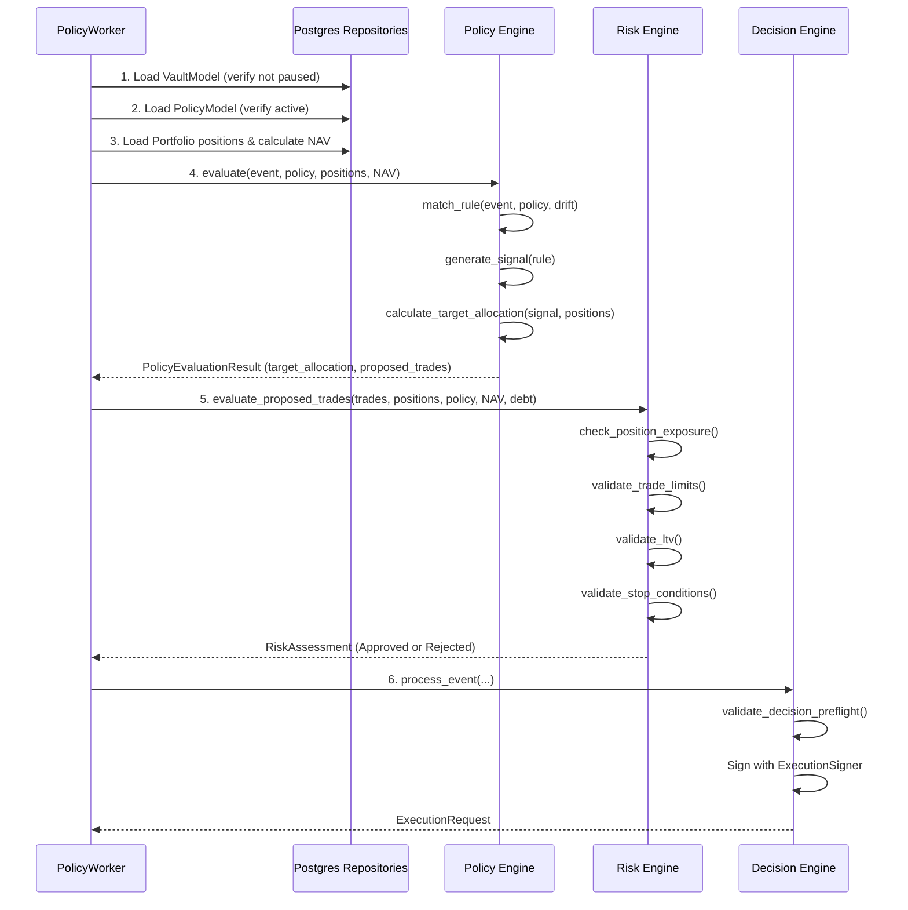
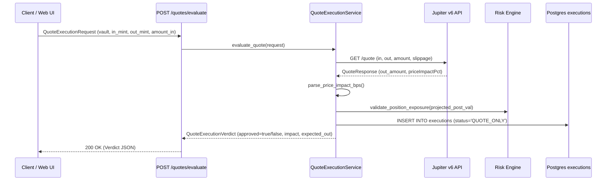

# 05. Data Flow & Business Pipelines

## 1. End-to-End Data Pipeline Architecture

Equity Catalyst manages three distinct primary data flows:
1. **Event Ingestion Flow**: How raw external market stimuli enter the system and are normalized.
2. **Decision Synthesis Flow**: How normalized events are transformed into validated trade manifests.
3. **Execution & Telemetry Flow**: How trades are evaluated via quotes, dry-run audited, and reflected back into on-chain state.



---

## 2. Pipeline 1: Event Ingestion Flow

```
External Data Sources
  ├── Financial News / SEC Filings (Earnings Reports, Surprises)
  ├── Pyth Hermes Price Updates (Extreme Volatility, Price Swings)
  └── User Rebalance Schedules (Periodic Cron)
          │
          ▼
Axum Router: POST /events (`apps/api/src/routes/events.rs`)
  ├── Schema Validation (UUID, event_type, sentiment_score, JSON payload)
  ├── Database Persistence: `EventRepository::create`
  │     └── INSERT INTO events (status = 'PENDING', detected_at = NOW())
  └── Queue Push (`apps/api/src/workers/event_listener.rs`)
        └── LPUSH events:queue <EventModel JSON>
```

### Event Payload Structure
```json
{
  "event_id": "9b1deb4d-3b7d-4bad-9bdd-2b0d7b3dcb6d",
  "vault_address": "8NhtqxR1mwq7a3HTUtcGABNZ3KWzQi9KM3fXu3rHS8LH",
  "event_type": "earnings_beat",
  "source": "Bloomberg Terminal",
  "sentiment_score": 0.85,
  "payload": {
    "symbol": "NVDA",
    "eps_actual": 0.68,
    "eps_estimate": 0.64,
    "surprise_pct": 8.0
  },
  "status": "PENDING"
}
```

---

## 3. Pipeline 2: Decision Synthesis Flow

The decision pipeline is driven by `PolicyWorker` in `apps/api/src/workers/policy_worker.rs`:



### Critical Flow Control Rules:
1. **Idempotency Guard**: If `event.status == "PROCESSED"`, the worker aborts immediately:
   ```rust
   if event.status == "PROCESSED" {
       warn!(event_id = %event.event_id, "Idempotency guard: Event has already been processed");
       return Err(ApiError::BadRequest(...));
   }
   ```
2. **Circuit Breaker Guard**: If `vault.is_paused == true`, pre-flight validation rejects decision synthesis.
3. **Emergency Halt Handling**: If `signal.signal_type == SignalType::EmergencyExit`, `calculate_target_allocation` generates trades selling all non-USDC assets into USDC (100% cash target).

---

## 4. Pipeline 3: Execution & Audit Telemetry Flow

The repository provides two execution pathways, both engineered with strict dry-run safety:

### Mode A: Automated Policy Worker Processing (`PolicyWorker`)
* Consumes events asynchronously.
* Completes full Policy $\to$ Risk $\to$ Decision evaluation.
* **Dry-Run Enforcement**: In accordance with system safety specifications, live swap submission is suppressed.
* **Audit Persistence**: Inserts an execution record into `executions` with status `LOGGED`:
  ```sql
  INSERT INTO executions (
      execution_id, vault_address, event_id, action, input_mint, output_mint,
      amount_in, amount_out_expected, slippage_bps, status, error_message, executed_at
  ) VALUES (
      'dec_uuid', 'vault_pda', 'evt_uuid', 'REBALANCE', 'USDC_mint', 'NVDA_mint',
      500000000, 500000000, 100, 'LOGGED', NULL, NOW()
  );
  ```
* Updates event status:
  ```sql
  UPDATE events SET status = 'PROCESSED', processed_at = NOW() WHERE event_id = 'evt_uuid';
  ```

### Mode B: Interactive Quote-Only Evaluation (`QuoteExecutionService`)
* Invoked via `POST /quotes/evaluate`.
* Queries the live Jupiter v6 routing engine for real-time liquidity and routes.
* Parses `priceImpactPct` into basis points.
* Checks price impact against `policy.rebalance_threshold_bps`.
* Validates projected position exposure.
* Records execution audit record with status `QUOTE_ONLY` (if approved) or `REJECTED`.
* Returns structured `QuoteExecutionVerdict` to the client.


