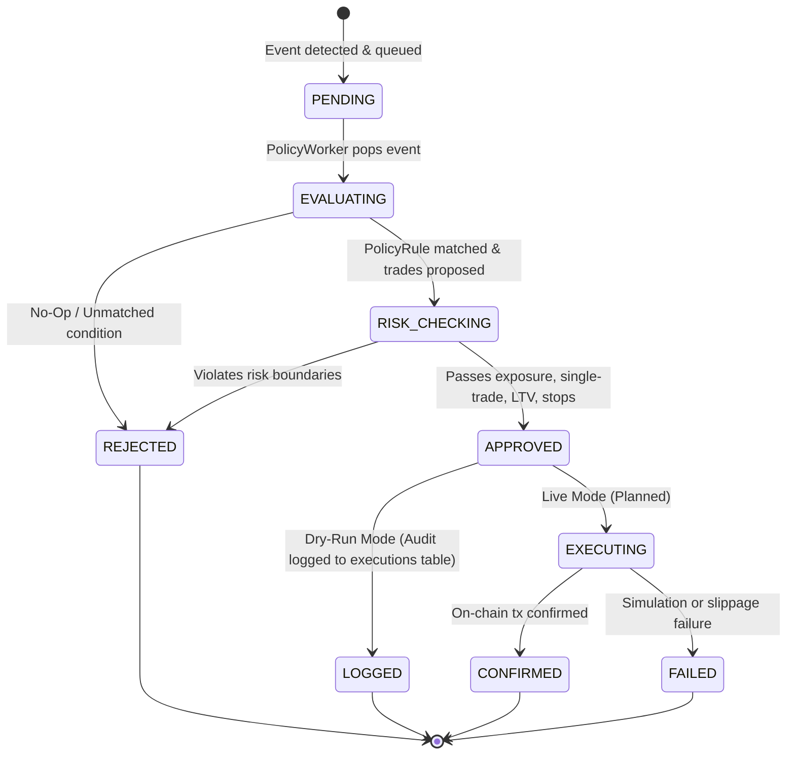
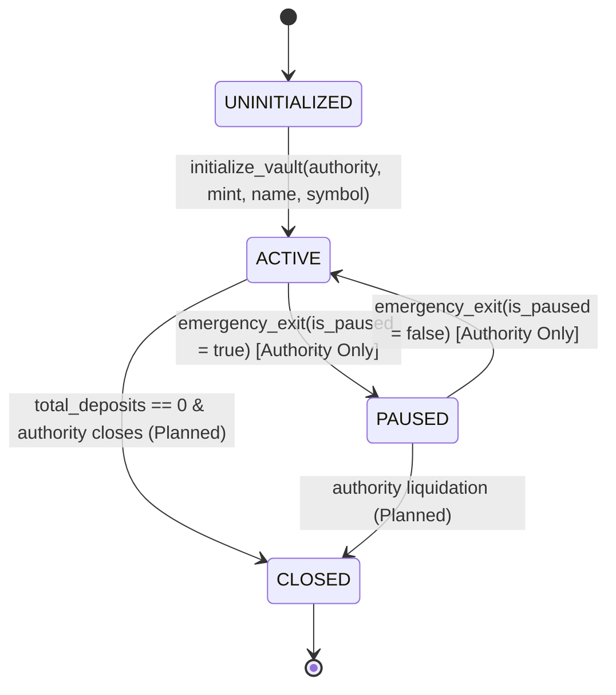
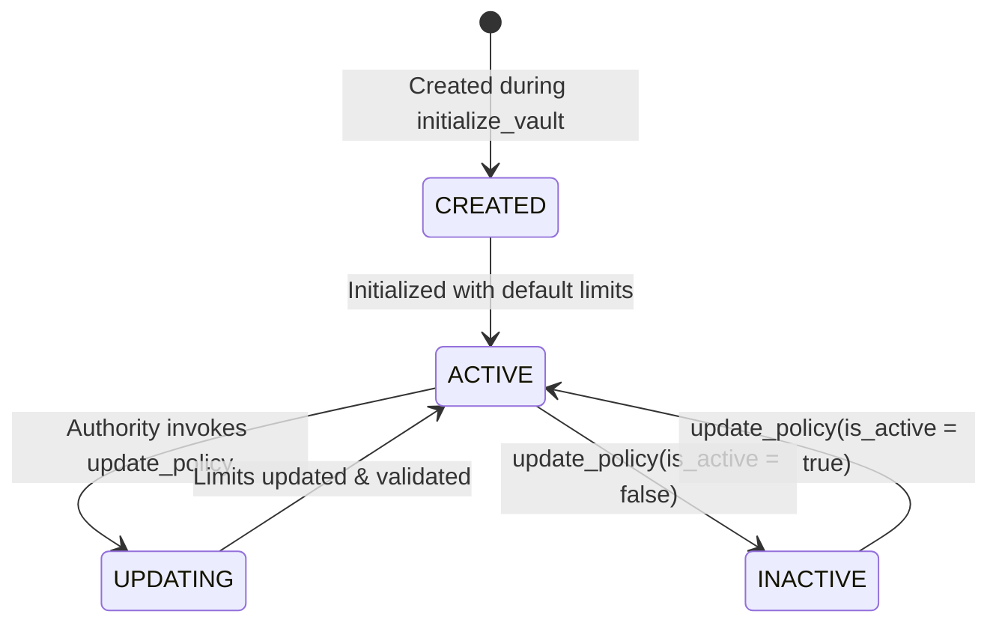
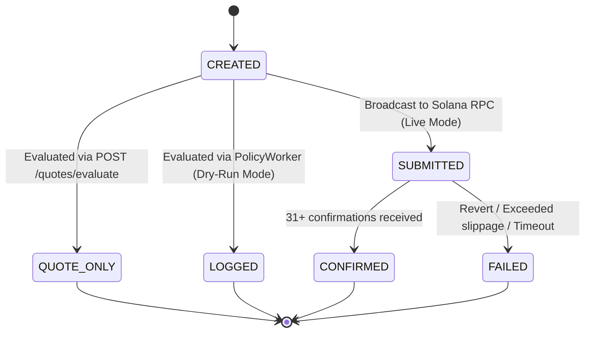
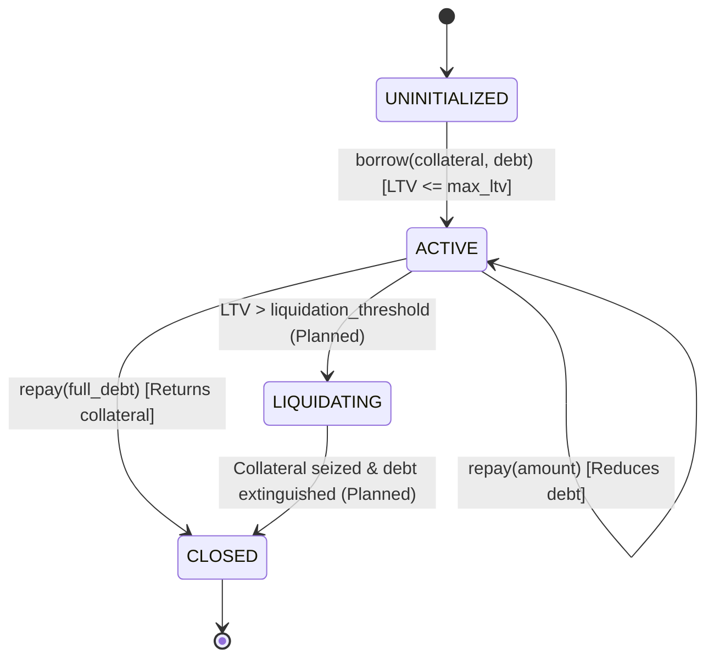

# 06. State Machines & Entity Lifecycles

## 1. Decision Lifecycle State Machine

The Decision Lifecycle represents the progression of an analytical order proposal from its initial synthesis through risk validation, approval or rejection, and final persistence.



### State Definitions & Transitions

| State | Meaning | Transition Owner | Persistence |
|---|---|---|---|
| **`PENDING`** | Event ingested and waiting in queue | `POST /events` | Postgres `events (status = 'PENDING')`, Redis |
| **`EVALUATING`** | Active evaluation by PolicyEngine | `PolicyWorker` | In-memory |
| **`RISK_CHECKING`**| Proposed trades under review by RiskEngine | `RiskEngine` | In-memory |
| **`APPROVED`** | All policy and risk constraints passed | `DecisionEngine` | In-memory `ExecutionRequest (approved = true)` |
| **`REJECTED`** | Risk violation or invalid pre-flight check | `RiskEngine` / `DecisionEngine` | Postgres `executions (status = 'REJECTED')` |
| **`LOGGED`** | Decision recorded in audit log without live trade | `PolicyWorker` | Postgres `executions (status = 'LOGGED')` |
| **`QUOTE_ONLY`** | Evaluated via Jupiter quote endpoint | `QuoteExecutionService`| Postgres `executions (status = 'QUOTE_ONLY')` |
| **`CONFIRMED`** | Transaction finalized on Solana cluster | `SolanaService` (Future) | Postgres `executions (status = 'CONFIRMED')` |
| **`FAILED`** | Transaction reverted or timed out | `SolanaService` (Future) | Postgres `executions (status = 'FAILED')` |

* **Invalid Transitions**:
  * `REJECTED → APPROVED`: Once rejected by the Risk Engine, a decision cannot be retroactively approved.
  * `LOGGED → EXECUTING`: In dry-run mode, a logged execution is terminal.
  * `PROCESSED → PENDING`: Events cannot re-enter the pending state.

---

## 2. Vault Lifecycle State Machine

The Vault Lifecycle governs the operational availability of user capital, share minting, and withdrawal rights on-chain.



### State Constraints & Invariants

```text
┌─────────────────────────────────────────────────────────────────────────────┐
│                          VAULT STATE CONSTRAINTS                            │
│                                                                             │
│   STATE: ACTIVE                                                             │
│   ├── Deposits: ALLOWED (Mints pro-rata shares)                             │
│   ├── Withdrawals: ALLOWED (Burns shares, returns assets)                   │
│   ├── Policy Updates: ALLOWED (Authority only)                              │
│   └── Rebalancing: ALLOWED                                                  │
│                                                                             │
│   STATE: PAUSED                                                             │
│   ├── Deposits: REJECTED with error EquityVaultError::VaultIsPaused         │
│   ├── Withdrawals: REJECTED with error EquityVaultError::VaultIsPaused      │
│   ├── Policy Updates: ALLOWED (To adjust risk limits during crisis)         │
│   └── Rebalancing: REJECTED by validate_decision_preflight                  │
└─────────────────────────────────────────────────────────────────────────────┘
```

* **Transition Owner**: The on-chain authority holding the private key corresponding to `vault.authority`.
* **On-Chain Enforcement**: In `programs/equity_vault/src/instructions/deposit.rs:24`:
  ```rust
  require!(!vault.is_paused, EquityVaultError::VaultIsPaused);
  ```
  And in `withdraw.rs:24`:
  ```rust
  require!(!vault.is_paused, EquityVaultError::VaultIsPaused);
  ```

---

## 3. Policy Lifecycle State Machine

Policies govern risk boundaries and strategy behavior. They are linked 1-to-1 with a Vault PDA.



### Validations on Policy Update
When transitioning to an updated policy, `programs/equity_vault/src/instructions/update_policy.rs` strictly enforces:
```rust
require!(max_ltv_bps <= MAX_BPS, EquityVaultError::InvalidBasisPoints);
require!(max_position_bps <= MAX_BPS, EquityVaultError::InvalidBasisPoints);
require!(stop_loss_bps <= MAX_BPS, EquityVaultError::InvalidBasisPoints);
require!(take_profit_bps <= MAX_BPS, EquityVaultError::InvalidBasisPoints);
require!(rebalance_threshold_bps <= MAX_BPS, EquityVaultError::InvalidBasisPoints);
```
If any basis point value exceeds $10,000$ ($100.00\%$), the transaction is aborted on-chain.

---

## 4. Execution Record Lifecycle State Machine

The `executions` table in Postgres tracks the full lifecycle of every execution request:



### Failure Recovery Actions
* **If `status == 'FAILED'`**:
  1. The error message is persisted in `executions.error_message`.
  2. The triggering event remains marked `PROCESSED` to prevent endless retry loops on fundamentally invalid transactions.
  3. An alert is logged for operator intervention.
  4. Vault shares and deposits remain completely unaffected (on-chain atomicity).

---

## 5. Loan Lifecycle State Machine `[PARTIALLY IMPLEMENTED]`



* **Account Structure**: Defined in `programs/equity_vault/src/state/loan.rs`.
* **State**: Current state allows PDA derivation `[b"loan", vault.key(), borrower.key()]` and mathematical LTV checking in `crates/shared/src/risk.rs`.
* **On-Chain Handlers**: Smart contract instruction handlers for borrow/repay are currently **PLANNED / NOT IMPLEMENTED**.
