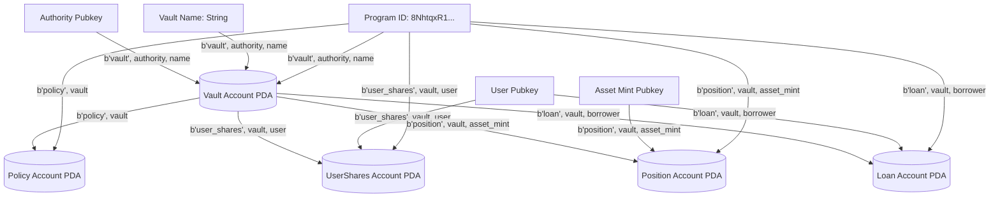

# 07. On-Chain Architecture & Anchor Program

## 1. Program Specifications

* **Program Name**: `equity_vault`
* **Framework**: Anchor v0.30.1 / Solana Toolchain v1.18.26 (Platform-Tools Rust 1.75.0)
* **Program ID**: `8NhtqxR1mwq7a3HTUtcGABNZ3KWzQi9KM3fXu3rHS8LH`
* **Target Binary**: `target/deploy/equity_vault.so` (244 KB)
* **IDL Location**: `target/idl/equity_vault.json`

---

## 2. Account Layouts & PDA Seeds

All accounts in `equity_vault` are derived deterministically as Program Derived Addresses (PDAs) using cryptographic seeds, eliminating arbitrary address collisions and ensuring non-custodial ownership.



### Account Specifications Table

| Account | Seeds | InitSpace Size | Mutability & Owner | Implemented Status |
|---|---|---|---|---|
| **`Vault`** | `[b"vault", authority.key(), name.as_bytes()]` | $8 + 32 + 32 + 32 + 4 + 32 + 4 + 12 + 8 + 8 + 1 + 1 + 8 + 8 = 188\text{ B}$ | Mutable, Program PDA | `[IMPLEMENTED]` |
| **`Policy`** | `[b"policy", vault.key()]` | $8 + 32 + 32 + 2 + 2 + 2 + 2 + 2 + 1 + 1 + 8 = 92\text{ B}$ | Mutable, Program PDA | `[IMPLEMENTED]` |
| **`UserShares`** | `[b"user_shares", vault.key(), user.key()]`| $8 + 32 + 32 + 8 + 1 + 8 = 89\text{ B}$ | Mutable, Program PDA | `[IMPLEMENTED]` |
| **`Position`** | `[b"position", vault.key(), asset_mint.key()]`| $8 + 32 + 32 + 8 + 8 + 8 + 1 + 1 + 8 + 8 = 114\text{ B}$ | Mutable, Program PDA | `[PARTIALLY IMPLEMENTED]` |
| **`Loan`** | `[b"loan", vault.key(), borrower.key()]` | $8 + 32 + 32 + 32 + 8 + 8 + 2 + 2 + 1 + 1 + 8 + 8 = 142\text{ B}$ | Mutable, Program PDA | `[PARTIALLY IMPLEMENTED]` |
| **`Execution`**| `[b"execution", vault.key(), execution_id.to_le_bytes()]`| $8 + 32 + 8 + 1 + 1 + 32 + 32 + 8 + 8 + 8 + 8 + 1 = 147\text{ B}$ | Mutable, Program PDA | `[PARTIALLY IMPLEMENTED]` |

> [!NOTE]
> `Position`, `Loan`, and `Execution` account layouts are fully declared with `#[derive(InitSpace)]` in `programs/equity_vault/src/state/`. Their instruction handlers are scheduled in Phase 2 on-chain expansion.

---

## 3. Instruction Set & Analysis

### 3.1 `initialize_vault` `[IMPLEMENTED]`
* **Purpose**: Creates a new Vault account and initializes its associated Policy account with default risk boundaries.
* **Signer**: `authority` (Must be a signer, pays rent).
* **Accounts**:
  1. `authority`: `[Signer, Mut]`
  2. `vault`: `[Mut]`, PDA seeds = `[b"vault", authority.key(), name.as_bytes()]`
  3. `policy`: `[Mut]`, PDA seeds = `[b"policy", vault.key()]`
  4. `asset_mint`: `[ReadOnly]`, The underlying SPL token mint (e.g. USDC).
  5. `system_program`: `[ReadOnly]`, Solana System Program.
* **Validation**:
  * `name` length $\le 32$, `symbol` length $\le 12$.
  * `max_ltv_bps <= 10_000`, `max_position_bps <= 10_000`.
* **Events Emitted**: `VaultInitialized { vault, authority, name, symbol, asset_mint, max_ltv_bps, max_position_bps }`.

---

### 3.2 `deposit` `[IMPLEMENTED]`
* **Purpose**: Allows a depositor to transfer underlying assets into the vault and receive pro-rata vault shares.
* **Signer**: `user` (Must be a signer, owner of source token account).
* **Accounts**:
  1. `user`: `[Signer, Mut]`
  2. `vault`: `[Mut]`
  3. `user_shares`: `[Mut]`, PDA seeds = `[b"user_shares", vault.key(), user.key()]`
  4. `user_asset_account`: `[Mut]`, User's Associated Token Account (ATA).
  5. `vault_asset_account`: `[Mut]`, Vault's ATA receiving the deposited tokens.
  6. `asset_mint`: `[ReadOnly]`
  7. `token_program`: `[ReadOnly]`, SPL Token Program.
  8. `system_program`: `[ReadOnly]`
* **Mathematical Invariant & Pro-Rata Share Formula**:
  * If first deposit ($S_{\text{total}} = 0$ or $D_{\text{total}} = 0$):
    $$\text{shares\_to\_mint} = \text{amount}$$
  * Subsequent deposits:
    $$\text{shares\_to\_mint} = \left\lfloor \frac{\text{amount} \times S_{\text{total}}}{D_{\text{total}}} \right\rfloor$$
* **Validation**:
  * `require!(!vault.is_paused, EquityVaultError::VaultIsPaused);`
  * `require!(amount > 0, EquityVaultError::ZeroDepositAmount);`
  * `require!(shares_to_mint > 0, EquityVaultError::ZeroSharesMinted);`
* **CPI Usage**: Invokes SPL Token `transfer` from `user_asset_account` to `vault_asset_account`.
* **State Mutation**:
  * `vault.total_deposits += amount;`
  * `vault.total_shares += shares_to_mint;`
  * `user_shares.shares += shares_to_mint;`
* **Events Emitted**: `DepositMade { vault, user, amount, shares_minted, total_deposits, total_shares }`.

---

### 3.3 `withdraw` `[IMPLEMENTED]`
* **Purpose**: Allows a user to redeem vault shares in exchange for their pro-rata share of underlying assets.
* **Signer**: `user` (Must be a signer).
* **Accounts**:
  1. `user`: `[Signer, Mut]`
  2. `vault`: `[Mut]`
  3. `user_shares`: `[Mut]`
  4. `user_asset_account`: `[Mut]`
  5. `vault_asset_account`: `[Mut]`
  6. `asset_mint`: `[ReadOnly]`
  7. `token_program`: `[ReadOnly]`
* **Mathematical Invariant & Share Redemption Formula**:
  $$\text{assets\_to\_return} = \left\lfloor \frac{\text{shares\_to\_burn} \times D_{\text{total}}}{S_{\text{total}}} \right\rfloor$$
* **Validation**:
  * `require!(!vault.is_paused, EquityVaultError::VaultIsPaused);`
  * `require!(shares_to_burn > 0, EquityVaultError::ZeroWithdrawAmount);`
  * `require!(user_shares.shares >= shares_to_burn, EquityVaultError::InsufficientShares);`
  * `require!(assets_to_return > 0, EquityVaultError::ZeroAssetsReturned);`
* **CPI Usage**: Invokes SPL Token `transfer` signed with **Vault PDA seeds**:
  ```rust
  let authority_seeds = &[
      b"vault",
      vault.authority.as_ref(),
      vault.name.as_bytes(),
      &[vault.bump],
  ];
  let signer_seeds = &[&authority_seeds[..]];
  token::transfer(cpi_ctx.with_signer(signer_seeds), assets_to_return)?;
  ```
* **State Mutation**:
  * `vault.total_shares -= shares_to_burn;`
  * `vault.total_deposits -= assets_to_return;`
  * `user_shares.shares -= shares_to_burn;`
* **Events Emitted**: `WithdrawalMade { vault, user, shares_burned, amount_returned, total_deposits, total_shares }`.

---

### 3.4 `update_policy` `[IMPLEMENTED]`
* **Purpose**: Adjusts risk parameters, stop loss, and rebalancing thresholds for a vault.
* **Signer**: `authority` (Must match `vault.authority`).
* **Validation**:
  * `require_keys_eq!(vault.authority, authority.key(), EquityVaultError::Unauthorized);`
  * All BPS parameters $\le 10,000\text{ bps}$.
* **Events Emitted**: `PolicyUpdated { vault, max_ltv_bps, max_position_bps, stop_loss_bps, take_profit_bps, rebalance_threshold_bps, is_active }`.

---

### 3.5 `emergency_exit` `[IMPLEMENTED]`
* **Purpose**: Circuit breaker to immediately halt all deposits and withdrawals during market anomaly or security incident.
* **Signer**: `authority` (Must match `vault.authority`).
* **State Mutation**: Sets `vault.is_paused = is_paused`.
* **Events Emitted**: `EmergencyExitTriggered { vault, is_paused }`.

---

## 4. Anchor Program Errors

Defined in `programs/equity_vault/src/errors.rs`:

```rust
#[error_code]
pub enum EquityVaultError {
    #[msg("Vault name exceeds maximum allowed length of 32 characters")]
    NameTooLong,
    #[msg("Vault symbol exceeds maximum allowed length of 12 characters")]
    SymbolTooLong,
    #[msg("Basis points value exceeds maximum allowed 10,000 (100.00%)")]
    InvalidBasisPoints,
    #[msg("Unauthorized: Signer does not have permission to execute this instruction")]
    Unauthorized,
    #[msg("Deposit amount must be greater than zero")]
    ZeroDepositAmount,
    #[msg("Withdraw shares must be greater than zero")]
    ZeroWithdrawAmount,
    #[msg("Deposit would result in zero shares minted")]
    ZeroSharesMinted,
    #[msg("Withdrawal would result in zero assets returned")]
    ZeroAssetsReturned,
    #[msg("User does not hold sufficient shares for withdrawal")]
    InsufficientShares,
    #[msg("Vault operations are currently paused")]
    VaultIsPaused,
    #[msg("Policy parameters exceed system limits")]
    PolicyLimitsExceeded,
    #[msg("Arithmetic calculation resulted in overflow or underflow")]
    MathOverflow,
    #[msg("Account constraint violation")]
    ConstraintViolation,
}
```

---

## 5. Security & Invariant Audit

1. **Vault Authority Invariant**:
   Only the original creator (`vault.authority`) can modify risk policy or toggle pause. Checked via Anchor constraint:
   `has_one = authority @ EquityVaultError::Unauthorized`.
2. **PDA Signer Protection**:
   The vault tokens can ONLY be transferred via CPI signed by the Vault's seeds: `[b"vault", authority, name, bump]`. No external keypair or operator can initiate transfers directly.
3. **Integer Math Safety**:
   All share calculations use 128-bit unsigned arithmetic (`u128`) with checked math before casting to `u64`:
   ```rust
   let res = (amount as u128)
       .checked_mul(total_shares as u128)
       .ok_or(EquityVaultError::MathOverflow)?
       .checked_div(total_deposits as u128)
       .ok_or(EquityVaultError::MathOverflow)?;
   ```
4. **Rounding Bias**:
   * Deposit: Rounds down (`checked_div`), favoring existing share holders.
   * Withdrawal: Rounds down (`checked_div`), leaving dust in vault rather than over-distributing.
