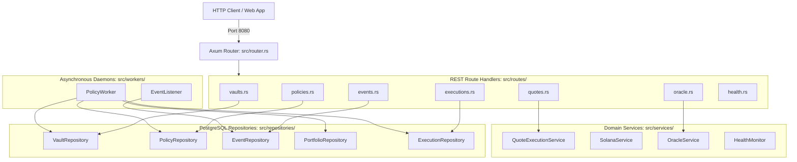

# 08. Off-Chain Architecture & Application Layer

## 1. Architectural Philosophy: The On-Chain vs. Off-Chain Boundary

A core principle of Equity Catalyst is the strict segregation of responsibilities between Solana smart contracts and off-chain compute infrastructure.

```
┌─────────────────────────────────────────────────────────────────────────────┐
│                    THE ARCHITECTURAL RESPONSIBILITY DIVIDE                  │
│                                                                             │
│   ON-CHAIN RESPONSIBILITIES (Anchor: programs/equity_vault)                 │
│   ├── SPL Asset Custody & Non-Custodial PDA Ownership                      │
│   ├── Pro-Rata Share Accounting & Mint/Burn Invariants                     │
│   ├── Enforceable Boundary Constraints (Max LTV, Max Concentration)         │
│   ├── Authority Verification & Signer Checks                               │
│   └── Emergency Circuit Breaker (Pause / Unpause)                           │
│                                                                             │
│   OFF-CHAIN RESPONSIBILITIES (Axum: apps/api & Background Workers)          │
│   ├── Real-Time Event Ingestion (Bloomberg, SEC EDGAR, Macro News)         │
│   ├── High-Throughput Market Telemetry & Pyth Oracle Normalization          │
│   ├── Algorithmic Rule Matching & Sentiment Score Evaluation                │
│   ├── Multi-Asset Portfolio Drift Calculations                              │
│   ├── Route Optimization via Jupiter v6 Quotes & Price Impact Checks        │
│   ├── Isolated Transaction Signing Preparation                              │
│   └── Historical Audit Trail Persistence (PostgreSQL & Redis)               │
└─────────────────────────────────────────────────────────────────────────────┘
```

### Why Logic is Off-Chain:
1. **Computational Limits & Compute Unit (CU) Budget**: Evaluating float sentiment scores, parsing unstructured SEC filings, querying external routing APIs, and calculating drift across large portfolios would exhaust Solana transaction compute limits ($1.4\text{M CU}$) and incur prohibitive transaction fees.
2. **Privacy & Proprietary Alpha**: Quantitative desks need to evaluate proprietary rules without broadcasting alpha-generating heuristics to public mempools.
3. **Data Availability**: Corporate news disclosures, earnings surprises, and macro indicators exist natively outside the Solana blockchain.

### Why Invariants Remain On-Chain:
1. **Non-Custodial Trust Invariant**: Off-chain engines can suggest trades, but cannot unilaterally steal deposits or mint unbacked shares.
2. **Hard Ceiling Invariants**: Even if an off-chain engine suffers a catastrophic bug or prompt injection, the on-chain contract enforces that single-asset exposure cannot breach `policy.max_position_bps` and borrowing cannot exceed `policy.max_ltv_bps`.

---

## 2. Application Architecture (`apps/api`)

The off-chain application layer is built using Rust, Axum, Tokio, and deadpool-postgres.



---

## 3. Asynchronous Workers & Queue Architecture

### 3.1 EventListener (`apps/api/src/workers/event_listener.rs`) `[IMPLEMENTED]`
* **Purpose**: Buffers incoming events from the HTTP layer into a high-throughput Redis FIFO queue.
* **Queue Key**: `events:queue`.
* **Behavior**:
  * Pushes serialized `EventModel` onto the queue via `LPUSH`.
  * If Redis is unavailable, gracefully logs a fallback notice, relying on PostgreSQL polling as a durable second-tier queue.

### 3.2 PolicyWorker (`apps/api/src/workers/policy_worker.rs`) `[IMPLEMENTED]`
* **Purpose**: Long-running background worker executing the full decision and risk pipeline on pending events.
* **Execution Loop**:
  1. Polls `events:queue` via Redis `LPOP` (non-blocking).
  2. If queue is empty, queries PostgreSQL for pending events (`status = 'PENDING'`):
     ```sql
     SELECT * FROM events WHERE status = 'PENDING' ORDER BY detected_at ASC LIMIT 1;
     ```
  3. Verifies event idempotency (ensures `status != 'PROCESSED'`).
  4. Loads vault metadata, risk policy, and portfolio positions.
  5. Executes `DecisionEngine::process_event(...)`.
  6. **Dry-Run Enforcement**: Suppresses live on-chain dispatch; logs decision rationale to console.
  7. Inserts execution record into `executions` table with `status = 'LOGGED'`.
  8. Updates event record in `events` table with `status = 'PROCESSED'`.

---

## 4. Domain Services Layer

### 4.1 SolanaService (`apps/api/src/services/solana_service.rs`) `[IMPLEMENTED]`
* **Safety Lock Architecture**: Built with an `allow_transactions: Arc<RwLock<bool>>` flag that **defaults to `false` (Read-Only Mode)**.
* **Capabilities**:
  * Read on-chain Vault, Policy, and UserShares PDAs.
  * Read SPL token balances and native SOL balances.
  * Sync on-chain state to PostgreSQL (`sync_vault_state_to_db`).
  * Subscribe to live program logs via WebSocket (`subscribe_events`).
  * Dispatch Anchor transactions when explicitly unlocked via `enable_transaction_submission()`.

### 4.2 QuoteExecutionService (`apps/api/src/services/quote_service.rs`) `[IMPLEMENTED]`
* **Quote-Only Execution**: Implements safe, non-custodial trade evaluation.
* **Pipeline**:
  1. Requests routing quote from Jupiter v6 HTTP client (`integrations/jupiter`).
  2. Parses price impact percentage into basis points.
  3. Validates price impact against `policy.rebalance_threshold_bps`.
  4. Validates projected post-trade exposure against `policy.max_position_bps`.
  5. Records execution audit log with status `QUOTE_ONLY` or `REJECTED`.
  6. Returns structured `QuoteExecutionVerdict` to the caller.

### 4.3 OracleService (`apps/api/src/services/oracle_service.rs`) `[IMPLEMENTED]`
* Manages real-time price feeds via `PythClient` (`integrations/pyth`).
* Normalizes price decimals to a standardized 6-decimal representation ($10^6$) for consistent portfolio arithmetic.

### 4.4 HealthMonitor (`apps/api/src/services/health_monitor.rs`) `[IMPLEMENTED]`
* Runs continuous health checks on:
  * PostgreSQL connection pool latency.
  * Redis connectivity and queue depth.
  * Solana RPC ping and current block height.
  * System uptime and memory consumption.
