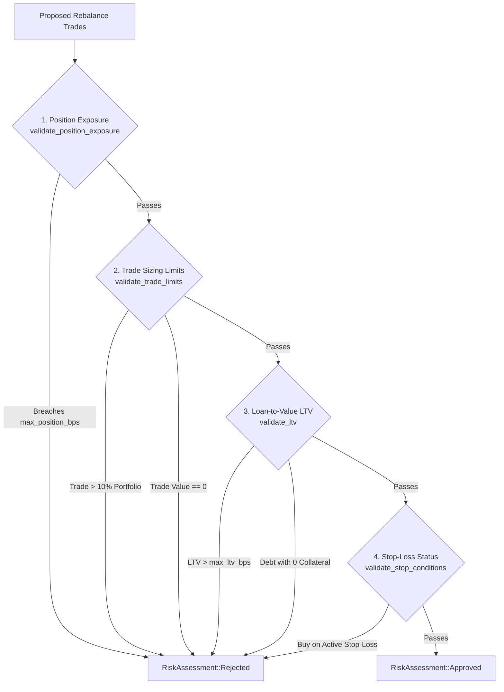

# 11. Risk Engine Architecture & Constraints

## 1. Architectural Overview

The Risk Engine serves as the core defensive boundary of Equity Catalyst. Every proposed rebalancing action, swap quote, or trade order must pass through the multi-factor risk validation pipeline before it can be synthesized into an `ExecutionRequest`.



---

## 2. Engine Components & Mathematical Formulations

The Risk Engine is implemented across modular files in `apps/api/src/engines/risk_engine/` backed by `crates/shared/src/risk.rs`:

### 2.1 Single-Asset Position Exposure (`exposure.rs`)
* **Purpose**: Prevents over-concentration in any single stock or volatile token.
* **Formulation**:
  $$\text{exposure\_bps} = \left\lfloor \frac{\text{post\_trade\_position\_usd} \times 10,000}{\text{total\_portfolio\_usd}} \right\rfloor$$
* **Constraint**:
  $$\text{exposure\_bps} \le \text{policy.max\_position\_bps}$$
* **Code Implementation**:
  ```rust
  pub fn validate_position_exposure(
      post_trade_value_usd: u64,
      total_portfolio_usd: u64,
      max_position_bps: u16,
  ) -> Result<(), String> {
      if total_portfolio_usd == 0 { return Ok(()); }
      check_position_exposure(
          post_trade_value_usd,
          total_portfolio_usd,
          BasisPoints(max_position_bps),
      ).map_err(|e| format!("Exposure violation: {}", e))
  }
  ```

---

### 2.2 Operational Trade Size & Slippage Limits (`limits.rs`)
* **Single Trade Sizing Limit**:
  * No individual trade can exceed $10.00\%$ ($1,000\text{ bps}$) of total portfolio value:
    $$\text{trade\_value} \times 10,000 \le 1,000 \times \text{total\_portfolio\_usd}$$
  * Rationale: Limits market impact and prevents flash drainage from single oversized execution orders.
* **Maximum Permissible Slippage**:
  * Hard protocol constant: `MAX_PERMISSIBLE_SLIPPAGE_BPS = 300` ($3.00\%$).
  * Any order or quote with expected slippage $> 3.00\%$ is rejected outright.
* **Zero Value Guard**:
  * Rejects trades with `trade_value == 0`.

---

### 2.3 Loan-to-Value (LTV) Boundary Defense (`ltv.rs`)
* **Purpose**: Enforces solvency boundaries when borrowing against vault collateral.
* **Formulation**:
  $$\text{ltv\_bps} = \left\lfloor \frac{\text{total\_debt\_usd} \times 10,000}{\text{total\_collateral\_usd}} \right\rfloor$$
* **Constraint**:
  $$\text{ltv\_bps} \le \text{policy.max\_ltv\_bps}$$
* **Edge Cases**:
  * If $\text{total\_debt\_usd} = 0$: Returns $0\text{ bps}$ (Passes).
  * If $\text{total\_collateral\_usd} = 0$ and $\text{total\_debt\_usd} > 0$: Returns error `"Debt exists with zero collateral"`.

---

### 2.4 Stop-Loss & Take-Profit Protections (`stops.rs`)
* **Purpose**: Prevents the strategy from "averaging down" or buying further into an asset that has crashed past its stop-loss threshold.
* **Trigger Condition**:
  $$\frac{(\text{entry\_price} - \text{current\_price}) \times 10,000}{\text{entry\_price}} \ge \text{policy.stop\_loss\_bps}$$
* **Constraint Enforcement**:
  * If stop-loss is active for an asset (`is_stop_loss_triggered == true`):
    * **BUY Orders**: Strictly REJECTED.
    * **SELL / Liquidate Orders**: ALLOWED.

---

## 3. Evaluation Pipeline Coordinator (`mod.rs`)

The main entry point `RiskEngine::evaluate_proposed_trades` coordinates all checks:

```rust
impl RiskEngine {
    pub fn evaluate_proposed_trades(
        &self,
        trades: &[RebalanceTrade],
        positions: &[PortfolioModel],
        policy: &PolicyModel,
        total_portfolio_usd: u64,
        total_debt_usd: u64,
    ) -> RiskAssessment {
        if trades.is_empty() {
            return RiskAssessment::Approved;
        }

        // 1. Position exposure check
        for trade in trades {
            if trade.is_buy {
                let current_val = positions
                    .iter()
                    .find(|p| p.asset_symbol == trade.symbol)
                    .map(|p| p.current_value_usd.max(0.0) as u64)
                    .unwrap_or(0);
                let post_trade_val = current_val + trade.trade_value;

                if let Err(err) = validate_position_exposure(
                    post_trade_val,
                    total_portfolio_usd,
                    policy.max_position_bps as u16,
                ) {
                    return RiskAssessment::Rejected { reason: err };
                }
            }
        }

        // 2. Operational trade limits
        if let Err(err) = validate_trade_limits(trades, total_portfolio_usd) {
            return RiskAssessment::Rejected { reason: err };
        }

        // 3. LTV boundary validation
        if let Err(err) = validate_ltv(total_debt_usd, total_portfolio_usd, policy.max_ltv_bps as u16) {
            return RiskAssessment::Rejected { reason: err };
        }

        // 4. Stop conditions
        if let Err(err) = validate_stop_conditions(trades, positions, policy.stop_loss_bps as u16) {
            return RiskAssessment::Rejected { reason: err };
        }

        RiskAssessment::Approved
    }
}
```
