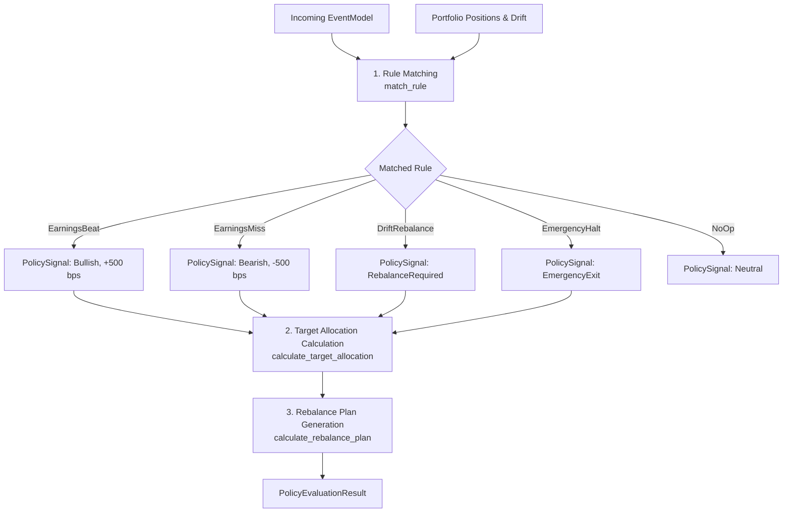

# 12. Policy Engine & Rule Matching

## 1. Architectural Role

The **Policy Engine** (`apps/api/src/engines/policy_engine/`) is the algorithmic evaluation component of Equity Catalyst. It converts incoming market events and portfolio state into actionable rebalancing proposals and target weight adjustments.



---

## 2. Rule Matching Subsystem (`rules.rs`)

`match_rule` compares incoming event metadata and current portfolio drift against deterministic criteria:

```rust
pub fn match_rule(
    event: &EventModel,
    policy: &PolicyModel,
    max_drift_bps: u16,
) -> PolicyRule {
    // 1. Check for emergency halt condition
    if is_emergency_condition(&event.event_type) {
        return PolicyRule::EmergencyHalt;
    }

    // 2. Check earnings event rules
    if let Some(symbol) = extract_symbol(event) {
        if is_bullish_sentiment(event.sentiment_score, SENTIMENT_THRESHOLD) {
            return PolicyRule::EarningsBeat {
                symbol,
                sentiment: event.sentiment_score.unwrap_or(0.0),
            };
        } else if is_bearish_sentiment(event.sentiment_score, SENTIMENT_THRESHOLD) {
            return PolicyRule::EarningsMiss {
                symbol,
                sentiment: event.sentiment_score.unwrap_or(0.0),
            };
        }
    }

    // 3. Check portfolio drift against policy threshold
    if max_drift_bps >= policy.rebalance_threshold_bps as u16 {
        return PolicyRule::DriftRebalance { max_drift_bps };
    }

    PolicyRule::NoOp
}
```

### Rule Matching Criteria Table

| Rule | Trigger Condition | Parameter Thresholds |
|---|---|---|
| **`EmergencyHalt`** | `event_type` in `["circuit_breaker", "emergency_halt", "protocol_pause"]` | Immediate |
| **`EarningsBeat`** | `sentiment_score > 0.50` or `event_type == "earnings_beat"` | `SENTIMENT_THRESHOLD = 0.50` |
| **`EarningsMiss`** | `sentiment_score < -0.50` or `event_type == "earnings_miss"` | Negative sentiment threshold |
| **`DriftRebalance`**| $\max(\text{drift\_bps}) \ge \text{policy.rebalance\_threshold\_bps}$ | Standard default $200\text{ bps}$ ($2.00\%$) |
| **`NoOp`** | No conditions satisfied | Zero actions emitted |

---

## 3. Signal Generation (`signals.rs`)

Signals encapsulate the direction and magnitude of the intended portfolio shift:

| Signal Type | Target Asset Delta | Rationale |
|---|---|---|
| **`Bullish`** | $+500\text{ bps}$ ($+5.00\%$) to target asset | Positive earnings beat expands capital allocation |
| **`Bearish`** | $-500\text{ bps}$ ($-5.00\%$) from target asset | Missed earnings reduces risk exposure |
| **`RebalanceRequired`** | $0\text{ bps}$ delta to targets | Restores drifted portfolio back to existing target weights |
| **`EmergencyExit`** | Sell all assets to $100\%$ USDC | Emergency market condition / circuit breaker |
| **`Neutral`** | $0\text{ bps}$ | No change |

---

## 4. Target Allocation & Rebalancing (`allocation.rs`)

When an asset target weight is adjusted, the change is balanced against the cash reserve (`USDC`):

```rust
// Apply delta to target asset and mirror adjustment in USDC
let new_target = (current_target + delta as i32).clamp(0, MAX_BPS as i32) as u16;
let new_usdc = (current_usdc - delta as i32).clamp(0, MAX_BPS as i32) as u16;

weights[target_idx].target_weight = BasisPoints(new_target);
weights[usdc_idx].target_weight = BasisPoints(new_usdc);
```

### Weight Normalization Invariant
To prevent mathematical skew, `calculate_target_allocation` ensures that all portfolio weights sum to exactly $10,000\text{ bps}$ ($100.00\%$):
```rust
let total_sum: u32 = weights.iter().map(|w| w.target_weight.0 as u32).sum();
if total_sum != MAX_BPS as u32 {
    if let Some(usdc) = weights.iter_mut().find(|w| w.symbol == "USDC") {
        let diff = MAX_BPS as i32 - total_sum as i32;
        let adjusted = (usdc.target_weight.0 as i32 + diff).max(0) as u16;
        usdc.target_weight = BasisPoints(adjusted);
    }
}
```

### Rebalance Order Planning
Finally, `calculate_rebalance_plan` in `crates/shared/src/allocation.rs` compares each asset's current valuation against its target valuation:
$$\text{target\_value} = \left\lfloor \frac{\text{total\_portfolio\_usd} \times \text{target\_weight\_bps}}{10,000} \right\rfloor$$
* If $\text{target\_value} > \text{current\_value}$: Generates a **BUY** order for $\Delta = \text{target\_value} - \text{current\_value}$.
* If $\text{target\_value} < \text{current\_value}$: Generates a **SELL** order for $\Delta = \text{current\_value} - \text{target\_value}$.
* Filters out trades where drift is below `rebalance_threshold_bps`.
