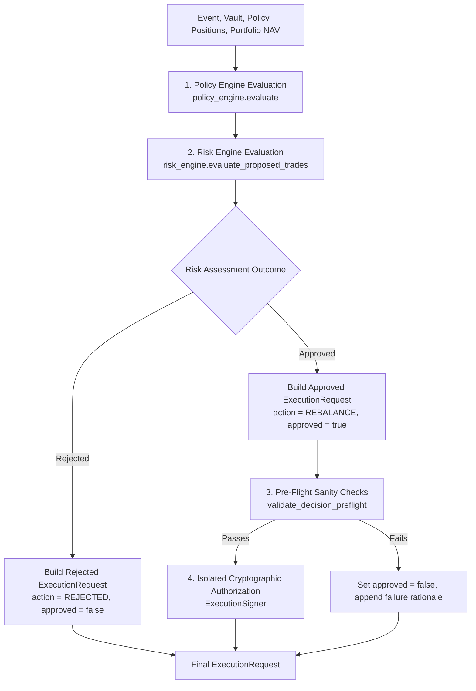

# 13. Decision Engine & Signer Isolation

## 1. Architectural Role

The **Decision Engine** (`apps/api/src/engines/decision_engine/`) serves as the coordinator between quantitative strategy evaluation (`PolicyEngine`), defensive boundary validation (`RiskEngine`), and cryptographic transaction authorization (`ExecutionSigner`).



---

## 2. Core Data Models (`decision.rs`)

The Decision Engine produces immutable execution manifests ready for downstream dispatch:

```rust
#[derive(Debug, Clone, Serialize, Deserialize)]
pub struct TradeOrder {
    pub symbol: String,
    pub is_buy: bool,
    pub usd_value: u64,
}

#[derive(Debug, Clone, Serialize, Deserialize)]
pub struct ExecutionRequest {
    pub decision_id: Uuid,
    pub vault_address: String,
    pub event_id: Option<Uuid>,
    pub action: String,
    pub trades: Vec<TradeOrder>,
    pub approved: bool,
    pub rationale: String,
    pub timestamp: DateTime<Utc>,
}
```

---

## 3. Cryptographic Signer Isolation (`signer.rs`)

To prevent key exfiltration through web vulnerabilities (such as SSRF or HTTP request injection), the `ExecutionSigner` is strictly isolated from Axum HTTP handler state.

* **Key Material Storage**:
  * Loads from a protected filesystem path specified in environment variables (`EXECUTION_SIGNER_KEY_PATH`).
  * If unconfigured in local development, initializes a deterministic seed keypair with explicit warning telemetry.
* **Separation of Concerns**:
  * The signer has **zero withdrawal authority**; it cannot transfer vault funds to external accounts.
  * Its public address is exclusively authorized as an execution keeper on-chain.

```rust
#[derive(Clone, Debug)]
pub struct ExecutionSigner {
    signer_pubkey: String,
    key_material: Vec<u8>,
}

impl ExecutionSigner {
    pub fn load_or_generate(path_str: &str) -> Self {
        // Loads keypair safely or falls back to deterministic local dev key
        ...
    }

    pub fn pubkey(&self) -> &str {
        &self.signer_pubkey
    }
}
```

---

## 4. Pre-Flight Sanity Validation (`validation.rs`)

Before any decision can be finalized, it must pass through deterministic pre-flight checks:

```rust
pub fn validate_decision_preflight(
    vault: &VaultModel,
    policy: &PolicyModel,
    request: &ExecutionRequest,
) -> Result<(), String> {
    // 1. Invariant: Never execute against a paused vault
    if vault.is_paused {
        return Err(format!("Pre-flight failed: Vault {} is paused", vault.vault_address));
    }

    // 2. Invariant: Policy must be active
    if !policy.is_active {
        return Err(format!("Pre-flight failed: Policy for vault {} is marked inactive", vault.vault_address));
    }

    // 3. Invariant: Policy vault address must match vault address exactly
    if policy.vault_address != vault.vault_address {
        return Err(format!(
            "Pre-flight failed: Policy vault mismatch (expected {}, got {})",
            vault.vault_address, policy.vault_address
        ));
    }

    // 4. Invariant: Approved non-NOOP decisions must have trade orders
    if request.approved && request.trades.is_empty() && request.action != "NOOP" {
        return Err("Pre-flight failed: Approved decision with non-NOOP action has no trades".to_string());
    }

    Ok(())
}
```

---

## 5. Pipeline Coordination (`mod.rs`)

```rust
impl DecisionEngine {
    pub fn process_event(
        &self,
        event: &EventModel,
        vault: &VaultModel,
        policy: &PolicyModel,
        positions: &[PortfolioModel],
        total_value_usd: u64,
        total_debt_usd: u64,
    ) -> Result<ExecutionRequest, ApiError> {
        let decision_id = Uuid::new_v4();

        // 1. Evaluate policy rules and rebalancing targets
        let eval_result = self.policy_engine.evaluate(event, policy, positions, total_value_usd)?;

        // 2. Evaluate proposed trades against risk boundaries
        let risk_assessment = self.risk_engine.evaluate_proposed_trades(
            &eval_result.proposed_trades,
            positions,
            policy,
            total_value_usd,
            total_debt_usd,
        );

        // 3. Synthesize decision
        let (approved, rationale, action) = match risk_assessment {
            RiskAssessment::Approved => {
                if eval_result.proposed_trades.is_empty() {
                    (true, "No rebalance required (drift within limits)".to_string(), "NOOP".to_string())
                } else {
                    (true, format!("Approved: {}", eval_result.signal.reason), "REBALANCE".to_string())
                }
            }
            RiskAssessment::Rejected { reason } => {
                (false, format!("Rejected by Risk Engine: {}", reason), "REJECTED".to_string())
            }
        };

        let mut request = ExecutionRequest {
            decision_id,
            vault_address: vault.vault_address.clone(),
            event_id: Some(event.event_id),
            action,
            trades: eval_result.proposed_trades.into_iter().map(Into::into).collect(),
            approved,
            rationale,
            timestamp: Utc::now(),
        };

        // 4. Run pre-flight checks
        if let Err(preflight_err) = validate_decision_preflight(vault, policy, &request) {
            request.approved = false;
            request.rationale = format!("{} | {}", request.rationale, preflight_err);
        }

        Ok(request)
    }
}
```
