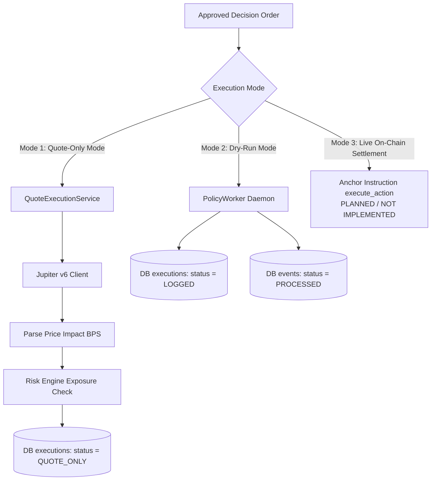

# 14. Execution Engine & DEX Routing

## 1. Execution Architecture & Operational Modes

Equity Catalyst implements a multi-tier execution strategy engineered around deterministic safety and capital preservation.



---

## 2. Operational Mode 1: Interactive Quote-Only Execution (`QuoteExecutionService`)

Implemented in `apps/api/src/services/quote_service.rs`, Quote-Only Execution provides a safe, non-custodial sandbox for evaluating DEX liquidity, slippage, and price impact without dispatching funds.

### The Pipeline:
1. **Request Formulation**: Client calls `POST /quotes/evaluate` with `input_mint`, `output_mint`, `amount_in`, and `slippage_bps`.
2. **Jupiter Routing**: Queries the Jupiter v6 REST API via `integrations/jupiter`:
   ```rust
   let quote_req = QuoteRequest::new(&request.input_mint, &request.output_mint, request.amount_in)
       .with_slippage_bps(slippage);
   let quote: QuoteResponse = self.jupiter_client.get_quote(&quote_req).await?;
   ```
3. **Price Impact Conversion**: Jupiter returns `priceImpactPct` as a string (e.g. `"0.05"`). Converted to basis points in `integrations/jupiter/quotes.rs`:
   $$\text{bps} = \text{round}(\text{price\_impact\_pct} \times 100)$$
4. **Multi-Factor Risk Verification**:
   * Asserts vault is not paused (`!vault.is_paused`).
   * Asserts policy is active (`policy.is_active`).
   * Asserts price impact $\le \text{policy.rebalance\_threshold\_bps}$ (capped at 1,000 bps).
   * Calculates projected post-trade exposure and verifies $\le \text{policy.max\_position\_bps}$.
5. **Audit Trail Persistence**: Inserts an execution row with status `QUOTE_ONLY` (if approved) or `REJECTED`.
6. **Verdict Return**: Emits `QuoteExecutionVerdict`.

---

## 3. Operational Mode 2: Automated Dry-Run Processing (`PolicyWorker`)

Implemented in `apps/api/src/workers/policy_worker.rs`, the worker executes the full decision pipeline in an automated daemon while guaranteeing zero unintended capital loss:

```rust
// In apps/api/src/workers/policy_worker.rs:118-126
info!(
    event_id = %event.event_id,
    decision_id = %decision.decision_id,
    action = %decision.action,
    trades_count = decision.trades.len(),
    approved = decision.approved,
    rationale = %decision.rationale,
    "Policy Worker evaluated decision — TRADE EXECUTION SUPPRESSED (DRY-RUN MODE)"
);
```

### Safety Guarantees:
* Live Solana transaction broadcasting is explicitly suppressed.
* Transaction hashes (`tx_signature`) are set to `None`.
* Execution records are saved with `status = 'LOGGED'`.
* Events are marked `PROCESSED` to prevent queue thrashing.

---

## 4. Operational Mode 3: The On-Chain Execution Gap

### Current Implementation Status: `[PLANNED / NOT IMPLEMENTED]`

A senior architectural audit of the repository reveals the exact boundary between client scaffolding and on-chain contract bytecode:

1. **Client Instruction Scaffolding**:
   * `integrations/solana/anchor_client.rs:310` implements `build_execute_action_ix`, computing the instruction discriminator:
     $$\text{sha256}("global:execute\_action")[..8]$$
   * `sdk/src/execution.ts` exports `findExecutionPda` and `executeAction`.
2. **On-Chain Anchor Program Reality**:
   * `programs/equity_vault/src/lib.rs` currently implements ONLY:
     * `initialize_vault`
     * `deposit`
     * `withdraw`
     * `update_policy`
     * `emergency_exit`
   * There is **no `execute_action` instruction handler** in `programs/equity_vault/src/instructions/`.
   * The `Execution` account struct exists in `programs/equity_vault/src/state/execution.rs`, but cannot be initialized or mutated on-chain yet.

### Architectural Rationale & Next Steps:
Suppressing live on-chain swaps in Phase 1 is a deliberate risk management choice. It prevents testnet/devnet capital drainage while the mathematical engines, risk limits, and off-chain telemetry undergo rigorous verification. Phase 2 implementation will introduce an Anchor instruction invoking Jupiter CPI via Jupiter's Solana Swap Program.
