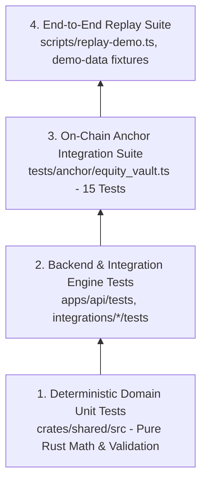

# 16. Testing Strategy & Test Pyramid

## 1. Testing Philosophy & Test Pyramid

Equity Catalyst implements a rigorous testing pyramid prioritizing deterministic mathematical correctness and non-custodial smart contract invariants before network-level integration.



---

## 2. Test Layer 1: Pure Deterministic Unit Tests (`crates/shared`)

* **Scope**: Mathematics, basis points arithmetic, exposure checks, LTV formulas, stop-loss trigger conditions, rebalance plans.
* **Characteristics**: Zero I/O, zero network, zero async runtime. Executes in $< 50\text{ ms}$.
* **Execution Command**:
  ```bash
  cargo test -p equity-catalyst-shared
  ```
* **Existing Test Coverage (7/7 Passing)**:
  * `test_basis_points_arithmetic`: Validates bounds checking ($\le 10,000\text{ bps}$) and percentage conversions.
  * `test_allocation_target_weights_sum`: Proves target allocations failing to sum to $10,000\text{ bps}$ are rejected with `WeightsDoNotSumTo100Percent`.
  * `test_ltv_calculation_and_limits`: Asserts loan-to-value calculations against max LTV boundaries.
  * `test_position_exposure_limits`: Verifies single-asset concentration limits.
  * `test_stop_loss_triggers`: Asserts that drops $\ge \text{stop\_loss\_bps}$ from entry price trigger defensive signals.
  * `test_rebalance_drift_calculation`: Verifies drift detection between current and target weights.
  * `test_rebalance_trade_generation`: Asserts exact dollar amounts for buy/sell orders when rebalancing.

---

## 3. Test Layer 2: On-Chain Anchor Integration Suite (`tests/anchor/`)

* **Scope**: Program instruction execution against a local Solana test validator (`solana-test-validator`).
* **Characteristics**: Verifies account constraints, PDA derivation, signature requirements, CPI token transfers, and error codes.
* **Execution Command**:
  ```bash
  anchor test --skip-build
  ```
* **Test Suite Inventory (`tests/anchor/equity_vault.ts` - 15 Passing Tests)**:
  1. `initializes vault with valid parameters`: Asserts creation of Vault and Policy PDAs.
  2. `rejects vault initialization with name exceeding 32 chars`: Asserts `EquityVaultError::NameTooLong`.
  3. `rejects vault initialization with symbol exceeding 12 chars`: Asserts `EquityVaultError::SymbolTooLong`.
  4. `rejects vault initialization with invalid max_ltv_bps > 10,000`: Asserts `EquityVaultError::InvalidBasisPoints`.
  5. `deposits initial capital (1:1 share ratio)`: Verifies initial deposit mints shares equal to token amount.
  6. `deposits secondary capital with proportional share issuance`: Asserts exact formula $\lfloor \frac{\text{amount} \times S}{D} \rfloor$.
  7. `rejects deposit of zero amount`: Asserts `EquityVaultError::ZeroDepositAmount`.
  8. `burns shares and returns assets on withdrawal`: Verifies pro-rata token return via CPI.
  9. `rejects withdrawal of zero shares`: Asserts `EquityVaultError::ZeroWithdrawAmount`.
  10. `rejects withdrawal exceeding user balance`: Asserts `EquityVaultError::InsufficientShares`.
  11. `updates policy parameters by authority`: Verifies authorized modification of risk limits.
  12. `rejects policy update by unauthorized non-manager`: Asserts `EquityVaultError::Unauthorized`.
  13. `pauses vault operations via emergency exit`: Toggles `is_paused = true`.
  14. `rejects deposit when vault is paused`: Asserts `EquityVaultError::VaultIsPaused`.
  15. `rejects withdrawal when vault is paused`: Asserts `EquityVaultError::VaultIsPaused`.

---

## 4. Test Layer 3: Application & Engine Integration Suite

* **Scope**: Axum HTTP handlers, service coordination, engine matrix tests, mock client behavior.
* **Execution Commands**:
  ```bash
  cargo test -p equity-catalyst-api --test engine_matrix_test
  cargo test -p equity-catalyst-api --test oracle_service_test
  cargo test -p equity-catalyst-api --test domain_services_test
  ```
* **Integration Crates**:
  * `integrations/pyth`: Tests Hermes price parsing, mock feeds, and confidence interval rejection (`cargo test -p equity-catalyst-pyth`).
  * `integrations/jupiter`: Tests quote retrieval, mock routes, price impact conversion, and slippage guards (`cargo test -p equity-catalyst-jupiter`).
  * `integrations/solana`: Tests RPC queries, account deserialization, and read-only mode safety locks (`cargo test -p equity-catalyst-solana`).

---

## 5. Test Layer 4: Deterministic End-to-End Replay Suite

* **Scope**: Full pipeline simulation from external event ingestion to Jupiter quote evaluation and simulated settlement.
* **Tooling**: `scripts/replay-demo.ts` with `demo-data/demo-script.json` and JSON fixtures.
* **Execution Command**:
  ```bash
  npx ts-node scripts/replay-demo.ts --fast
  ```
* **Replay Phases**:
  1. `EVENT_DETECTED`: Ingests simulated NVDA earnings beat.
  2. `SIGNAL_GENERATED`: Matches `PolicyRule::EarningsBeat`, produces $+500\text{ bps}$ bullish signal.
  3. `PORTFOLIO_EVALUATED`: Rebalances target allocation (NVDA $30\% \to 35\%$, USDC $10\% \to 5\%$).
  4. `RISK_DEFENSE_VERIFIED`: Passes exposure, single trade size, and stop-loss checks.
  5. `DECISION_SYNTHESIZED`: Creates signed `ExecutionRequest`.
  6. `JUPITER_ROUTED`: Simulates Jupiter v6 swap route and validates price impact.
  7. `ONCHAIN_SETTLED`: Emits settlement confirmation telemetry.
