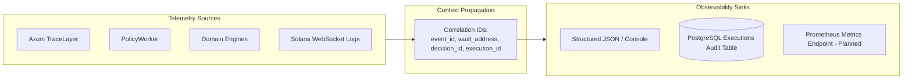

# 18. Observability & Structured Tracing

## 1. Observability Architecture

In an asynchronous, event-driven portfolio controller, distributed tracing and correlation IDs are essential for debugging and compliance. Equity Catalyst implements structured logging using the Rust `tracing` ecosystem and OpenTelemetry conventions.



---

## 2. Core Correlation IDs

Every state transition and log line is anchored by one or more standardized correlation IDs:

* **`event_id`** (`UUIDv4`): Identifies the incoming market stimulus from inception through processing.
* **`vault_address`** (`Pubkey`): Identifies the target on-chain vault entity.
* **`decision_id`** (`UUIDv4`): Identifies the specific analytical verdict generated by the Decision Engine.
* **`execution_id`** (`UUIDv4`): Identifies the database audit record in `executions`.
* **`tx_signature`** (Base58 string): Identifies the finalized on-chain Solana transaction.

---

## 3. End-to-End Tracing Example

The following structured log progression traces a single event through the entire lifecycle:

```json
{"timestamp":"2026-09-14T12:00:00.102Z","level":"INFO","target":"equity_catalyst_api::routes::events","event_id":"9b1deb4d-3b7d-4bad-9bdd-2b0d7b3dcb6d","vault_address":"8NhtqxR1mwq7a3HTUtcGABNZ3KWzQi9KM3fXu3rHS8LH","stage":"EVENT_RECEIVED","message":"External market event ingested and queued"}
{"timestamp":"2026-09-14T12:00:00.145Z","level":"DEBUG","target":"equity_catalyst_api::workers::policy_worker","event_id":"9b1deb4d-3b7d-4bad-9bdd-2b0d7b3dcb6d","vault_address":"8NhtqxR1mwq7a3HTUtcGABNZ3KWzQi9KM3fXu3rHS8LH","stage":"EVENT_POPPED","message":"Popped pending event from Redis FIFO queue"}
{"timestamp":"2026-09-14T12:00:00.180Z","level":"INFO","target":"equity_catalyst_api::engines::policy_engine","event_id":"9b1deb4d-3b7d-4bad-9bdd-2b0d7b3dcb6d","rule":"PolicyRule::EarningsBeat","signal":"Bullish(+500bps)","stage":"POLICY_MATCHED","message":"Matched earnings beat policy rule for NVDA"}
{"timestamp":"2026-09-14T12:00:00.210Z","level":"INFO","target":"equity_catalyst_api::engines::risk_engine","event_id":"9b1deb4d-3b7d-4bad-9bdd-2b0d7b3dcb6d","evaluated_exposure_bps":3500,"max_allowed_bps":3500,"stage":"RISK_PASSED","message":"Proposed rebalancing trade passed all risk boundary checks"}
{"timestamp":"2026-09-14T12:00:00.235Z","level":"INFO","target":"equity_catalyst_api::engines::decision_engine","decision_id":"f47ac10b-58cc-4372-a567-0e02b2c3d479","event_id":"9b1deb4d-3b7d-4bad-9bdd-2b0d7b3dcb6d","trades_count":2,"stage":"DECISION_SYNTHESIZED","message":"Decision signed by isolated execution signer"}
{"timestamp":"2026-09-14T12:00:00.260Z","level":"INFO","target":"equity_catalyst_api::workers::policy_worker","decision_id":"f47ac10b-58cc-4372-a567-0e02b2c3d479","stage":"DECISION_AUDIT_LOGGED","status":"LOGGED","message":"Trade execution suppressed in dry-run mode; persisted to executions table"}
{"timestamp":"2026-09-14T12:00:00.285Z","level":"INFO","target":"equity_catalyst_api::workers::policy_worker","event_id":"9b1deb4d-3b7d-4bad-9bdd-2b0d7b3dcb6d","stage":"EVENT_PROCESSED","message":"Event status transitioned to PROCESSED"}
```

---

## 4. Key Performance & Telemetry Metrics (Target State)

| Metric Name | Type | Description |
|---|---|---|
| `events_ingested_total` | Counter | Total events received via `POST /events`. |
| `events_processed_total` | Counter | Total events processed by `PolicyWorker`. |
| `policy_evaluation_duration_seconds` | Histogram | Latency of `PolicyEngine::evaluate`. |
| `risk_rejections_total` | Counter (by reason) | Count of trades rejected by RiskEngine. |
| `quote_price_impact_bps` | Histogram | Distribution of Jupiter DEX quote price impact. |
| `vault_net_asset_value_usd` | Gauge (by vault) | Real-time aggregate capitalization of vaults. |
| `solana_rpc_latency_ms` | Gauge | Latency of Solana RPC calls. |
