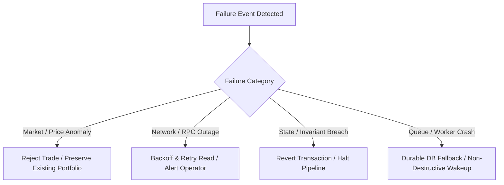

# 23. Failure Scenarios & Recovery Matrix

## 1. System Failure Topology & Resilience Model

Equity Catalyst is designed to fail gracefully. In financial systems, **doing nothing is vastly superior to doing the wrong thing**. Any unhandled anomaly or risk violation must default to a halted or non-executing state.

---

## 2. Comprehensive Failure Matrix

| Failure Mode | Detection Mechanism | System Behavior (Actual Implementation) | Automated Recovery Action | Manual Operator Recovery | Status |
|---|---|---|---|---|---|
| **Stale Price Feed** | Timestamp difference in `PythClient` $> 60\text{s}$ or confidence $> 2\%$ | Rejects quote / policy evaluation with `PythError::InvalidPrice` | Queries fallback Hermes endpoints | Refresh Pyth feed ID mapping | `[IMPLEMENTED]` |
| **Invalid / Inactive Policy** | Pre-flight check `validate_decision_preflight` | Aborts decision synthesis; sets `approved = false` | None (prevents execution) | Manager invokes `update_policy(is_active = true)` | `[IMPLEMENTED]` |
| **Risk Limit Violation** | `RiskEngine::evaluate_proposed_trades` | Returns `RiskAssessment::Rejected { reason }`; logs to `executions` | Skips trade; event marked `PROCESSED` | Manager widens limits if desired | `[IMPLEMENTED]` |
| **Solana RPC Outage / Timeout** | Client timeout error in `SolanaRpcClient` | Returns `ApiError::InternalServerError`; worker logs error and sleeps $500\text{ ms}$ | Automatic retry on next polling loop | Switch `SOLANA_RPC_URL` to secondary provider | `[IMPLEMENTED]` |
| **Solana Tx Drop / Expired Hash** | `SolanaRpcClient::confirm_signature` timeout | Transaction marked as unconfirmed | Re-queries signature status | Resubmit transaction with fresh blockhash | `[IMPLEMENTED]` |
| **Duplicate / Replayed Event** | `event.status == "PROCESSED"` check in `PolicyWorker` | Emits `warn!` log and rejects processing with `ApiError::BadRequest` | Skips event immediately (Idempotency guarantee) | None required (safely ignored) | `[IMPLEMENTED]` |
| **Excessive Slippage / Price Impact** | `parse_price_impact_bps` exceeds `rebalance_threshold_bps` | Rejects quote in `QuoteExecutionService`; sets `approved = false` | Refuses to execute swap | Re-attempt swap in smaller tranches | `[IMPLEMENTED]` |
| **Vault Operation Paused** | `vault.is_paused == true` in Anchor / Pre-flight | Anchor contract reverts with `VaultIsPaused`; pre-flight blocks trade | Halts all deposits, withdrawals, and trades | Authority invokes `emergency_exit(false)` | `[IMPLEMENTED]` |
| **Redis Server Outage** | Connection error in `PolicyWorker::poll_and_process_next` | Gracefully falls back to querying pending events directly from PostgreSQL | Seamless failover to Postgres polling loop | Restart Redis container (`docker restart equity-redis`) | `[IMPLEMENTED]` |
| **First Depositor Inflation Exploit** | Anchor assertion `require!(shares_to_mint > 0)` | Transaction reverts with `ZeroSharesMinted` | Reverts transaction; protects user deposit | Burn 1,000 dead shares during init `[RECOMMENDED]` | `[IMPLEMENTED]` |

---

## 3. Detailed Incident Recovery Procedures

### Scenario: High Market Volatility Triggers RPC Dropped Transactions
1. **Symptom**: Transactions submitted by keepers return timeout before confirmation.
2. **Automated Behavior**:
   * The backend does NOT assume success or increment share counters.
   * On-chain state remains authoritative.
3. **Recovery Action**:
   * Inspect transaction status on Solana Explorer using `tx_signature`.
   * If failed, the `executions` record is updated to `FAILED`, and the vault positions remain synchronized with on-chain SPL balances via `sync_vault_state_to_db`.
