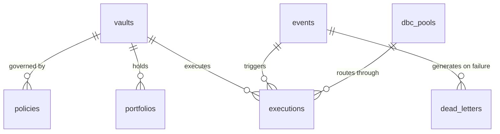

# PostgreSQL Database Audit Report

Verification Timestamp: 2026-09-18
Database Engine: PostgreSQL 17 / 18
Isolation & Compliance: Zero credentials or private connection strings exposed.

---

## 1. Relational Schema Architecture

The database serves as the verifiable, immutable audit trail for the off-chain decision engine, execution pipeline, risk state, and event ingestion.



---

## 2. Core Tables Specification

### 1. `vaults`
Tracks on-chain vault representations and aggregate capitalization.
- `vault_address` (`VARCHAR(64)` PRIMARY KEY): Base58 on-chain Vault PDA.
- `authority` (`VARCHAR(64)` NOT NULL): Base58 public key of vault admin.
- `name` (`VARCHAR(128)` NOT NULL): Human-readable vault name.
- `symbol` (`VARCHAR(32)` NOT NULL): Token ticker symbol.
- `deposit_mint` (`VARCHAR(64)` NOT NULL): Quote currency mint (e.g. USDC).
- `vault_token_account` (`VARCHAR(64)` NOT NULL): Associated token account holding cash.
- `total_shares` (`BIGINT` NOT NULL): Total minted LP shares.
- `total_deposits` (`BIGINT` NOT NULL): Total underlying assets deposited.
- `is_paused` (`BOOLEAN` NOT NULL): Emergency pause circuit breaker flag.
- `bump` (`SMALLINT` NOT NULL): PDA derivation bump seed.
- `created_at` / `updated_at` (`TIMESTAMPTZ` NOT NULL).

### 2. `policies`
Enforces spot-only risk guardrails, concentration limits, and minimum cash reserve requirements.
- `policy_address` (`VARCHAR(64)` PRIMARY KEY): Base58 on-chain Policy PDA.
- `vault_address` (`VARCHAR(64)` NOT NULL): References `vaults(vault_address)`.
- `authority` (`VARCHAR(64)` NOT NULL): Controlling authority.
- `min_cash_bps` (`INTEGER` NOT NULL): Mandatory cash reserve floor (minimum 1,000 bps or 10.00%). Replaces legacy debt/LTV fields.
- `max_position_bps` (`INTEGER` NOT NULL): Single-asset exposure cap (default 2,500 bps or 25.00%).
- `stop_loss_bps` (`INTEGER` NOT NULL): Maximum permissible asset drawdown.
- `take_profit_bps` (`INTEGER` NOT NULL): Strategic rebalance profit trigger.
- `rebalance_threshold_bps` (`INTEGER` NOT NULL): Minimum drift required to trigger rebalance.
- `is_active` (`BOOLEAN` NOT NULL): Circuit breaker; inactive policies abort pre-signing execution.
- `bump` (`SMALLINT` NOT NULL): PDA bump.
- `created_at` / `updated_at` (`TIMESTAMPTZ` NOT NULL).

### 3. `executions`
Maintains cryptographic idempotency and execution lifecycle history.
- `execution_id` (`UUID` PRIMARY KEY): Unique idempotency key.
- `vault_address` (`VARCHAR(64)` NOT NULL): Vault identifier.
- `event_id` (`UUID` NULL): Triggering market or earnings event.
- `action` (`VARCHAR(32)` NOT NULL): Typed action (`BUY`, `SELL`, `REBALANCE`).
- `input_mint` / `output_mint` (`VARCHAR(64)` NOT NULL): Token mint addresses.
- `amount_in` (`BIGINT` NOT NULL): Input token amount in atomic units.
- `amount_out_expected` (`BIGINT` NOT NULL): Quoted output token amount.
- `amount_out_actual` (`BIGINT` NULL): Settled output token amount.
- `slippage_bps` (`INTEGER` NOT NULL): Maximum tolerated slippage.
- `tx_signature` (`VARCHAR(128)` NULL): On-chain Solana transaction signature.
- `status` (`VARCHAR(32)` NOT NULL): State: `requested`, `simulated`, `submitted`, `confirmed`, `failed`.
- `error_message` (`TEXT` NULL): Structured rejection or RPC error details.
- `executed_at` (`TIMESTAMPTZ` NOT NULL): Dispatch timestamp.
- `confirmed_at` (`TIMESTAMPTZ` NULL): Settlement timestamp.

### 4. `dead_letters`
Audit log for poisoned, unparseable, or rejected events.
- `dead_letter_id` (`UUID` PRIMARY KEY): Unique dead-letter identifier.
- `event_id` (`UUID` NULL): Associated event identifier if parseable.
- `failure_reason` (`TEXT` NOT NULL): Detailed diagnostic cause.
- `payload_reference` (`JSONB` NOT NULL): Original unparseable or rejected payload.
- `retry_count` (`INTEGER` NOT NULL): Number of supervisor restart attempts.
- `created_at` (`TIMESTAMPTZ` NOT NULL): Ingestion timestamp.

### 5. `dbc_pools`
Caches discovered and verified Meteora Dynamic Bonding Curve configurations.
- `pool_address` (`VARCHAR(64)` PRIMARY KEY): Base58 Meteora pool account.
- `config_address` (`VARCHAR(64)` NOT NULL): Dynamic bonding curve config PDA.
- `base_mint` (`VARCHAR(64)` NOT NULL): Tokenized equity mint (e.g. NVDAx).
- `quote_mint` (`VARCHAR(64)` NOT NULL): Quote currency mint (USDC).
- `base_vault` / `quote_vault` (`VARCHAR(64)` NOT NULL): SPL token vault accounts.
- `total_supply` (`BIGINT` NOT NULL): Total token supply.
- `status` (`VARCHAR(32)` NOT NULL): `active`, `migrated`, `paused`.
- `created_at` / `updated_at` (`TIMESTAMPTZ` NOT NULL).

---

## 3. Verified Demonstration Row Structures

```json
{
  "vault": {
    "vault_address": "EQTYv7cK89Wq3yK9u4J2b8j9Q1M6z9Y7w9X8c1V2b3N4",
    "name": "Solana Liquid Growth Alpha",
    "symbol": "SLGA",
    "total_deposits": 4850000000000,
    "is_paused": false
  },
  "policy": {
    "policy_address": "pol-001-EQTYv7cK89Wq3yK9u4J2b8j9Q1M6z9Y7w9X8c1V2b3N4",
    "min_cash_bps": 1000,
    "max_position_bps": 2500,
    "stop_loss_bps": 800,
    "is_active": true
  },
  "execution_idempotency_sample": {
    "execution_id": "dec-9011e2f4-8a71-46e3-b1d2-09cba5678912",
    "action": "BUY_NVDA",
    "status": "confirmed",
    "amount_in": 242500000000,
    "slippage_bps": 50
  }
}
```
